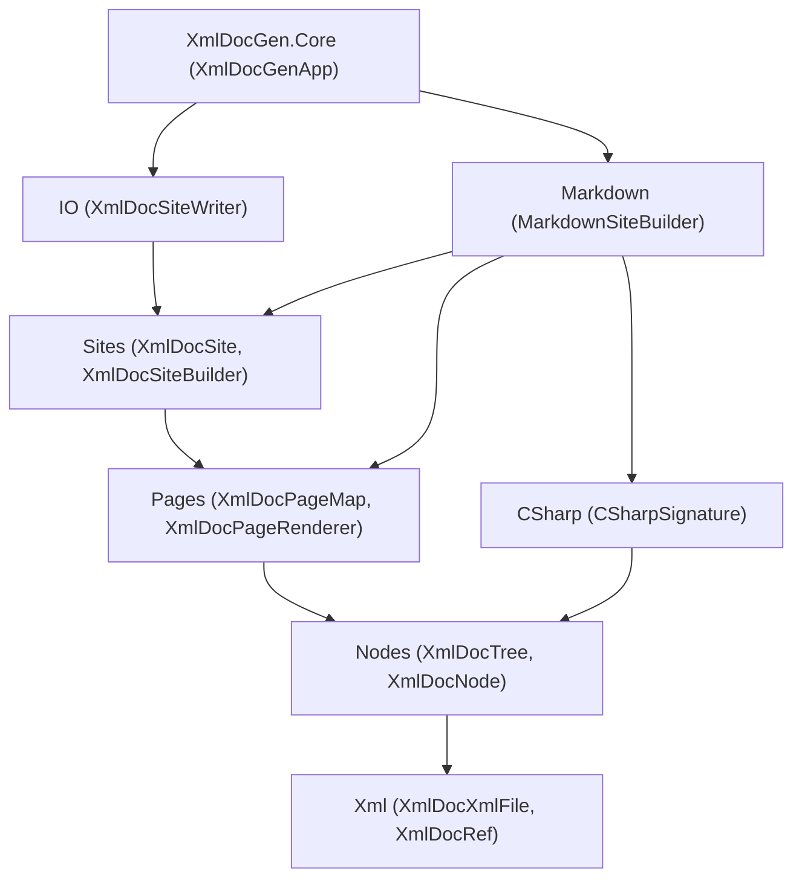

# XmlDocGen Plan

A plan for taking the current `XmlDocMarkdown.Core` work-in-progress and reshaping it into a new,
layered library named **XmlDocGen**, published to a new repository. No backward compatibility is
required.

The goal is a clean, **layered** API where each layer has a single responsibility and lives in its own
namespace. Every layer is **public and self-sufficient**: a client in a different assembly can take any
layer and build their own higher layers on top of it, or replace a layer entirely, without code
duplication. The library still makes it trivially easy to generate a GitHub/Docusaurus-friendly
Markdown site by default.

The library targets **.NET 10** (C# 14) and uses current platform APIs and well-supported NuGet
packages instead of hand-rolled algorithms wherever that simplifies the code (see
[Modern .NET 10 opportunities](#modern-net-10-opportunities)).

## Goals

- One NuGet package, `XmlDocGen.Core`, consumed by a tiny local host tool (conventionally `XmlDocGen`)
  that references the assemblies to be documented and calls into the library.
- Markdown generation works out of the box with strong defaults.
- **This library does not ship HTML (or any non-Markdown) output.** Instead it guarantees that a
  *consumer* can produce HTML (or any other format) by plugging in one component — an
  `XmlDocPageRenderer` — without touching or duplicating any other layer. The HTML examples in this
  plan illustrate what a consumer would write; they are not part of `XmlDocGen.Core`.
- The API is layered, with each layer depending only on the layers below it:
  - Layers that perform **I/O** are separate from layers that work purely **in memory**.
  - **C# signature** generation is its own independently usable/testable layer.
  - **Markdown** generation is its own independently usable/testable layer, exposed as building blocks.
- A rich, reflection-backed object model (`XmlDocNode` and friends) is the single source of truth that
  all output formats render from, and it spans **multiple assemblies**.
- Filtering is first-class via a composable `XmlDocNodeVisibility`.
- Linking to types/members **outside** the documented assemblies, and mapping paths to URLs, are
  customizable extension points.
- **Every layer is customizable** without rewriting the layers around it: page mapping, signature
  formatting, link resolution, and per-section rendering are all extension points.

## Conventions

- **XML documentation is required on every public and protected member.** This is enforced as a build
  warning-as-error and verified by a doc-coverage test (see Testing Plan).
- **Prefer abstract methods over virtual methods.** Contract methods that a subclass must supply are
  `abstract`; ready-made behavior is provided by concrete sealed subclasses rather than virtual
  defaults on a base class. The one deliberate exception is the **renderer/builder section methods**
  (e.g. `MarkdownRenderer.WriteSummary`), which are `virtual` precisely so a client can override one
  section and reuse the rest — that is their entire purpose.
- **"Writer"/"writing" is reserved for I/O.** In-memory producers are "builders" (e.g.
  `CSharpSignatureBuilder`), not writers. The exception is `MarkdownWriter`, a low-level text
  emitter that writes to an in-memory `TextWriter`; the `MarkdownRenderer` section methods are named
  `Write…` because they write *into* that in-memory `MarkdownWriter`, never to the file system.
- **Settings, not Options.** Configuration objects are uniformly named `...Settings`.
- **Prefer the platform and well-supported packages over hand-rolled algorithms.** Use current
  .NET 10 APIs and mature NuGet packages where they remove custom string/reflection/file code without
  compromising the layering (see [Modern .NET 10 opportunities](#modern-net-10-opportunities)).

## Namespaces

The root namespace matches the assembly name, `XmlDocGen.Core`, and each layer is a child namespace.

| Layer | Namespace | Responsibility | I/O? |
|-------|-----------|----------------|------|
| XML file | `XmlDocGen.Core.Xml` | Parse compiler-emitted XML; `XmlDocRef` value type. | In memory |
| Object model | `XmlDocGen.Core.Nodes` | Join reflection + XML into the `XmlDocNode` tree across assemblies; filtering. | In memory |
| C# signatures | `XmlDocGen.Core.CSharp` | Produce structured C# signatures/tokens from nodes. | In memory |
| Pages | `XmlDocGen.Core.Pages` | Map nodes to pages; resolve links/URLs; abstract page rendering. | In memory |
| Sites | `XmlDocGen.Core.Sites` | Assemble rendered pages into an in-memory site. | In memory |
| Markdown | `XmlDocGen.Core.Markdown` | Markdown building blocks + Markdown page/site rendering. | In memory |
| IO | `XmlDocGen.Core.IO` | Write a site to the file system (diff, clean, dry-run, verify). | **File system** |
| Application | `XmlDocGen.Core` (root) | CLI entry point wiring it all together. | Console + file system |

Dependency rule: a namespace may reference those above it in the table but never those below it. All
disk access lives in `XmlDocGen.Core.IO` and the root app; everything else is pure in-memory work.



---

## Xml Layer (`XmlDocGen.Core.Xml`)

Pure parsing of the compiler-emitted `.xml` file plus the `XmlDocRef` value type. No reflection; no file
system beyond opt-in convenience loaders. This is today's `XmlDocFile`/`XmlDocMember`/`XmlDocBlock`
model, made public, moved to its own namespace, and renamed with an `XmlDocXml` prefix to avoid
collisions with higher-layer "file"/"site" concepts. The inline model is public so a non-Markdown
renderer in another assembly can format it.

```csharp
namespace XmlDocGen.Core.Xml;

/// <summary>An XML documentation identifier, e.g. "T:My.Type" or "M:My.Type.Method(System.Int32)".</summary>
public readonly struct XmlDocRef : IEquatable<XmlDocRef>
{
    /// <summary>Wraps an identifier string (basic prefix validation only).</summary>
    public XmlDocRef(string value);

    /// <summary>The raw identifier string (e.g. "T:My.Type").</summary>
    public string Value { get; }

    /// <summary>Build a reference from reflection metadata.</summary>
    public static XmlDocRef ForType(Type type);
    public static XmlDocRef ForMember(MemberInfo member);
    public static XmlDocRef ForNamespace(string namespaceName);

    public bool Equals(XmlDocRef other);
    public override string ToString();    // returns Value
}

/// <summary>An in-memory representation of a compiler-generated XML documentation file.</summary>
public sealed class XmlDocXmlFile
{
    public XmlDocXmlFile();
    public XmlDocXmlFile(XDocument document);

    /// <summary>Opt-in loaders (the only I/O in this layer).</summary>
    public static XmlDocXmlFile Load(string path);
    public static XmlDocXmlFile Load(Stream stream);
    public static XmlDocXmlFile Parse(string xml);

    /// <summary>The assembly name from the &lt;assembly&gt; element, if present.</summary>
    public string? AssemblyName { get; }

    public IReadOnlyList<XmlDocXmlMember> Members { get; }

    /// <summary>Find documentation for the given reference.</summary>
    public XmlDocXmlMember? FindMember(XmlDocRef reference);
}

/// <summary>The parsed XML documentation for a single member.</summary>
public sealed class XmlDocXmlMember
{
    public XmlDocRef Ref { get; }
    public IReadOnlyList<XmlDocXmlBlock> Summary { get; }
    public IReadOnlyList<XmlDocXmlParameter> TypeParameters { get; }
    public IReadOnlyList<XmlDocXmlParameter> Parameters { get; }
    public IReadOnlyList<XmlDocXmlBlock> ReturnValue { get; }
    public IReadOnlyList<XmlDocXmlBlock> PropertyValue { get; }
    public IReadOnlyList<XmlDocXmlException> Exceptions { get; }
    public IReadOnlyList<XmlDocXmlBlock> Remarks { get; }
    public IReadOnlyList<XmlDocXmlBlock> Examples { get; }
    public IReadOnlyList<XmlDocXmlSeeAlso> SeeAlso { get; }

    /// <summary>The raw &lt;inheritdoc&gt; directive, if present, for the Nodes layer to resolve.</summary>
    public XmlDocXmlInheritDoc? InheritDoc { get; }
}

public sealed class XmlDocXmlBlock { /* inlines + optional list kind */ }
public sealed class XmlDocXmlInline { /* text, code, see (XmlDocRef/href/langword), paramref, typeparamref */ }
public sealed class XmlDocXmlParameter { /* name + blocks */ }
public sealed class XmlDocXmlException { /* XmlDocRef + blocks */ }
public sealed class XmlDocXmlSeeAlso { /* XmlDocRef or href + text */ }
public sealed class XmlDocXmlInheritDoc { /* optional cref + optional path */ }
public enum XmlDocXmlListKind { Bullet, Number, Table, Definition }
```

### Examples

```csharp
// Parse an XML doc file and look up a type's summary, with no higher layers involved.
var xml = XmlDocXmlFile.Load("MyLib.xml");
var member = xml.FindMember(new XmlDocRef("T:MyLib.Widget"));
foreach (var block in member?.Summary ?? [])
    Console.WriteLine(block);

// Build a reference straight from reflection.
XmlDocRef widgetRef = XmlDocRef.ForType(typeof(MyLib.Widget));
XmlDocRef methodRef = XmlDocRef.ForMember(typeof(MyLib.Widget).GetMethod("Spin")!);
```

### Design decisions
- `XmlDocXmlInline` stays a single class with a kind discriminator; the public docs explain the kinds.
- The inline model and `XmlDocRef` are fully public so other assemblies can render XML doc content.
- The constructor does only basic prefix validation; it does not parse the full identifier grammar. The
  member-kind prefix (`T`/`M`/`P`/`F`/`E`/`N`) is an internal detail used for matching/sorting, not a
  public property — consumers branch on node type (`XmlDocTypeNode`/`XmlDocMemberNode`/…) instead.

---

## Nodes Layer (`XmlDocGen.Core.Nodes`)

The heart of the redesign: everything from **reflection**, joined with the matching `XmlDocXmlMember`
content, as an `XmlDocNode` tree (`XmlDocTree`) spanning **multiple assemblies**. All downstream layers
read from this tree, so feature support (records, `required`, `ref struct`, etc.) is added here once.

```csharp
namespace XmlDocGen.Core.Nodes;

/// <summary>A documentation tree built from one or more assemblies.</summary>
public sealed class XmlDocTree
{
    public static XmlDocTree Create(IEnumerable<XmlDocAssemblyNode> assemblies);
    public static XmlDocTree Create(IEnumerable<(Assembly Assembly, XmlDocXmlFile Xml)> inputs);

    public IReadOnlyList<XmlDocAssemblyNode> Assemblies { get; }

    /// <summary>Find any node in the tree by reference (across all assemblies).</summary>
    public XmlDocNode? FindNode(XmlDocRef reference);

    /// <summary>Find the node documenting a reflection type or member, if it is in the tree.</summary>
    public XmlDocNode? FindNode(MemberInfo member);
}

/// <summary>Base class for any documentable node (assembly, namespace, type, or member).</summary>
public abstract class XmlDocNode
{
    public abstract string Name { get; }                    // simple display name
    public abstract XmlDocRef Ref { get; }                  // this node's reference

    public XmlDocNode? Parent { get; }                      // null for assembly roots
    public XmlDocAssemblyNode Assembly { get; }             // owning assembly node
    public XmlDocXmlMember? XmlMember { get; }              // joined XML doc, if any (inheritdoc resolved)

    public bool IsObsolete { get; }
    public bool IsBrowsable { get; }
    public bool IsCompilerGenerated { get; }
    public XmlDocVisibility Visibility { get; }

    public IReadOnlyList<XmlDocNode> Children { get; }      // unfiltered, in declaration order
    public IEnumerable<XmlDocNode> GetChildren(XmlDocNodeVisibility visibility);

    /// <summary>This node and all descendants that pass the filter (depth-first, declaration order).</summary>
    public IEnumerable<XmlDocNode> DescendantsAndSelf(XmlDocNodeVisibility visibility);

    /// <summary>Surface an attribute for custom filtering/rendering, if applied to this node.</summary>
    public bool TryGetAttribute<T>(out T attribute) where T : Attribute;
}

public sealed class XmlDocAssemblyNode : XmlDocNode
{
    /// <summary>Build a single-assembly node by joining reflection with parsed XML documentation.</summary>
    public static XmlDocAssemblyNode Create(Assembly assembly, XmlDocXmlFile xml);

    public Assembly ReflectionAssembly { get; }             // the reflected assembly
    public XmlDocXmlFile Xml { get; }                       // the parsed XML doc file
    public IReadOnlyList<XmlDocNamespaceNode> Namespaces { get; }
}

public sealed class XmlDocNamespaceNode : XmlDocNode
{
    public IReadOnlyList<XmlDocTypeNode> Types { get; }     // top-level types in this namespace
}

public sealed class XmlDocTypeNode : XmlDocNode
{
    public Type Type { get; }
    public XmlDocTypeKind Kind { get; }
    public IReadOnlyList<XmlDocTypeNode> NestedTypes { get; }
    public IReadOnlyList<XmlDocMemberNode> Members { get; }
    // structural signature data: base type, interfaces, type parameters + constraints, modifiers
}

public sealed class XmlDocMemberNode : XmlDocNode
{
    public MemberInfo MemberInfo { get; }
    public XmlDocMemberKind MemberKind { get; }
    // structural signature data: parameters, return type, accessors, modifiers
}

/// <summary>Visibility ordered from least to most visible, so comparisons (&gt;=) work directly.</summary>
public enum XmlDocVisibility { Private, Internal, ProtectedInternal, Protected, Public }
public enum XmlDocTypeKind { Class, Struct, Interface, Enum, Delegate, Record, RecordStruct }
public enum XmlDocMemberKind { Constructor, Method, Property, Field, Event, Operator }
```

Notes:
- `XmlMember` is the joined XML doc for a node (renamed from `Documentation`), with any
  `<inheritdoc>` already resolved against base types/interfaces during tree construction.
- `XmlDocVisibility` replaces today's `XmlDocVisibilityLevel`, framed as "the node's own visibility."
  The enum is ordered, so a custom generator can compare visibilities directly. It keeps a
  `ProtectedInternal` level (more visible than `Internal`, less than `Protected`) so a node's exact
  visibility is reported faithfully.
- The tree exposes **structural** signature data so any formatter can build signatures; canonical C#
  text is produced by the `CSharp` layer.

### Visibility / filtering

`XmlDocNodeVisibility` is an abstract base with one abstract method, `IsVisible(XmlDocNode)`, plus a
static property per visibility level and a small set of fluent exclusions.

```csharp
namespace XmlDocGen.Core.Nodes;

public abstract class XmlDocNodeVisibility
{
    public abstract bool IsVisible(XmlDocNode node);

    /// <summary>One ready-made filter per visibility level (each includes that level and above).</summary>
    public static XmlDocNodeVisibility Public { get; }
    public static XmlDocNodeVisibility Protected { get; }            // default
    public static XmlDocNodeVisibility Internal { get; }
    public static XmlDocNodeVisibility Private { get; }              // includes everything

    /// <summary>The minimum visibility to include; e.g. Create(ProtectedInternal) when that level is wanted.</summary>
    public static XmlDocNodeVisibility Create(XmlDocVisibility minimum);

    // Fluent, composable refinements (each returns a new XmlDocNodeVisibility):
    public XmlDocNodeVisibility ExcludeObsolete();
    public XmlDocNodeVisibility ExcludeUnbrowsable();
    public XmlDocNodeVisibility ExcludeCompilerGenerated();
    public XmlDocNodeVisibility Exclude(Func<XmlDocNode, bool> shouldExclude);
}
```

### Examples

```csharp
// Build a multi-assembly tree directly from reflection + XML, no higher layers.
var tree = XmlDocTree.Create(
[
    (typeof(Widget).Assembly, XmlDocXmlFile.Load("Widgets.xml")),
    (typeof(Gadget).Assembly, XmlDocXmlFile.Load("Gadgets.xml")),
]);

// Walk visible public types and print their names.
var visibility = XmlDocNodeVisibility.Public.ExcludeObsolete().ExcludeCompilerGenerated();
foreach (var assembly in tree.Assemblies)
    foreach (var ns in assembly.Namespaces)
        foreach (var type in ns.GetChildren(visibility))
            Console.WriteLine(type.Name);

// A completely custom filter.
sealed class TestApiVisibility : XmlDocNodeVisibility
{
    public override bool IsVisible(XmlDocNode node) => !node.Name.EndsWith("Internal", StringComparison.Ordinal);
}
```

### Design decisions
- **Cross-assembly behavior**: `XmlDocTree` documents each assembly from its own metadata and XML.
  `FindNode` resolves references across all assemblies in the tree, so a type in one example assembly
  can link to a type in the other. Type forwarding and `InternalsVisibleTo` are **out of scope**: a
  forwarded type is documented only if its defining assembly is included. This keeps the tree a faithful
  per-assembly view and avoids surprising merges.
- `GetChildren` filters immediate children only; callers compose traversal via `DescendantsAndSelf`.
  Visibility does not implicitly cascade (a visible type can still expose its visible members even if an
  enclosing namespace were filtered), which matches how documentation is actually consumed.

---

## CSharp Layer (`XmlDocGen.Core.CSharp`)

C# signature generation as an independent, testable layer. It turns nodes into **structured signatures**
(a token list) so any output format can render them — Markdown can hyperlink type tokens, HTML can wrap
them in spans, plain text can ignore the structure. Each linkable token carries the **reflection
target** it refers to, so the linking layer never deals with raw reference strings.

```csharp
namespace XmlDocGen.Core.CSharp;

public enum CSharpTokenKind { Keyword, Identifier, TypeName, Operator, Punctuation, Whitespace, Literal }

/// <summary>One piece of a C# signature.</summary>
public readonly struct CSharpToken
{
    public CSharpTokenKind Kind { get; }
    public string Text { get; }

    /// <summary>For tokens that refer to a type or member, the reflection target to link to (Type is a MemberInfo).</summary>
    public MemberInfo? LinkTarget { get; }
}

/// <summary>A structured C# signature.</summary>
public sealed class CSharpSignature
{
    public IReadOnlyList<CSharpToken> Tokens { get; }
    public override string ToString();                      // concatenated token text
}

/// <summary>
/// Builds a structured C# signature from a node (dispatching on type vs. member internally). The
/// variants we actually use are exposed as static singletons; subclass to produce a custom signature.
/// </summary>
public abstract class CSharpSignatureBuilder
{
    public abstract CSharpSignature GetSignature(XmlDocNode node);

    /// <summary>Full declaration — access modifiers, modifiers, and parameter names — used in page headings.</summary>
    public static CSharpSignatureBuilder Full { get; }

    /// <summary>Brief, link-friendly form — name plus parameter types — used in summary tables.</summary>
    public static CSharpSignatureBuilder Short { get; }
}
```

### Examples

```csharp
// Render a type's signature as plain C#, no Markdown involved.
var type = (XmlDocTypeNode) tree.FindNode(typeof(Widget))!;
CSharpSignature sig = CSharpSignatureBuilder.Full.GetSignature(type);
Console.WriteLine(sig.ToString());   // "public sealed class Widget : IWidget"

// Inspect the tokens to build your own hyperlinked output.
foreach (var token in sig.Tokens)
    if (token.LinkTarget is { } target)
        Console.WriteLine($"links to {target}");
```

### Design decisions
- Token granularity stays fine (one token per syntactic atom); today's model works well and gives
  renderers full control.
- **One method, two built-in variants.** Rather than a settings object plus separate
  type/member/short methods, `GetSignature(node)` dispatches on the node kind, and the only
  combinations we actually emit are the static `Full` (page headings) and `Short` (summary tables)
  singletons. A consumer who needs something else subclasses `CSharpSignatureBuilder`.
- The file-name-safe identifier/path for a node belongs to the Pages layer (`XmlDocPageMap`), not here;
  this layer produces signatures only.

---

## Pages Layer (`XmlDocGen.Core.Pages`)

Page mapping, link resolution, and the abstract page renderer. The simplest way to build pages is a
**node → path mapping**: every node that maps to the same path is documented on the same page. This
layer also owns URL mapping and external link resolution, because linking is part of rendering a page.

```csharp
namespace XmlDocGen.Core.Pages;

/// <summary>Maps each documentable node to the logical page path (no extension) where it is documented.</summary>
public abstract class XmlDocPageMap
{
    /// <summary>
    /// The site-relative logical path (no extension, no leading slash) for the page that documents this
    /// node. Granularity is decided entirely here: nodes that return the same path share a page, so a
    /// node gets "its own page" precisely when it maps to a unique path. There is no separate
    /// granularity flag.
    /// </summary>
    public abstract string GetPagePath(XmlDocNode node);

    // Ready-made granularities (each is just a built-in GetPagePath implementation):
    public static XmlDocPageMap PerMember { get; }       // member -> own page, type -> own page (default)
    public static XmlDocPageMap PerType { get; }         // members folded onto their type's page
    public static XmlDocPageMap PerNamespace { get; }    // types + members folded onto a namespace page
    public static XmlDocPageMap PerAssembly { get; }     // everything in one assembly on one page
    public static XmlDocPageMap SinglePage { get; }      // the entire site on one page
}

/// <summary>A logical page: the nodes documented together in one output file.</summary>
public sealed class XmlDocPage
{
    public XmlDocPage(string path, IEnumerable<XmlDocNode> nodes);

    public string Path { get; }                             // site-relative, '/'-separated, NO extension
    public IReadOnlyList<XmlDocNode> Nodes { get; }         // the first node is the page's subject
}

/// <summary>Builds the page set by grouping visible nodes by their mapped path.</summary>
public static class XmlDocPageBuilder
{
    /// <summary>Group visible nodes by <see cref="XmlDocPageMap.GetPagePath"/> into logical pages.</summary>
    public static IReadOnlyList<XmlDocPage> CreatePages(
        XmlDocTree tree, XmlDocNodeVisibility visibility, XmlDocPageMap map);
}

/// <summary>A rendered output file: a logical page turned into a path (with extension) and text.</summary>
public sealed record XmlDocRenderedFile(string Path, string Text);

/// <summary>Renders a single page to an output file. Format-specific subclasses implement this.</summary>
public abstract class XmlDocPageRenderer
{
    /// <summary>
    /// Render the page to a file. The renderer owns the output format, so it both produces the text
    /// and forms the file path (logical <see cref="XmlDocPage.Path"/> plus its own extension).
    /// </summary>
    public abstract XmlDocRenderedFile RenderPage(XmlDocPage page, XmlDocPageContext context);
}

/// <summary>
/// Maps a link from one page to a documented node to a URL relative to the current page. The mapper
/// owns the link format end to end: it computes the relative path between the logical page paths,
/// appends its format's extension (or none), and — when the target node is not the target page's subject
/// (i.e. it shares the page) — appends an intra-page fragment it slugifies the same way its host
/// renderer does. "Anchor" never appears in the public API.
/// </summary>
public abstract class XmlDocUrlMapper
{
    /// <summary>The relative URL from <paramref name="fromPage"/> to <paramref name="targetNode"/> on
    /// <paramref name="targetPage"/>. Both page paths are logical (no extension, no leading slash).</summary>
    public abstract string GetUrl(XmlDocPage fromPage, XmlDocPage targetPage, XmlDocNode targetNode);

    public static XmlDocUrlMapper GitHub { get; }           // relative ".md" links (default)
    public static XmlDocUrlMapper Docusaurus { get; }       // extensionless, slugged links
}

/// <summary>Resolves links to types, members, or namespaces OUTSIDE the documented assemblies.</summary>
public abstract class XmlDocExternalLinkResolver
{
    /// <summary>
    /// An absolute URL for a target not in the tree, or null if unknown. <paramref name="reference"/> is
    /// always supplied (a `T:`/`M:`/`P:`/`F:`/`E:`/`N:` identifier, so namespaces resolve too);
    /// <paramref name="member"/> is the resolved reflection object when one is available (e.g. a loaded
    /// BCL type or method) and null otherwise (notably for namespaces and unresolved refs).
    /// </summary>
    public abstract string? TryGetUrl(XmlDocRef reference, MemberInfo? member);

    public static XmlDocExternalLinkResolver DotNetApi { get; }                       // Microsoft Learn for System.*
    public static XmlDocExternalLinkResolver UrlPattern(string urlFormat);            // custom external source
    public static XmlDocExternalLinkResolver Combine(params XmlDocExternalLinkResolver[] resolvers);
}

/// <summary>Resolves a documented member to a "view source" URL via the assembly's SourceLink PDB.</summary>
public sealed class XmlDocSourceLinks
{
    /// <summary>Reads SourceLink info from the assembly's portable PDB; returns null if unavailable.</summary>
    public static XmlDocSourceLinks? TryCreate(Assembly assembly);

    /// <summary>An absolute source URL (file + line) for the member, or null if it cannot be resolved.</summary>
    public string? TryGetUrl(MemberInfo member);
}

/// <summary>Context available while rendering a page: page lookup and unified link resolution.</summary>
public sealed class XmlDocPageContext
{
    public XmlDocTree Tree { get; }
    public XmlDocPage Page { get; }                         // the page being rendered
    public IReadOnlyList<XmlDocPage> Pages { get; }

    public XmlDocPage? FindPage(XmlDocNode node);
    public XmlDocPage? FindPage(XmlDocRef reference);

    /// <summary>
    /// Resolve a type or member to a URL relative to the current page: an internal page link (the URL
    /// mapper adds an intra-page fragment when the target shares a page) if it is in the tree; otherwise
    /// an external link; otherwise null.
    /// </summary>
    public string? GetLinkUrl(MemberInfo member);

    /// <summary>
    /// Resolve any reference — type, member, or namespace (`N:`) — to a URL relative to the current
    /// page, using the tree first and the external resolver second. This is the form used when rendering
    /// `&lt;see cref&gt;` content, where only the identifier is known.
    /// </summary>
    public string? GetLinkUrl(XmlDocRef reference);

    /// <summary>A "view source" URL for a documented member, or null if source links are unavailable.</summary>
    public string? GetSourceUrl(MemberInfo member);
}
```

### Linking (design)

Internal and external linking are **separate abstractions**, and the external resolver is only consulted
when an internal link is impossible:

1. `XmlDocPageContext.GetLinkUrl(...)` looks up the target (by `MemberInfo` or `XmlDocRef`) in the tree.
2. If found (internal), it finds the target page and asks the `XmlDocUrlMapper` for a URL **relative to
   the current page**, passing the current page, the target page, and the target node. The mapper alone
   decides whether an intra-page fragment is needed (when the target node is not the target page's
   subject) and slugifies it to match its host renderer — so the word "anchor" never appears in the API.
3. If not found (external), it consults `XmlDocExternalLinkResolver.TryGetUrl(reference, member)`. Because
   the resolver keys on `XmlDocRef`, this path also resolves **namespace** links (`N:` refs), for which
   no `MemberInfo` exists.
4. Otherwise it returns null (render as plain text).

Callers never pass the current page themselves; the context supplies it. A same-page link is simply the
mapper returning a fragment-only URL.

> **Open question (flagged for implementation):** exactly what we hold when a link is resolved. Inside
> rendered XML doc content we always have the `XmlDocRef` from the `cref`; we may or may not have a
> resolved `MemberInfo` (we do for in-tree targets and loaded BCL types, not for arbitrary external
> refs or namespaces). The resolver signature `(XmlDocRef reference, MemberInfo? member)` is chosen to
> degrade gracefully, but may be revisited once the renderer's exact inputs are pinned down.

### Source links via SourceLink (design)

When the documented assemblies are built with **SourceLink** (already enabled by `Faithlife.Build`, and
on by default for SDK-style projects with `PublishRepositoryUrl`), the portable PDB embeds a SourceLink
document map (local path -> raw URL template) and sequence points (each member's file + starting line).
`XmlDocSourceLinks.TryCreate(assembly)` reads them via the in-box `System.Reflection.Metadata`
(`MetadataReader`) — no extra dependency — and returns `null` when no PDB/SourceLink is present.
`XmlDocPageContext.GetSourceUrl(member)` then returns a "view source" URL or null, and the Markdown
renderer emits a `[source](…)` link in a member's header only when it is non-null. It is a pure add-on:
source links are off (`null`) unless the consumer passes an `XmlDocSourceLinks` via
`XmlDocSiteBuilderSettings.SourceLinks` (also exposed on the app context).

### Examples

```csharp
// Compute the page set for a tree without rendering or writing files.
var pages = XmlDocPageBuilder.CreatePages(tree, XmlDocNodeVisibility.Public, XmlDocPageMap.PerNamespace);
foreach (var page in pages)
    Console.WriteLine($"{page.Path} <- {page.Nodes[0].Name}");

// A custom mapping: one page per type, members folded onto their type's page.
sealed class FlatPageMap : XmlDocPageMap
{
    public override string GetPagePath(XmlDocNode node) =>
        node is XmlDocMemberNode m ? GetPagePath(m.Parent!) : $"{node.Assembly.Name}/{node.Name}";
}
```

### Design decisions
- **Path conventions.** A *logical* path (`XmlDocPage.Path`, `XmlDocPageMap.GetPagePath`) is
  site-relative, `/`-separated, has **no extension**, and does **not** start with a slash (e.g.
  `MyLib/Widget`). A *physical* path (`XmlDocRenderedFile.Path`, what the IO layer writes) is the same
  string with the renderer's extension appended and is likewise relative with **no leading slash** (e.g.
  `MyLib/Widget.md`). The `XmlDocUrlMapper` consumes **logical** paths (from the two `XmlDocPage`s) and
  is the one component that knows about extensions/slugs — it produces the final, page-relative link.
- `XmlDocPage.Path` is **logical (no extension)**; the renderer forms the actual file path by appending
  its own extension when it returns an `XmlDocRenderedFile`. There is no separate `FileExtension`
  property: the renderer already knows its format, so it owns both the text and the filename. Link
  extensions (`.md` or none) are an independent concern owned by the `XmlDocUrlMapper`.
- Page granularity is chosen with a `XmlDocPageMap` (the `PerMember`/`PerType`/`PerNamespace`/
  `PerAssembly`/`SinglePage` presets, or a custom subclass). There is **no settings object**: a settings
  bag would only re-encode what `GetPagePath` already expresses, so it was removed.
- The page map is purely structural and does not know the `XmlDocUrlMapper`; URL style is applied later.
  It maps nodes to **paths only** — intra-page fragments ("anchors") are not its concern; the
  `XmlDocUrlMapper` derives them when it forms a link, so the page map never sees the word "anchor."
- The page's subject is simply `Nodes[0]`; there is no separate "primary node" concept.
- **Page granularity lives entirely in `GetPagePath`.** A node has its own page iff it maps to a unique
  path; folding a member onto its type's page is just returning the type's path for that member. The
  built-in presets (`PerMember`/`PerType`/`PerNamespace`/`PerAssembly`/`SinglePage`) are nothing more
  than different `GetPagePath` implementations. See the
  [Customization cookbook](#customization-cookbook) for one example of each granularity.

### Intra-page links for overloaded members (proposal)

The hard case is that the **fragment is generated by the Markdown renderer, not by us** (GitHub and
Docusaurus each slugify headings their own way), so we cannot freely invent fragments and expect links to
match. Proposal:

- **Default to one page per member** (`PerMember`), where no intra-page fragment is needed: a link
  targets the page, full stop. This sidesteps the slug-matching problem for the common case and is
  today's behavior.
- When members *are* folded onto a shared page, the fragment is computed **inside the
  `XmlDocUrlMapper`**, because the slug algorithm belongs to the same component that owns link
  formatting. `GetUrl(fromPage, targetPage, targetNode)` appends a fragment only when `targetNode` is
  not `targetPage.Nodes[0]`, slugifying the heading text the way its host (`GitHub`/`Docusaurus`)
  does. The page map and the rest of the API stay free of the "anchor" concept.
- For **overloads that produce identical heading text**, emit a disambiguating suffix *into the heading
  itself* (e.g. `Spin(Int32)` vs `Spin(String)`) so the renderer-generated slug is naturally unique,
  rather than trying to predict a `-1`/`-2` collision suffix the renderer would append. The signature is
  already available from the CSharp layer, so the heading can carry the parameter list.
- Document the limitation: intra-page links are only guaranteed for the URL styles we model (`GitHub`,
  `Docusaurus`); a custom renderer with a different slugger must supply a matching `XmlDocUrlMapper`.

---

## Sites Layer (`XmlDocGen.Core.Sites`)

Site building: combine a tree, page map, renderer, URL mapper, and external link resolver into a complete
in-memory site. Format-agnostic — it takes an `XmlDocPageRenderer` and is unaware of Markdown vs HTML.

```csharp
namespace XmlDocGen.Core.Sites;

/// <summary>A generated documentation site: a set of output files.</summary>
public sealed class XmlDocSite
{
    public XmlDocSite(IEnumerable<XmlDocSiteFile> files);
    public IReadOnlyList<XmlDocSiteFile> Files { get; }     // stable ordering for deterministic output
    public XmlDocSiteFile? FindFile(string path);
}

/// <summary>A single generated output file (formerly NamedText).</summary>
public sealed class XmlDocSiteFile
{
    public XmlDocSiteFile(string path, string text);
    public string Path { get; }                             // site-relative, '/'-separated, with extension
    public string Text { get; }
}

/// <summary>Builds a site by rendering each page with a page renderer.</summary>
public class XmlDocSiteBuilder
{
    public XmlDocSiteBuilder(XmlDocPageRenderer renderer, XmlDocSiteBuilderSettings? settings = null);

    public XmlDocSite Build(XmlDocTree tree);
}

public sealed class XmlDocSiteBuilderSettings
{
    public XmlDocNodeVisibility? Visibility { get; set; }   // default: Protected
    public XmlDocPageMap? PageMap { get; set; }             // default: XmlDocPageMap.PerMember
    public XmlDocUrlMapper? UrlMapper { get; set; }         // default: GitHub
    public XmlDocExternalLinkResolver? ExternalLinks { get; set; } // default: DotNetApi
    public XmlDocSourceLinks? SourceLinks { get; set; }     // default: null (off)
    public string? NewLine { get; set; }
}
```

`Build` creates the page set (`XmlDocPageBuilder`), constructs an `XmlDocPageContext` per page (wired
with the page set, URL mapper, external link resolver, and source links), renders each page into an
`XmlDocRenderedFile`, and collects the results into an `XmlDocSite`.

### Examples

```csharp
// Build a site in memory using a custom page renderer (no Markdown, no file I/O).
sealed class JsonPageRenderer : XmlDocPageRenderer
{
    public override XmlDocRenderedFile RenderPage(XmlDocPage page, XmlDocPageContext context) =>
        new($"{page.Path}.json", JsonSerializer.Serialize(new { page.Path, subject = page.Nodes[0].Name }));
}

var site = new XmlDocSiteBuilder(new JsonPageRenderer()).Build(tree);
foreach (var file in site.Files)
    Console.WriteLine(file.Path);

// Document framework types via Microsoft Learn; everything else links within the site.
var settings = new XmlDocSiteBuilderSettings { ExternalLinks = XmlDocExternalLinkResolver.DotNetApi };
```

### Design decisions
- Internal links are resolved entirely from the tree/page set; `XmlDocExternalLinkResolver` is consulted
  only when a target is not in the tree. The two concerns stay separate abstractions.

---

## Markdown Layer (`XmlDocGen.Core.Markdown`)

Markdown generation as an independent, testable layer exposed as **building blocks**. This is the only
place Markdown syntax lives. The renderer is composed of small `virtual` section methods (the deliberate
exception to the abstract-over-virtual convention) so a client can override one section without
duplicating the rest. Section methods write into a shared `MarkdownWriter` for easy composition.

```csharp
namespace XmlDocGen.Core.Markdown;

/// <summary>Low-level Markdown emit helpers (formerly MarkdownWriter); writes to an in-memory TextWriter.</summary>
public sealed class MarkdownWriter
{
    public MarkdownWriter(TextWriter writer);
    public void Write(string text);
    public void WriteLine();
    public void WriteLine(string text);
    public void WriteLink(string text, string url);
    public void WriteHeading(int level, string text);
    public void WriteTableRow(params string[] cells);
    // ...code spans, fenced blocks, etc.
}

/// <summary>Renders node/XML content as Markdown building blocks; override a method to customize one section.</summary>
public class MarkdownRenderer
{
    public MarkdownRenderer();

    public virtual void WriteSignature(MarkdownWriter writer, XmlDocNode node, XmlDocPageContext context);
    public virtual void WriteSummary(MarkdownWriter writer, XmlDocNode node, XmlDocPageContext context);
    public virtual void WriteRemarks(MarkdownWriter writer, XmlDocNode node, XmlDocPageContext context);
    public virtual void WriteParameters(MarkdownWriter writer, XmlDocMemberNode member, XmlDocPageContext context);
    public virtual void WriteSeeAlso(MarkdownWriter writer, XmlDocNode node, XmlDocPageContext context);
    public virtual void WriteInlines(MarkdownWriter writer, IEnumerable<XmlDocXmlInline> inlines, XmlDocPageContext context);
}

/// <summary>A page renderer that emits Markdown. Override the section hooks to customize layout.</summary>
public class MarkdownPageRenderer : XmlDocPageRenderer
{
    public MarkdownPageRenderer(MarkdownRenderer? renderer = null);

    public override XmlDocRenderedFile RenderPage(XmlDocPage page, XmlDocPageContext context);  // path: page.Path + ".md"

    protected MarkdownRenderer Renderer { get; }

    /// <summary>
    /// Emits front matter for a page. The default writes nothing; override to emit per-page front matter
    /// (e.g. a "---" fenced YAML block whose values vary by <paramref name="page"/>).
    /// </summary>
    protected virtual void WriteFrontMatter(MarkdownWriter writer, XmlDocPage page);
    protected virtual void WriteHeader(MarkdownWriter writer, XmlDocPage page, XmlDocPageContext context);
    protected virtual void WriteBody(MarkdownWriter writer, XmlDocPage page, XmlDocPageContext context);
}

/// <summary>Convenience: an XmlDocSiteBuilder preconfigured with a MarkdownPageRenderer.</summary>
public sealed class MarkdownSiteBuilder
{
    public MarkdownSiteBuilder(XmlDocSiteBuilderSettings? settings = null, MarkdownPageRenderer? renderer = null);
    public XmlDocSite Build(XmlDocTree tree);
}
```

A **consumer** can add HTML by writing their own `HtmlPageRenderer : XmlDocPageRenderer` (in their own
project, e.g. an `XmlDocGen.Html` package they own) with analogous building blocks, reusing every lower
layer unchanged. This library ships no HTML; see the [Customization cookbook](#customization-cookbook).

### Examples

```csharp
// Customize only the parameter table, reusing every other block.
sealed class MyRenderer : MarkdownRenderer
{
    public override void WriteParameters(MarkdownWriter writer, XmlDocMemberNode m, XmlDocPageContext c)
    {
        writer.WriteLine("> custom params");
        base.WriteParameters(writer, m, c);
    }
}

// Use the building blocks directly to assemble a bespoke page.
using var sw = new StringWriter();
var md = new MarkdownWriter(sw);
md.WriteHeading(1, "Widget");
new MarkdownRenderer().WriteSummary(md, widgetNode, context);
```

### Design decisions
- Section methods are writer-based (compose without intermediate strings); this is the intentional
  exception to abstract-over-virtual.
- Front matter is **per-page and override-based**: a consumer subclasses `MarkdownPageRenderer` and
  overrides `WriteFrontMatter(writer, page)` to emit whatever their site generator expects, varying it
  by page. There is no `MarkdownFrontMatter` model or settings property — the override has the page in
  hand and writes directly, which is both simpler and strictly more flexible.

---

## IO Layer (`XmlDocGen.Core.IO`)

The only layer (besides the app) that touches the file system. Takes an already-built `XmlDocSite` and
writes it with diffing, clean, dry-run, and verify semantics. Adapted from the I/O half of today's
`XmlDocMarkdownGenerator.Generate`.

```csharp
namespace XmlDocGen.Core.IO;

public sealed class XmlDocSiteWriter
{
    public XmlDocSiteWriter(XmlDocSiteWriterSettings? settings = null);

    /// <summary>Write the site to the output directory, returning what changed.</summary>
    public XmlDocSiteWriteResult Write(XmlDocSite site, string outputPath);
}

public sealed class XmlDocSiteWriterSettings
{
    public bool ShouldClean { get; set; }                   // delete stale generated files
    public bool IsDryRun { get; set; }                      // compute result without writing
    public bool IsQuiet { get; set; }                       // suppress per-file messages

    /// <summary>Abstracts the file system so writing/diffing can be unit-tested without a temp dir.</summary>
    public IXmlDocFileSystem? FileSystem { get; set; }      // default: the real file system

    /// <summary>How to normalize newlines before comparing existing vs. generated content.</summary>
    public XmlDocNewLineComparison NewLineComparison { get; set; }   // default: Ignore
}

public enum XmlDocNewLineComparison { Ignore, Exact }       // Ignore = normalize CRLF/LF before compare

public interface IXmlDocFileSystem
{
    bool FileExists(string path);
    string ReadAllText(string path);
    void WriteAllText(string path, string text);
    void DeleteFile(string path);
    IEnumerable<string> EnumerateFiles(string directory);
}

public sealed class XmlDocSiteWriteResult
{
    public IReadOnlyList<string> Added { get; }
    public IReadOnlyList<string> Changed { get; }
    public IReadOnlyList<string> Removed { get; }
    public IReadOnlyList<string> Messages { get; }
    public bool HasChanges => Added.Count + Changed.Count + Removed.Count != 0;
}
```

### Clean detection via manifest (design)

`--clean` deletes generated files that are no longer produced, without ever touching hand-authored
files. The writer maintains a small **manifest** file (e.g. `.xmldocgen-manifest`) listing every file it
generated on the last run. On each write it:

1. Reads the previous manifest (if any).
2. Writes the new site and computes the new file list.
3. Deletes only files that were in the previous manifest but are not in the new list.
4. Writes the updated manifest.

This is deterministic and safe: files the tool never generated are never listed, so they are never
deleted. There is **no content marker / "DO NOT EDIT" scan** — the manifest is the single source of
truth. (On the very first `--clean` run with no manifest, nothing is deleted; the manifest is created
for subsequent runs.)

### Examples

```csharp
// Write any site to disk; works for Markdown, HTML, JSON — anything that produced XmlDocSiteFiles.
var result = new XmlDocSiteWriter(new XmlDocSiteWriterSettings { ShouldClean = true })
    .Write(site, "docs");
foreach (var message in result.Messages)
    Console.WriteLine(message);

// Verify mode: report whether regeneration would change anything, write nothing.
var check = new XmlDocSiteWriter(new XmlDocSiteWriterSettings { IsDryRun = true }).Write(site, "docs");
return check.HasChanges ? 1 : 0;
```

---

## Application Layer (`XmlDocGen.Core` root)

The thin top layer: a CLI that wires the layers together. Defaults to Markdown; a `configure` callback
lets the host customize any layer. Loads **one or more** assemblies by name with their sibling `.xml`.

```csharp
namespace XmlDocGen.Core;

public sealed class XmlDocGenApp
{
    public static int Run(IReadOnlyList<string> args, Action<XmlDocGenAppContext>? configure = null);
}

/// <summary>Passed to the configure callback to tweak any layer before generation runs.</summary>
public sealed class XmlDocGenAppContext
{
    public IReadOnlyList<string> AssemblyNames { get; }
    public string OutputPath { get; }

    public XmlDocNodeVisibility Visibility { get; set; }            // default: Protected
    public XmlDocPageMap PageMap { get; set; }                     // default: XmlDocPageMap.PerMember
    public XmlDocPageRenderer Renderer { get; set; }               // default: MarkdownPageRenderer
    public XmlDocUrlMapper UrlMapper { get; set; }                 // default: GitHub
    public XmlDocExternalLinkResolver ExternalLinks { get; set; }  // default: DotNetApi
    public XmlDocSourceLinks? SourceLinks { get; set; }            // default: null (off)
    public XmlDocSiteWriterSettings WriterSettings { get; }        // clean/dryrun/quiet from CLI (--verify = dry-run + HasChanges)

    /// <summary>
    /// The argument reader, positioned after the built-in options have been read but before the
    /// "no unexpected arguments" check. A consumer reads its OWN options/flags here, so custom
    /// command-line options compose with the built-in ones.
    /// </summary>
    public XmlDocArgsReader Args { get; }

    /// <summary>Extra usage lines appended to <c>--help</c> output for the consumer's options.</summary>
    public IList<string> HelpLines { get; }
}
```

CLI surface:

```
Usage: XmlDocGen <input-assembly>... <output-dir> [options]
  --clean     Delete previously generated files that are no longer used.
  --dryrun    Run without writing to the file system.
  --quiet     Suppress normal console output.
  --verify    Exit with code 1 if changes are needed.
  --help, -h, -?
```

Internally `Run`:
1. Parses the built-in args (reuse `XmlDocArgsReader`); supports multiple input assemblies.
2. For each assembly, loads it **by name** and its sibling `.xml`/`.XML` (project/package references
   ensure loading works), then `XmlDocTree.Create(...)`.
3. Builds defaults (Markdown renderer, default map/URL mapper/external links), invokes `configure`
   **with the still-open `XmlDocArgsReader`** so the consumer can read its own options/flags and append
   `--help` lines.
4. Verifies no unexpected arguments remain (so unknown flags still error after custom options are read).
5. `new XmlDocSiteBuilder(renderer, settings).Build(tree)` → `XmlDocSite`.
6. `new XmlDocSiteWriter(writerSettings).Write(site, outputPath)` → result; prints; returns exit code.

### Examples

```csharp
// Minimal host tool ("XmlDocGen") that documents two assemblies as Markdown.
return XmlDocGenApp.Run(args);

// Host tool that switches to Docusaurus URLs and excludes internal members.
return XmlDocGenApp.Run(args, ctx =>
{
    ctx.Visibility = XmlDocNodeVisibility.Public.ExcludeObsolete();
    ctx.UrlMapper = XmlDocUrlMapper.Docusaurus;
});

// Host tool that adds its OWN command-line options on top of the built-in ones.
return XmlDocGenApp.Run(args, ctx =>
{
    ctx.HelpLines.Add("  --source-link   Add 'view source' links using SourceLink.");
    ctx.HelpLines.Add("  --title <text>  Set the front-matter title prefix.");

    if (ctx.Args.ReadFlag("source-link"))
        ctx.SourceLinks = XmlDocSourceLinks.TryCreate(typeof(Widget).Assembly);

    if (ctx.Args.ReadOption("title") is { } title)
        ctx.Renderer = new TitledMarkdownPageRenderer(title);
});

// Per-page front matter is just an override; the page is in hand, so values can vary by page.
sealed class TitledMarkdownPageRenderer(string titlePrefix) : MarkdownPageRenderer
{
    protected override void WriteFrontMatter(MarkdownWriter writer, XmlDocPage page)
    {
        writer.WriteLine("---");
        writer.WriteLine($"title: {titlePrefix}{page.Nodes[0].Name}");
        writer.WriteLine("---");
    }
}
```

### Design decisions
- The app loads assemblies **by name only**; project/package references in the host tool guarantee the
  assemblies (and their dependencies) resolve. Per-assembly settings are not supported.
- **Consumers can add their own CLI options.** `configure` runs with the `XmlDocArgsReader` still open,
  so a host tool reads its custom options/flags before the app's leftover-argument check, and contributes
  `--help` lines. This keeps custom options first-class without the library predefining them.

---

## Customization cookbook

Full, self-contained host-tool examples (each is a complete `Program.cs` body). They show that page
granularity is just a `XmlDocPageMap` choice, and that output format is just an `XmlDocPageRenderer`
choice. Markdown renderers ship in `XmlDocGen.Core`; HTML renderers are written by the consumer.

### One file per member (default)

```csharp
// Each type and each member gets its own page — the out-of-the-box behavior.
return XmlDocGenApp.Run(args, ctx => ctx.PageMap = XmlDocPageMap.PerMember);
```

### One file per type

```csharp
// Members are documented on their declaring type's page; one file per type.
return XmlDocGenApp.Run(args, ctx => ctx.PageMap = XmlDocPageMap.PerType);
```

### One file per namespace

```csharp
// Every type and member in a namespace is documented on a single namespace page.
return XmlDocGenApp.Run(args, ctx => ctx.PageMap = XmlDocPageMap.PerNamespace);
```

### One file per assembly

```csharp
// Each assembly collapses to a single page.
return XmlDocGenApp.Run(args, ctx => ctx.PageMap = XmlDocPageMap.PerAssembly);
```

### One file for the entire site

```csharp
// The whole documentation set on one page (e.g. a single README-style API reference).
return XmlDocGenApp.Run(args, ctx => ctx.PageMap = XmlDocPageMap.SinglePage);
```

### A bespoke granularity (custom map)

```csharp
// One page per type, but group every namespace under a top-level "api/" folder.
sealed class ApiPageMap : XmlDocPageMap
{
    public override string GetPagePath(XmlDocNode node) => node switch
    {
        XmlDocMemberNode m => GetPagePath(m.Parent!),              // fold members onto their type
        XmlDocTypeNode t   => $"api/{t.Assembly.Name}/{t.Name}",   // a page per type
        _                  => $"api/{node.Assembly.Name}/index",   // assembly/namespace -> index page
    };
}

return XmlDocGenApp.Run(args, ctx => ctx.PageMap = new ApiPageMap());
```

### Markdown (default) vs. a consumer-supplied HTML renderer

Markdown needs no code — it is the default. HTML is produced entirely by a **consumer-written**
`XmlDocPageRenderer` (this library ships no HTML); every lower layer is reused unchanged.

```csharp
// Markdown (default).
return XmlDocGenApp.Run(args);

// HTML — written by the consumer in their own project; XmlDocGen.Core supplies tree, nodes,
// signatures, page map, link resolution, and the site/IO layers underneath it.
sealed class HtmlPageRenderer : XmlDocPageRenderer
{
    public override XmlDocRenderedFile RenderPage(XmlDocPage page, XmlDocPageContext context)
    {
        var subject = page.Nodes[0];
        var sb = new StringBuilder();
        sb.Append($"<!doctype html><html><head><title>{WebUtility.HtmlEncode(subject.Name)}</title></head><body>");
        foreach (var node in page.Nodes)
        {
            sb.Append($"<h1>{WebUtility.HtmlEncode(node.Name)}</h1>");

            // Reuse the CSharp layer for type signatures; hyperlink type tokens via the page context.
            if (node is XmlDocTypeNode type)
            {
                foreach (var token in CSharpSignatureBuilder.Full.GetSignature(type).Tokens)
                {
                    var url = token.LinkTarget is { } t ? context.GetLinkUrl(t) : null;
                    var text = WebUtility.HtmlEncode(token.Text);
                    sb.Append(url is null ? text : $"<a href=\"{url}\">{text}</a>");
                }
            }

            // Reuse the XML inline/summary content (already inheritdoc-resolved by the Nodes layer).
            if (node.XmlMember is { Summary: var summary })
                sb.Append($"<p>{WebUtility.HtmlEncode(string.Concat(summary))}</p>");

            // "View source" link when the member came from a node backed by reflection metadata.
            var member = node switch
            {
                XmlDocTypeNode t => (MemberInfo) t.Type,
                XmlDocMemberNode m => m.MemberInfo,
                _ => null,
            };
            if (member is not null && context.GetSourceUrl(member) is { } src)
                sb.Append($"<p><a href=\"{src}\">view source</a></p>");
        }
        sb.Append("</body></html>");

        return new XmlDocRenderedFile($"{page.Path}.html", sb.ToString());
    }
}

return XmlDocGenApp.Run(args, ctx => ctx.Renderer = new HtmlPageRenderer());
```

The HTML example also shows source links (`GetSourceUrl`) and internal/external link reuse
(`GetLinkUrl`) — none of which the consumer reimplements.

---

## Samples

The repo ships a `samples/` folder of small, runnable host tools — one focused project per technique, so
a consumer can copy the closest match. Each sample is a single `Program.cs` over the example assemblies,
with a one-paragraph README and a checked-in expected-output snapshot (so samples double as tests).

| Sample project | Demonstrates | Key API |
|---|---|---|
| `Samples.Default` | Out-of-the-box Markdown, one file per member | `XmlDocGenApp.Run(args)` |
| `Samples.PagePerType` | One page per type | `ctx.PageMap = XmlDocPageMap.PerType` |
| `Samples.PagePerNamespace` | One page per namespace | `ctx.PageMap = XmlDocPageMap.PerNamespace` |
| `Samples.SinglePage` | Whole API on one page | `ctx.PageMap = XmlDocPageMap.SinglePage` |
| `Samples.CustomPageMap` | Bespoke page layout/paths | custom `XmlDocPageMap` subclass |
| `Samples.DocusaurusUrls` | Docusaurus-style URLs | `ctx.UrlMapper = XmlDocUrlMapper.Docusaurus` |
| `Samples.CustomUrlMapper` | Hand-rolled permalink scheme | custom `XmlDocUrlMapper` |
| `Samples.ExternalLinks` | Link BCL/other-package types out | `ctx.ExternalLinks` (`XmlDocExternalLinkResolver`) |
| `Samples.SourceLinks` | "View source" links via SourceLink | `XmlDocSourceLinks.TryCreate` |
| `Samples.FrontMatter` | Jekyll/Docusaurus front matter | `WriteFrontMatter` override |
| `Samples.CustomMarkdown` | Override one Markdown section | `MarkdownRenderer` subclass |
| `Samples.HtmlRenderer` | Consumer-written HTML output | custom `XmlDocPageRenderer` |
| `Samples.CustomCliOptions` | Add host-tool CLI options | `ctx.Args` / `ctx.HelpLines` |
| `Samples.MultiAssembly` | Document & cross-link two assemblies | multiple inputs |
| `Samples.LibraryApi` | Build a site without the app/IO layers | `XmlDocSiteBuilder` + `XmlDocSiteWriter` directly |

Samples reference `src/XmlDocGen.Core` and the example assemblies by project reference; a build target
runs each and verifies its expected output, keeping every documented technique compiling and correct.

---

## Missing Functionality (vs. the current implementation)

Gaps to close in the new library, independent of the API shape. Each gets example types and tests. Items
marked **(API)** require additions to the layer APIs above; the proposed additions are listed after each
group.

### XML documentation features
- `<inheritdoc>` resolution (with optional `cref` and `path`) against base types and interfaces. **(API)**
- `<see langword="..."/>` and `<see href="..."/>` in addition to `<see cref="..."/>`. **(API)**
- `<paramref>` and `<typeparamref>` rendered as links to the relevant parameter. **(API)**
- `<list type="bullet|number|table">` including tables and definition lists.
- `<c>` inline code and `<code lang="...">` fenced blocks with language hints. **(API)**
- `<para>`, `<value>`, `<example>`, `<exception>`, `<returns>`, `<remarks>` (verify all are handled).
- `<include>` to merge external doc fragments. **(API)**
- `cref` to overloaded members and to constructed generic types.

**Proposed API changes:**
- `<inheritdoc>`: already covered by `XmlDocXmlMember.InheritDoc` (Xml) and resolution during
  `XmlDocTree.Create` (Nodes); add `XmlDocXmlInheritDoc { XmlDocRef? Cref; string? Path }`.
- `<see langword/href>` and `<paramref>`/`<typeparamref>`: extend the inline model with explicit kinds.
  Add to `XmlDocXmlInline` a `Kind` enum value set `{ Text, Code, SeeCref, SeeHref, SeeLangword,
  ParamRef, TypeParamRef }` and properties `Href`, `Langword`, `Name` (for the ref name). The Markdown
  renderer resolves `ParamRef`/`TypeParamRef` against the member's parameters and `SeeCref` via
  `XmlDocPageContext.GetLinkUrl`.
- `<code lang>`: add `string? Language` to the block/inline that carries fenced code so the renderer can
  emit a language hint.
- `<include>`: add `XmlDocXmlFile.Resolve(Func<string, XDocument> open)` (or a loader hook on
  `XmlDocXmlFile.Load`) that expands `<include file= path=>` before the Nodes layer consumes it; expansion
  stays in the Xml layer so no other layer sees `<include>`.

### C# syntax
- `record`, `record struct`, `readonly record struct`. **(API)**
- `readonly struct`, `ref struct`, `readonly ref struct`, and `allows ref struct` anti-constraint. **(API)**
- `required` members and `init` accessors. **(API)**
- `in`, `ref readonly`, and `scoped` parameters and returns. **(API)**
- Function pointer types.
- `static abstract` and `static virtual` interface members; `sealed` interface members. **(API)**
- Checked operators and the unsigned right-shift operator (`>>>`).
- Newer generic constraints: `notnull`, `unmanaged`, `default`, nullable-qualified `class`.
- Primary constructors (including the record case) and compiler-emitted members.
- Nullable reference type annotations. **(API)**
- Default parameter values, `params`, and `params` collections.
- Tuple element names; `nint`/`nuint` native integers.

**Proposed API changes:**
- Records: `XmlDocTypeKind` already adds `Record` and `RecordStruct`; expose `bool IsReadOnly` on
  `XmlDocTypeNode` for `readonly struct`/`readonly record struct`.
- Ref-ness / modifiers: a `CSharpTokenKind` is sufficient for rendering, but to drive it structurally
  add to `XmlDocMemberNode` a `XmlDocParameterInfo[]` exposing per-parameter `RefKind { None, Ref, Out,
  In, RefReadOnly }`, `bool IsScoped`, `bool IsParams`, `bool HasDefaultValue`, `object? DefaultValue`,
  and to the type a `bool IsRefStruct` / `bool AllowsRefStruct`. Most modifier rendering (`>>>`, checked,
  function pointers, native ints, tuple names) needs no new node API — it lives in
  `CSharpSignatureBuilder`, which reads richer reflection/`System.Reflection.Metadata` data directly.
- `required`/`init`: add `bool IsRequired` to `XmlDocMemberNode` and an accessor descriptor
  (`bool HasGet`, `bool HasSet`, `bool IsInitOnly`) for properties.
- `static abstract`/`static virtual`/`sealed` interface members: add `bool IsStatic`, `bool IsAbstract`,
  `bool IsVirtual`, `bool IsSealed` to `XmlDocMemberNode` (some already implied by reflection but surfaced
  for renderers).
- Nullable annotations: add `NullabilityInfo` access (via `NullabilityInfoContext`) on parameter/return
  descriptors so the signature builder can render `?` and `!` correctly; this is the one feature that
  genuinely needs structured data because reflection alone does not expose NRT annotations.
- Generic constraints: add `XmlDocTypeParameterInfo[]` (name, variance, constraint flags) to
  `XmlDocTypeNode`/`XmlDocMemberNode` so constraints render from structured data rather than ad-hoc.

---

## Modern .NET 10 opportunities

Targeting .NET 10 lets us replace several hand-rolled algorithms in today's code with platform APIs or
mature NuGet packages. Each item notes the current code it replaces.

### XML doc identifiers & reading — consider `Namotion.Reflection` / `LoxSmoke.DocXml`
`XmlDocUtility.GetXmlDocRef` hand-builds `T:`/`M:`/`P:` identifiers (generics, arrays, by-ref,
`op_Implicit~`, etc.). Mature packages (`Namotion.Reflection`, `LoxSmoke.DocXml`) already compute the
compiler's XML doc identifier from reflection and read the XML. Proposal: keep our own `XmlDocRef`
(it's small and central) but **port its identifier algorithm against one of these as a test oracle**, and
evaluate adopting the package outright for the `Xml` layer's parsing if it covers our inline model.

### Source links — `System.Reflection.Metadata` (in-box)
`XmlDocSourceLinks.TryCreate` reads the portable PDB's SourceLink JSON and sequence points via the in-box
`MetadataReader` — no third-party dependency. New capability, no replacement.

### Newline normalization — `string.ReplaceLineEndings`
The diff in `XmlDocMarkdownGenerator.Generate` compares files via `.Replace("\r", "", …)`. Replace with
`string.ReplaceLineEndings("\n")` (clearer, handles all newline forms). Backs
`XmlDocNewLineComparison.Ignore`.

### Fast character scanning — `SearchValues<char>` (.NET 8+)
`EscapeHtml` and `GetSafeName` call `string.Replace` repeatedly and scan with `Regex`. Use a cached
`SearchValues<char>` plus `string.AsSpan().IndexOfAny(...)` to skip allocation when no special characters
are present (the common case), and a single pass otherwise.

### Source-generated regex — `[GeneratedRegex]` (.NET 7+)
`XmlDocUtility.XmlDocNameRegex()` and `SurroundCode`'s `Regex.Matches(value, "`+")` should be
`[GeneratedRegex]` partial methods (compile-time, allocation-free) — or, for the backtick run, a tiny
manual scan, which is even cheaper.

### Grouping & indexing — `GroupBy`, `Enumerable.Index`, `CountBy` (.NET 9)
`XmlDocPageBuilder.CreatePages` groups nodes by mapped path — a clean `GroupBy`/`ToLookup`. The many
`for (var i = 0; …)` index loops in the renderer become `foreach (var (i, x) in items.Index())`.

### Deterministic file ordering — `OrderedDictionary<TKey,TValue>` (.NET 9)
`XmlDocSite.Files` needs stable ordering *and* `FindFile` lookup. Back it with
`OrderedDictionary<string, XmlDocSiteFile>` for O(1) lookup with insertion order, instead of a list plus
a side dictionary.

### `params ReadOnlySpan<T>` (.NET 9)
`MarkdownWriter.WriteTableRow(params string[] cells)` becomes `params ReadOnlySpan<string>` to avoid
array allocation per row.

### Future enhancements (not in the initial build)
- **`MetadataLoadContext` (NuGet: `System.Reflection.MetadataLoadContext`).** The initial app loads the
  target assembly **into the running process** (like today) — the simplest approach, since the host tool
  references the assemblies it documents. A future enhancement could switch to `MetadataLoadContext` to
  inspect assemblies *without running them* (no module initializers, no version pinning to the tool, more
  robust cross-framework targets). `XmlDocTree.Create((Assembly, XmlDocXmlFile))` would be unchanged; only
  how the app obtains the `Assembly` changes.

| Current type | New type | Namespace |
|---|---|---|
| `XmlDocFile`, `XmlDocMember`, `XmlDocBlock`, `XmlDocInline`, `XmlDocParameter`, `XmlDocSeeAlso`, `XmlDocException`, `XmlDocListKind` | `XmlDocXmlFile`, `XmlDocXmlMember`, … (`XmlDocXml` prefix), public | `XmlDocGen.Core.Xml` |
| `XmlDocUtility.GetXmlDocRef` | `XmlDocRef` (readonly struct + `ForType`/`ForMember`/`ForNamespace`) | `XmlDocGen.Core.Xml` |
| `XmlDocVisibilityLevel` | `XmlDocVisibility` + `XmlDocNodeVisibility` | `XmlDocGen.Core.Nodes` |
| reflection logic in `MarkdownGenerator` (`IsVisible`, `GetTypeKind`, tree walk) | `XmlDocNode` tree + `XmlDocTree` (multi-assembly) | `XmlDocGen.Core.Nodes` |
| signature building in `MarkdownGenerator` | `CSharpSignatureBuilder`, `CSharpSignature`, `CSharpToken` | `XmlDocGen.Core.CSharp` |
| paging/path logic in `MarkdownGenerator`, `NamespacePages` | `XmlDocPageMap` (presets + custom), `XmlDocPage`, `XmlDocPageBuilder` | `XmlDocGen.Core.Pages` |
| permalink/`MakeRelative`/`GetSafeName`/`GetPermalink`, `PermalinkStyle` | `XmlDocUrlMapper` (GitHub/Docusaurus) | `XmlDocGen.Core.Pages` |
| `ExternalDocumentation` | **removed**; replaced by in-tree internal links + `XmlDocExternalLinkResolver` (`DotNetApi`, namespaces too) | `XmlDocGen.Core.Pages` |
| (new) | `XmlDocSourceLinks` (SourceLink "view source") | `XmlDocGen.Core.Pages` |
| `NamedText` | `XmlDocSiteFile` (+ `XmlDocSite`) | `XmlDocGen.Core.Sites` |
| `MarkdownGenerator` orchestration | `XmlDocSiteBuilder` (format-agnostic) | `XmlDocGen.Core.Sites` |
| `MarkdownGenerator` rendering, `MarkdownWriter` | `MarkdownPageRenderer`, `MarkdownRenderer`, `MarkdownWriter` | `XmlDocGen.Core.Markdown` |
| `XmlDocMarkdownSettings` | split across site-builder / renderer / writer settings (no page-map or signature settings) | various |
| I/O half of `XmlDocMarkdownGenerator.Generate`, `XmlDocMarkdownResult` | `XmlDocSiteWriter`, `XmlDocSiteWriteResult` | `XmlDocGen.Core.IO` |
| `XmlDocMarkdownApp` | `XmlDocGenApp` (+ `XmlDocGenAppContext` with custom-option hook) | `XmlDocGen.Core` (root) |
| `Assembly.Load`/`assembly.Location` | reused (load into the running process; `MetadataLoadContext` is a future enhancement) | `XmlDocGen.Core` (root) |
| `ArgsReader`, `ArgsReaderException`, `CommonArgs` | `XmlDocArgsReader` (+ exception), internal | (internal) |

---

## Repository & Packaging

- New repo, new package id `XmlDocGen.Core` (root namespace `XmlDocGen.Core`).
- Target **.NET 10** (`net10.0`), C# 14, nullable enabled, central package management — carry over
  the existing build template, `Directory.Build.props`, `Directory.Packages.props`, `build.ps1`.
- **All layers ship in one `XmlDocGen.Core` assembly**, separated by namespace.
- Projects:
  - `src/XmlDocGen.Core` — the library (all layers/namespaces).
  - `tests/XmlDocGen.Core.Tests` — unit + integration tests.
  - `tools/ExampleAssembly` and a second example assembly — example types per feature.
  - `tools/XmlDocGen` — the local host tool used to regenerate this repo's own docs.
  - `samples/*` — small, self-contained host tools, one per customization technique (see [Samples](#samples)).
- Carry over the docs-verification build target (regenerate `docs/` and fail on diff).
- Enforce "XML docs required on public/protected members" as warning-as-error.
- Key dependencies (see [Modern .NET 10 opportunities](#modern-net-10-opportunities)):
  `System.Reflection.Metadata` (in-box, for SourceLink PDB reading). No YAML or snapshot-testing
  packages. `Faithlife.Build` already enables SourceLink for this repo's own build, so no explicit
  `Microsoft.SourceLink.GitHub` reference is needed.

---

## Example Assemblies

Reorganized to make tests clearer:

- **Two assemblies** so multi-assembly trees and cross-assembly linking are exercised end to end.
- Group example types by **theme**, each in its own namespace, so tests can target a focused subset:
  - `Features.Records`, `Features.Structs`, `Features.Generics`, `Features.Operators`,
    `Features.Members`, `Features.Modifiers` — one type (or a few) per modern C# feature above.
  - `Visibility.*` — types/members at every visibility level for filtering tests.
  - `Filtering.*` — obsolete, unbrowsable, and compiler-generated examples.
  - `Linking.*` — types referencing BCL types and types in the *other* example assembly.
  - `Docs.*` — rich XML doc comments (summary/remarks/params/exceptions/seealso/lists/code/inheritdoc)
    for renderer snapshot tests.
- Each example type carries a model-level assertion and, where relevant, a checked-in expected signature
  and rendered page.
- Both example assemblies are built with **SourceLink** + a portable PDB so the source-link layer
  (`XmlDocSourceLinks.TryCreate`) is exercised end to end.

---

## Testing Plan

The layering lets us unit-test each layer in isolation, with end-to-end integration tests on top.

### Xml layer
- Parse representative fragments: summary, remarks, params, typeparams, returns, value, exceptions,
  examples, seealso, `inheritdoc`, nested `<list>`/`<code>`/`<see>`/`<paramref>`/`<typeparamref>` inlines.
- Malformed/partial XML handled gracefully; unknown elements ignored.
- `XmlDocRef`: `ForType`/`ForMember`/`ForNamespace` against `ExampleAssembly` produce the exact strings
  the compiler emits; equality; round-trip `new XmlDocRef(x.Value)`.
- `FindMember(XmlDocRef)` lookups; `AssemblyName` extraction.

### Nodes layer
- `XmlDocAssemblyNode.Create`: tree shape/counts, nesting, `Assembly`/`Xml` exposed correctly.
- `XmlDocTree.Create` over **two** assemblies; `FindNode(ref)` and `FindNode(MemberInfo)` resolve
  cross-assembly; `<inheritdoc>` resolution merges base/interface docs.
- `XmlMember` join: each node maps to the right `XmlDocXmlMember` by `Ref`.
- Correct `Visibility`, `IsObsolete`, `IsBrowsable`, `IsCompilerGenerated`, `Kind`, `MemberKind`,
  `DescendantsAndSelf`, `TryGetAttribute<T>`.
- `XmlDocNodeVisibility`: each static level; `ExcludeObsolete`/`ExcludeUnbrowsable`/
  `ExcludeCompilerGenerated` alone and combined; `Exclude` predicate; custom subclass.
- Modern C# feature coverage (table-driven against `Features.*`): every item in **Missing Functionality**.

### CSharp layer
- `CSharpSignatureBuilder` golden tests: `Full` and `Short` signatures for each `Features.*` example,
  asserted as exact token sequences and as `ToString()` text.
- Linkable tokens carry the correct `LinkTarget`; `GetSignature` dispatches type vs. member correctly.
- A custom `CSharpSignatureBuilder` subclass changes one signature shape without affecting the built-ins.

### Pages layer
- Built-in and custom maps: `GetPagePath` groups nodes correctly across the
  `PerMember`/`PerType`/`PerNamespace`/`PerAssembly`/`SinglePage` presets; logical paths have no leading
  slash or extension.
- `XmlDocPageBuilder.CreatePages`: page set, paths, subject = `Nodes[0]`, visibility applied during
  grouping.
- `XmlDocUrlMapper.GitHub`/`Docusaurus`: relative links across sibling/parent/child/same-page given
  `(fromPage, targetPage, targetNode)`; period and extension handling; global namespace; deep nesting;
  safe-name escaping; fragment appended (and slugged) only when the target node is not the page subject;
  overload disambiguation produces unique fragments.
- `XmlDocExternalLinkResolver`: `DotNetApi` maps `System.*` types, members, and namespaces to Learn
  URLs; `UrlPattern`; `Combine` first-wins.
- `XmlDocPageContext.GetLinkUrl` (`MemberInfo` and `XmlDocRef`, incl. namespaces): internal target →
  relative URL (with fragment when the target shares a page); external target → external URL; unknown →
  null.
- `XmlDocSourceLinks.TryCreate`: reads SourceLink JSON + sequence points from the example assemblies'
  PDBs and produces correct source URLs; missing-PDB and unresolvable-member cases return null.

### Sites layer
- `XmlDocSiteBuilder` with a tiny JSON renderer proves it is genuinely format-agnostic.
- `XmlDocSite` ordering is deterministic; `FindFile`.

### Markdown layer
- `MarkdownWriter` primitives (headings, links, table rows, code/fenced blocks).
- `MarkdownRenderer` block methods over `Docs.*`: **approval/snapshot tests** for summary, remarks,
  parameters, see-also, inline `<see>`/`<paramref>` resolution to links; overriding one block changes
  only that section.
- `MarkdownPageRenderer` full-page snapshots (assembly/namespace/type/member pages); front matter on/off;
  `NewLine` honored; cross-assembly links between the two example assemblies.

### IO layer
- Write via the real file system and via an `IXmlDocFileSystem` fake: files created with correct content
  and `/`→OS paths.
- Diffing under both `NewLineComparison` modes; added/changed/removed classification.
- `--clean` via manifest deletes only previously-generated files; leaves hand-authored files; first run
  with no manifest deletes nothing but writes the manifest.
- `IsDryRun` writes nothing but computes the result; `IsQuiet` suppresses messages; idempotency.

### Application layer (end-to-end)
- Arg parsing: missing input/output, multiple inputs, unknown flags, `--help` (exit codes 0/2).
- Full run over both example assemblies to a temp dir; compare against checked-in expected docs.
- `--verify` returns 1 when changes needed, 0 when clean; `--dryrun`/`--quiet`/`--clean`.
- `configure` can swap `Visibility`, `Renderer`, `UrlMapper`, `ExternalLinks`, `PageMap`.
- Custom CLI options: a host tool reads its own option/flag via `ctx.Args`; unknown flags still error;
  custom `--help` lines appear.
- Each `XmlDocPageMap` preset (`PerMember`/`PerType`/`PerNamespace`/`PerAssembly`/`SinglePage`) produces
  the expected file count and grouping end to end.
- Missing XML doc file → friendly error and non-zero exit.

### Cross-cutting
- A **doc-coverage test** asserts every public/protected member of `XmlDocGen.Core` has XML docs.
- Keep `docs/` regeneration as an integration test (regenerate, fail on diff); diagnose rendering via
  unit + snapshot tests.
- Code-coverage collection with a minimum bar for `XmlDocGen.Core`.
- CI on Ubuntu, Windows, and macOS.
- Snapshots use **checked-in expected files** (no snapshot/approval library): the test compares rendered
  output against committed expected files and updates them via a regeneration step.

---

## Suggested Build Order

1. `Xml` — port + make public; `XmlDocRef`; parser/ref tests.
2. `Nodes` — node tree, `XmlDocTree` (multi-assembly), `inheritdoc`, `XmlDocNodeVisibility`; tests.
3. `CSharp` — structured signatures; golden signature tests.
4. `Pages` — page map + page builder + URL mapper + external links + abstract renderer; tests.
5. `Sites` — site model + format-agnostic site builder; mapper/resolver tests.
6. `Markdown` — building blocks + page renderer; snapshot tests (checked-in expected files); reach output parity with today.
7. `IO` — writer + diff/clean (manifest); I/O tests.
8. `XmlDocGen.Core` app — CLI (load assemblies into the running process, custom-option hook); source
   links; end-to-end tests; regenerate `docs/`.
9. Coverage, CI matrix, README, release notes.
