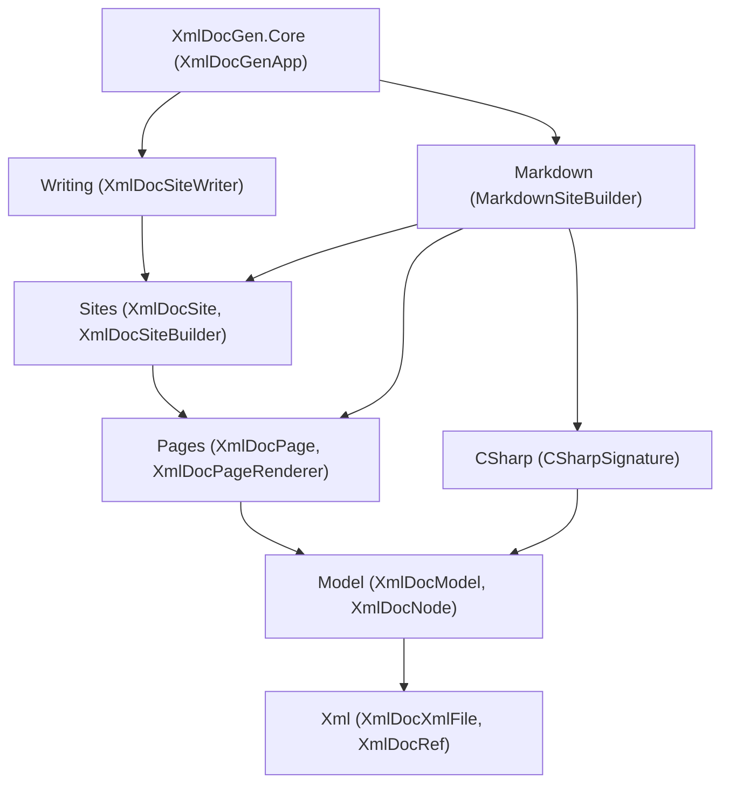

# XmlDocGen Plan

A plan for taking the current `XmlDocMarkdown.Core` work-in-progress and reshaping it into a new,
layered library named **XmlDocGen**, published to a new repository. No backward compatibility is
required.

The goal is a clean, **layered** API where each layer has a single responsibility and lives in its own
namespace. Every layer is **public and self-sufficient**: a client can take any layer and build their
own higher layers on top of it, or replace a layer entirely, without code duplication. The library
still makes it trivially easy to generate a GitHub/Docusaurus-friendly Markdown site by default.

## Goals

- One NuGet package, `XmlDocGen.Core`, consumed by a tiny local host tool (conventionally `XmlDocGen`)
  that references the assemblies to be documented and calls into the library.
- Markdown generation works out of the box with strong defaults.
- HTML (or any other output) is achievable by plugging in one component, without touching the rest.
- The API is layered, with each layer depending only on the layers below it:
  - Layers that perform **I/O** are separate from layers that work purely **in memory**.
  - **C# signature** generation is its own independently usable/testable layer.
  - **Markdown** generation is its own independently usable/testable layer, exposed as building blocks.
- A rich, reflection-backed object model (`XmlDocNode` and friends) is the single source of truth that
  all output formats render from, and it spans **multiple assemblies**.
- Filtering is first-class via a composable `XmlDocNodeVisibility`.
- Cross-references (including to types/members **outside** the documented assemblies) and path→URL
  mapping are customizable extension points.
- **Every layer is customizable** without rewriting the layers around it: page partitioning, signature
  formatting, link resolution, and per-section rendering are all override points.

## Namespaces

The root namespace matches the assembly name, `XmlDocGen.Core`, and each layer is a child namespace.

| Layer | Namespace | Responsibility | I/O? |
|-------|-----------|----------------|------|
| XML file | `XmlDocGen.Core.Xml` | Parse compiler-emitted XML; `XmlDocRef` value type. | In memory |
| Object model | `XmlDocGen.Core.Model` | Join reflection + XML into the `XmlDocNode` tree across assemblies; filtering. | In memory |
| C# signatures | `XmlDocGen.Core.CSharp` | Produce structured C# signatures/tokens from model nodes. | In memory |
| Pages | `XmlDocGen.Core.Pages` | Partition the model into pages; abstract page rendering. | In memory |
| Sites | `XmlDocGen.Core.Sites` | Assemble pages into a site; URL mapping; link resolution. | In memory |
| Markdown | `XmlDocGen.Core.Markdown` | Markdown building blocks + Markdown page renderer/site builder. | In memory |
| Writing | `XmlDocGen.Core.Writing` | Write a site to the file system (diff, clean, dry-run, verify). | **File system** |
| Application | `XmlDocGen.Core` (root) | CLI entry point wiring it all together. | Console + file system |

Dependency rule: a namespace may reference those above it in the table but never those below it. All
disk access lives in `XmlDocGen.Core.Writing` and the root app; everything else is pure in-memory work.



---

## Xml Layer (`XmlDocGen.Core.Xml`)

Pure parsing of the compiler-emitted `.xml` file plus the `XmlDocRef` value type. No reflection; no file
system beyond opt-in convenience loaders. This is today's `XmlDocFile`/`XmlDocMember`/`XmlDocBlock`
model, made public, moved to its own namespace, and renamed with an `XmlDocXml` prefix to avoid
collisions with higher-layer "file"/"site" concepts.

```csharp
namespace XmlDocGen.Core.Xml;

/// <summary>An XML documentation identifier, e.g. "T:My.Type" or "M:My.Type.Method(System.Int32)".</summary>
public readonly struct XmlDocRef : IEquatable<XmlDocRef>
{
    public XmlDocRef(string value);

    /// <summary>The raw identifier string (e.g. "T:My.Type").</summary>
    public string Value { get; }

    /// <summary>The member-kind prefix: 'T', 'M', 'P', 'F', 'E', or 'N' (namespace); '\0' if unknown.</summary>
    public char Kind { get; }

    /// <summary>Build a reference from reflection metadata.</summary>
    public static XmlDocRef ForType(Type type);
    public static XmlDocRef ForMember(MemberInfo member);
    public static XmlDocRef ForNamespace(string namespaceName);

    public bool Equals(XmlDocRef other);
    public override string ToString();    // returns Value
}

/// <summary>An in-memory representation of a compiler-generated XML documentation file.</summary>
public sealed class XmlDocXmlFile
{
    public XmlDocXmlFile();
    public XmlDocXmlFile(XDocument document);

    /// <summary>Opt-in loaders (the only I/O in this layer).</summary>
    public static XmlDocXmlFile Load(string path);
    public static XmlDocXmlFile Load(Stream stream);
    public static XmlDocXmlFile Parse(string xml);

    /// <summary>The assembly name from the &lt;assembly&gt; element, if present.</summary>
    public string? AssemblyName { get; }

    public IReadOnlyList<XmlDocXmlMember> Members { get; }

    /// <summary>Find documentation for the given reference.</summary>
    public XmlDocXmlMember? FindMember(XmlDocRef reference);
}

/// <summary>The parsed XML documentation for a single member.</summary>
public sealed class XmlDocXmlMember
{
    public XmlDocRef Ref { get; }                            // was XmlDocName (string)
    public IReadOnlyList<XmlDocXmlBlock> Summary { get; }
    public IReadOnlyList<XmlDocXmlParameter> TypeParameters { get; }
    public IReadOnlyList<XmlDocXmlParameter> Parameters { get; }
    public IReadOnlyList<XmlDocXmlBlock> ReturnValue { get; }
    public IReadOnlyList<XmlDocXmlBlock> PropertyValue { get; }
    public IReadOnlyList<XmlDocXmlException> Exceptions { get; }
    public IReadOnlyList<XmlDocXmlBlock> Remarks { get; }
    public IReadOnlyList<XmlDocXmlBlock> Examples { get; }
    public IReadOnlyList<XmlDocXmlSeeAlso> SeeAlso { get; }
}

public sealed class XmlDocXmlBlock { /* inlines + list kind */ }
public sealed class XmlDocXmlInline { /* text, code, see-ref (XmlDocRef), paramref, etc. */ }
public sealed class XmlDocXmlParameter { /* name + blocks */ }
public sealed class XmlDocXmlException { /* XmlDocRef + blocks */ }
public sealed class XmlDocXmlSeeAlso { /* XmlDocRef + text */ }
public enum XmlDocXmlListKind { Bullet, Number, Table }
```

### Examples

```csharp
// Parse an XML doc file and look up a type's summary, with no higher layers involved.
var xml = XmlDocXmlFile.Load("MyLib.xml");
var member = xml.FindMember(new XmlDocRef("T:MyLib.Widget"));
foreach (var block in member?.Summary ?? [])
    Console.WriteLine(block);

// Build a reference straight from reflection.
XmlDocRef widgetRef = XmlDocRef.ForType(typeof(MyLib.Widget));
XmlDocRef methodRef = XmlDocRef.ForMember(typeof(MyLib.Widget).GetMethod("Spin")!);
```

### Proposed additions
- `XmlDocRef.TryParse(string, out XmlDocRef)` and a `Name`/`Namespace` decomposition helper.
- An overload `XmlDocRef.ForType(Type, includeTypeArguments: bool)` to control constructed-generic refs.

### Open questions
- Should `XmlDocRef` normalize/validate input in its constructor, or stay a thin wrapper?
- Keep `XmlDocXmlInline` as one class with a kind discriminator, or split into a small inline hierarchy?
- Expose the inline model publicly now, or keep inlines internal until a non-Markdown renderer needs them?

---

## Model Layer (`XmlDocGen.Core.Model`)

The heart of the redesign: everything from **reflection**, joined with the matching `XmlDocXmlMember`
content, as an `XmlDocNode` tree spanning **multiple assemblies**. All downstream layers read from this
tree, so feature support (records, `required`, `ref struct`, etc.) is added here once.

```csharp
namespace XmlDocGen.Core.Model;

/// <summary>A documentation model built from one or more assemblies.</summary>
public sealed class XmlDocModel
{
    public static XmlDocModel Create(IEnumerable<XmlDocAssemblyNode> assemblies);

    public IReadOnlyList<XmlDocAssemblyNode> Assemblies { get; }

    /// <summary>Find any node in the model by reference (across all assemblies).</summary>
    public XmlDocNode? FindNode(XmlDocRef reference);
}

/// <summary>Base class for any documentable node (assembly, namespace, type, or member).</summary>
public abstract class XmlDocNode
{
    public abstract string Name { get; }                    // simple display name
    public abstract XmlDocRef Ref { get; }                  // this node's reference

    public XmlDocNode? Parent { get; }                      // null for assembly roots
    public XmlDocAssemblyNode Assembly { get; }             // owning assembly node
    public XmlDocXmlMember? Documentation { get; }          // joined XML doc, if any

    public bool IsObsolete { get; }
    public bool IsBrowsable { get; }
    public bool IsCompilerGenerated { get; }
    public XmlDocVisibility Visibility { get; }

    public IReadOnlyList<XmlDocNode> Children { get; }      // unfiltered
    public IEnumerable<XmlDocNode> GetChildren(XmlDocNodeVisibility visibility);
}

public sealed class XmlDocAssemblyNode : XmlDocNode
{
    /// <summary>Build a single-assembly node by joining reflection with parsed XML documentation.</summary>
    public static XmlDocAssemblyNode Create(Assembly assembly, XmlDocXmlFile xmlFile);

    public Assembly Assembly { get; }                       // the reflected assembly
    public XmlDocXmlFile XmlFile { get; }                   // the parsed XML doc file
    public IReadOnlyList<XmlDocNamespaceNode> Namespaces { get; }
}

public sealed class XmlDocNamespaceNode : XmlDocNode
{
    public IReadOnlyList<XmlDocTypeNode> Types { get; }     // top-level types in this namespace
}

public sealed class XmlDocTypeNode : XmlDocNode
{
    public Type Type { get; }
    public XmlDocTypeKind Kind { get; }
    public IReadOnlyList<XmlDocTypeNode> NestedTypes { get; }
    public IReadOnlyList<XmlDocMemberNode> Members { get; }
    // structural signature data: base type, interfaces, type parameters + constraints, modifiers
}

public sealed class XmlDocMemberNode : XmlDocNode
{
    public MemberInfo MemberInfo { get; }
    public XmlDocMemberKind MemberKind { get; }
    // structural signature data: parameters, return type, accessors, modifiers
}

public enum XmlDocVisibility { Private, Internal, ProtectedInternal, Protected, Public }
public enum XmlDocTypeKind { Class, Struct, Interface, Enum, Delegate, Record, RecordStruct }
public enum XmlDocMemberKind { Constructor, Method, Property, Field, Event, Operator }
```

Notes:
- `XmlDocVisibility` replaces today's `XmlDocVisibilityLevel`, framed as "the node's own visibility"
  rather than "the minimum to document." Filtering is done by `XmlDocNodeVisibility` (below).
- The tree exposes **structural** signature data so any formatter (C#, Markdown, HTML) can build
  signatures itself; the canonical C# text is produced by the `CSharp` layer.

### Visibility / filtering

`XmlDocNodeVisibility` is an abstract base with one conceptual method, `IsVisible(XmlDocNode)`, plus a
static property per visibility level and a small set of fluent exclusions. `Include`/`And` are
intentionally omitted to keep the surface minimal.

```csharp
namespace XmlDocGen.Core.Model;

public abstract class XmlDocNodeVisibility
{
    public abstract bool IsVisible(XmlDocNode node);

    /// <summary>One ready-made filter per visibility level (each includes that level and above).</summary>
    public static XmlDocNodeVisibility Public { get; }
    public static XmlDocNodeVisibility Protected { get; }            // default
    public static XmlDocNodeVisibility ProtectedInternal { get; }
    public static XmlDocNodeVisibility Internal { get; }
    public static XmlDocNodeVisibility Private { get; }              // includes everything

    /// <summary>Equivalent to the matching static property.</summary>
    public static XmlDocNodeVisibility Create(XmlDocVisibility minimum);

    // Fluent, composable refinements (each returns a new XmlDocNodeVisibility):
    public XmlDocNodeVisibility ExcludeObsolete();
    public XmlDocNodeVisibility ExcludeUnbrowsable();
    public XmlDocNodeVisibility ExcludeCompilerGenerated();
    public XmlDocNodeVisibility Exclude(Func<XmlDocNode, bool> shouldExclude);
}
```

### Examples

```csharp
// Build a multi-assembly model directly from reflection + XML, no higher layers.
var widgets = XmlDocAssemblyNode.Create(typeof(Widget).Assembly, XmlDocXmlFile.Load("Widgets.xml"));
var gadgets = XmlDocAssemblyNode.Create(typeof(Gadget).Assembly, XmlDocXmlFile.Load("Gadgets.xml"));
var model = XmlDocModel.Create([widgets, gadgets]);

// Walk visible public types and print their names.
var visibility = XmlDocNodeVisibility.Public.ExcludeObsolete().ExcludeCompilerGenerated();
foreach (var assembly in model.Assemblies)
    foreach (var ns in assembly.Namespaces)
        foreach (var type in ns.GetChildren(visibility))
            Console.WriteLine(type.Name);

// A completely custom filter.
sealed class TestApiVisibility : XmlDocNodeVisibility
{
    public override bool IsVisible(XmlDocNode node) => !node.Name.EndsWith("Internal", StringComparison.Ordinal);
}
```

### Proposed additions
- `XmlDocModel.Create(IEnumerable<(Assembly, XmlDocXmlFile)>)` convenience overload.
- `XmlDocNode.DescendantsAndSelf(XmlDocNodeVisibility)` for easy whole-tree traversal.
- `XmlDocNode.TryGetAttribute<T>()` to surface arbitrary attributes for advanced filtering/rendering.

### Open questions
- Should `XmlDocModel` own cross-assembly de-duplication/forwarding (type forwards, `InternalsVisibleTo`)?
- Should `GetChildren` be recursive-aware (a parent hidden by visibility hiding its children), or do
  callers compose that themselves?
- Do we expose `XmlDocVisibility` ordering helpers (e.g. `>=`) or keep comparisons internal?

---

## CSharp Layer (`XmlDocGen.Core.CSharp`)

C# signature generation as an independent, testable layer. It turns model nodes into **structured
signatures** (a token list) so any output format can render them — Markdown can hyperlink type tokens,
HTML can wrap them in spans, and plain text can ignore the structure.

```csharp
namespace XmlDocGen.Core.CSharp;

public enum CSharpTokenKind { Keyword, Identifier, TypeName, Operator, Punctuation, Whitespace, Literal }

/// <summary>One piece of a C# signature.</summary>
public readonly struct CSharpToken
{
    public CSharpTokenKind Kind { get; }
    public string Text { get; }

    /// <summary>For TypeName/Identifier tokens that refer to a documentable entity, its reference.</summary>
    public XmlDocRef? Reference { get; }
}

/// <summary>A structured C# signature.</summary>
public sealed class CSharpSignature
{
    public IReadOnlyList<CSharpToken> Tokens { get; }
    public override string ToString();                      // concatenated token text
}

public sealed class CSharpSignatureOptions
{
    public bool IncludeAccessModifiers { get; set; } = true;
    public bool IncludeParameterNames { get; set; } = true;
    public bool FullyQualifyTypes { get; set; }
    // ...future knobs (e.g. nullable annotations, default values)
}

/// <summary>Builds C# signatures from model nodes. Virtual methods are override points.</summary>
public class CSharpSignatureWriter
{
    public CSharpSignatureWriter(CSharpSignatureOptions? options = null);

    public virtual CSharpSignature GetTypeSignature(XmlDocTypeNode type);
    public virtual CSharpSignature GetMemberSignature(XmlDocMemberNode member);

    /// <summary>The short, link-friendly signature used in summary tables.</summary>
    public virtual CSharpSignature GetShortSignature(XmlDocNode node);
}
```

### Examples

```csharp
// Render a type's signature as plain C#, no Markdown involved.
var type = (XmlDocTypeNode) model.FindNode(XmlDocRef.ForType(typeof(Widget)))!;
CSharpSignature sig = new CSharpSignatureWriter().GetTypeSignature(type);
Console.WriteLine(sig.ToString());   // "public sealed class Widget : IWidget"

// Inspect the tokens to build your own hyperlinked output.
foreach (var token in sig.Tokens)
    if (token.Kind == CSharpTokenKind.TypeName && token.Reference is { } r)
        Console.WriteLine($"links to {r}");
```

### Proposed additions
- A `CSharpKeywords` helper exposing the language keyword set for syntax highlighting.
- Optional XML-doc-style display of constructed generics and tuple element names.

### Open questions
- Token granularity: one token per syntactic atom (more flexible) vs. coarser chunks (simpler)?
- Should this layer also produce the file-name-safe **identifier** for a node, or does that belong to
  the page/URL layer? (Leaning: page layer owns paths; CSharp owns signatures only.)

---

## Pages Layer (`XmlDocGen.Core.Pages`)

Page building, cleanly separated from site building. This layer decides **which nodes go on which page**
(the layout) and defines the **abstract page renderer** that formats one page. Whether namespaces get
their own page is a property of the layout here — not a global setting.

```csharp
namespace XmlDocGen.Core.Pages;

/// <summary>A logical page: the nodes documented together in one output file.</summary>
public sealed class XmlDocPage
{
    public XmlDocPage(string path, XmlDocNode primaryNode, IEnumerable<XmlDocNode> nodes);

    public string Path { get; }                             // site-relative, '/'-separated, no extension
    public XmlDocNode PrimaryNode { get; }                  // the page's subject
    public IReadOnlyList<XmlDocNode> Nodes { get; }         // all nodes documented on the page
}

/// <summary>Partitions a model into pages and assigns each page a path. Override points are virtual.</summary>
public class XmlDocPageLayout
{
    public XmlDocPageLayout(XmlDocPageLayoutOptions? options = null);

    public virtual IReadOnlyList<XmlDocPage> CreatePages(XmlDocModel model, XmlDocNodeVisibility visibility);

    /// <summary>Compute the site-relative path (no extension) for a node's page.</summary>
    protected virtual string GetPagePath(XmlDocNode node);
}

public sealed class XmlDocPageLayoutOptions
{
    /// <summary>Generate a separate page per namespace (replaces the old NamespacePages setting).</summary>
    public bool NamespacePages { get; set; }

    /// <summary>Give each member its own page (vs. documenting members inline on the type page).</summary>
    public bool MemberPages { get; set; } = true;
}

/// <summary>Renders a single page to file text. Format-specific subclasses implement this.</summary>
public abstract class XmlDocPageRenderer
{
    /// <summary>The output file extension (e.g. ".md", ".html").</summary>
    public abstract string FileExtension { get; }

    /// <summary>Render the page using cross-page context (link resolution, sibling pages).</summary>
    public abstract string RenderPage(XmlDocPage page, XmlDocPageContext context);
}

/// <summary>Context available while rendering a page: link resolution and page lookup.</summary>
public sealed class XmlDocPageContext
{
    public XmlDocModel Model { get; }
    public XmlDocPage Page { get; }
    public IReadOnlyList<XmlDocPage> AllPages { get; }
    public XmlDocLinkResolver Links { get; }

    /// <summary>Find the page that documents a node, for cross-page links.</summary>
    public XmlDocPage? FindPage(XmlDocNode node);
    public XmlDocPage? FindPage(XmlDocRef reference);
}
```

### Examples

```csharp
// Compute the page set for a model without building a site or writing files.
var layout = new XmlDocPageLayout(new XmlDocPageLayoutOptions { NamespacePages = true });
IReadOnlyList<XmlDocPage> pages = layout.CreatePages(model, XmlDocNodeVisibility.Public);
foreach (var page in pages)
    Console.WriteLine($"{page.Path} <- {page.PrimaryNode.Name}");

// A custom layout that flattens everything onto one page per type (no member pages).
var flat = new XmlDocPageLayout(new XmlDocPageLayoutOptions { MemberPages = false });
```

### Proposed additions
- `XmlDocPageLayout.GetAnchor(XmlDocNode)` for intra-page anchors when members share a type page.
- A `OnePageLayout` and `PerTypeLayout` ready-made subclass for common shapes.

### Open questions
- Should `XmlDocPage.Path` include or exclude the extension? (Leaning: exclude; the renderer adds it.)
- Does the layout need to know the `XmlDocUrlMapper`, or is path assignment purely structural and the
  mapper applied later in the Sites layer? (Leaning: structural here, mapping in Sites.)

---

## Sites Layer (`XmlDocGen.Core.Sites`)

Site building: assemble rendered pages into a complete in-memory site, resolve cross-references
(including **outside** the documented assemblies), and map paths to URLs. Format-agnostic — it takes an
`XmlDocPageRenderer` and is unaware of Markdown vs HTML.

```csharp
namespace XmlDocGen.Core.Sites;

/// <summary>A generated documentation site: a set of output files.</summary>
public sealed class XmlDocSite
{
    public XmlDocSite(IEnumerable<XmlDocSiteFile> files);
    public IReadOnlyList<XmlDocSiteFile> Files { get; }
}

/// <summary>A single generated output file (formerly NamedText).</summary>
public sealed class XmlDocSiteFile
{
    public XmlDocSiteFile(string path, string text);
    public string Path { get; }                             // site-relative, '/'-separated, with extension
    public string Text { get; }
}

/// <summary>Maps a page path to the relative URL used to link to it from another page.</summary>
public abstract class XmlDocUrlMapper
{
    public abstract string GetUrl(string fromPath, string targetPath);
    public static XmlDocUrlMapper GitHub { get; }           // relative ".md" links (default)
    public static XmlDocUrlMapper Docusaurus { get; }       // extensionless, slugged links
}

/// <summary>The result of resolving a reference to a link.</summary>
public readonly struct XmlDocLink
{
    public XmlDocLink(string url, string? text = null);
    public string Url { get; }                              // relative (in-site) or absolute (external)
    public string? Text { get; }                            // optional display text
}

/// <summary>
/// Resolves a reference to a link. Replaces the old "external documentation" concept with a single
/// abstraction that covers both in-site links and links to types/members outside the documented set.
/// </summary>
public abstract class XmlDocLinkResolver
{
    public abstract XmlDocLink? ResolveLink(XmlDocRef reference, string fromPath);

    /// <summary>Try each resolver in order; first non-null wins.</summary>
    public static XmlDocLinkResolver Combine(params XmlDocLinkResolver[] resolvers);
}

/// <summary>Links references found in the site to their generated pages (via an XmlDocUrlMapper).</summary>
public sealed class XmlDocSiteLinkResolver : XmlDocLinkResolver { /* ctor(pages, urlMapper) */ }

/// <summary>Links framework/BCL references (System.*, etc.) to Microsoft Learn.</summary>
public sealed class DotNetApiLinkResolver : XmlDocLinkResolver { /* configurable base URL */ }

/// <summary>Builds a site by rendering each page with a page renderer.</summary>
public class XmlDocSiteBuilder
{
    public XmlDocSiteBuilder(XmlDocPageRenderer renderer, XmlDocSiteBuilderSettings? settings = null);

    public XmlDocSite Build(XmlDocModel model);
}

public sealed class XmlDocSiteBuilderSettings
{
    public XmlDocNodeVisibility? Visibility { get; set; }   // default: Protected
    public XmlDocPageLayout? Layout { get; set; }           // default: new XmlDocPageLayout()
    public XmlDocUrlMapper? UrlMapper { get; set; }         // default: GitHub
    public XmlDocLinkResolver? ExternalLinks { get; set; }  // default: DotNetApiLinkResolver
    public string? NewLine { get; set; }
}
```

The builder composes the link resolver: an `XmlDocSiteLinkResolver` for in-site references combined with
the configured external resolver (default `DotNetApiLinkResolver`), so renderers get one unified
`XmlDocLinkResolver` and never special-case "external" links.

### Examples

```csharp
// Build a site in memory using a custom page renderer (no Markdown, no file I/O).
sealed class JsonPageRenderer : XmlDocPageRenderer
{
    public override string FileExtension => ".json";
    public override string RenderPage(XmlDocPage page, XmlDocPageContext context) =>
        JsonSerializer.Serialize(new { page.Path, primary = page.PrimaryNode.Name });
}

var site = new XmlDocSiteBuilder(new JsonPageRenderer()).Build(model);
foreach (var file in site.Files)
    Console.WriteLine(file.Path);

// Link to System types on Microsoft Learn, everything else within the site.
var resolver = XmlDocLinkResolver.Combine(
    new DotNetApiLinkResolver(),
    /* site resolver supplied internally by the builder */ null!);
```

### Proposed additions
- A `MicrosoftDocsLinkResolver` vs. a generic `UrlPatternLinkResolver` for arbitrary external sources.
- `XmlDocSite.FindFile(string path)` and stable ordering guarantees for deterministic output.

### Open questions
- Should `XmlDocLinkResolver` receive the `fromPath` (current design) or return an abstract target that
  the URL mapper later turns into a relative URL? The latter decouples resolution from URL style.
- Where does anchor handling live when multiple nodes share a page — in the link resolver or the renderer?

---

## Markdown Layer (`XmlDocGen.Core.Markdown`)

Markdown generation as an independent, testable layer exposed as **building blocks**. This is the only
place Markdown syntax lives. The page renderer is composed of small virtual methods so a client can
override a single section (e.g. how parameters render) without duplicating the rest.

```csharp
namespace XmlDocGen.Core.Markdown;

/// <summary>Low-level Markdown emit helpers (formerly MarkdownWriter).</summary>
public sealed class MarkdownWriter
{
    public MarkdownWriter(TextWriter writer);
    public void Write(string text);
    public void WriteLine();
    public void WriteLine(string text);
    public void WriteLink(string text, string url);
    public void WriteHeading(int level, string text);
    public void WriteTableRow(params string[] cells);
    // ...code spans, fenced blocks, etc.
}

/// <summary>Renders model content as Markdown fragments. Reusable building blocks; all virtual.</summary>
public class MarkdownRenderer
{
    public MarkdownRenderer(CSharpSignatureWriter? signatures = null);

    public virtual string RenderSignature(XmlDocNode node, XmlDocPageContext context);   // links type tokens
    public virtual string RenderSummary(XmlDocNode node, XmlDocPageContext context);
    public virtual string RenderRemarks(XmlDocNode node, XmlDocPageContext context);
    public virtual string RenderParameters(XmlDocMemberNode member, XmlDocPageContext context);
    public virtual string RenderSeeAlso(XmlDocNode node, XmlDocPageContext context);
    public virtual string RenderInlines(IEnumerable<XmlDocXmlInline> inlines, XmlDocPageContext context);
}

/// <summary>A page renderer that emits Markdown. Override points map to MarkdownRenderer blocks.</summary>
public class MarkdownPageRenderer : XmlDocPageRenderer
{
    public MarkdownPageRenderer(MarkdownPageRendererOptions? options = null);

    public override string FileExtension => ".md";
    public override string RenderPage(XmlDocPage page, XmlDocPageContext context);

    protected MarkdownRenderer Renderer { get; }            // reuse/override individual blocks
    protected virtual void WriteFrontMatter(MarkdownWriter writer, XmlDocPage page);
    protected virtual void WriteHeader(MarkdownWriter writer, XmlDocPage page, XmlDocPageContext context);
    protected virtual void WriteBody(MarkdownWriter writer, XmlDocPage page, XmlDocPageContext context);
}

public sealed class MarkdownPageRendererOptions
{
    public string? FrontMatter { get; set; }                // optional Jekyll/Docusaurus front matter
}

/// <summary>Convenience: an XmlDocSiteBuilder preconfigured with a MarkdownPageRenderer.</summary>
public sealed class MarkdownSiteBuilder
{
    public MarkdownSiteBuilder(XmlDocSiteBuilderSettings? settings = null, MarkdownPageRendererOptions? markdown = null);
    public XmlDocSite Build(XmlDocModel model);
}
```

An HTML layer would be a sibling `XmlDocGen.Core.Html` with an `HtmlPageRenderer : XmlDocPageRenderer`
and analogous building blocks, reusing every lower layer unchanged.

### Examples

```csharp
// Render a single page to Markdown without writing files.
var pages = new XmlDocPageLayout().CreatePages(model, XmlDocNodeVisibility.Public);
var renderer = new MarkdownPageRenderer();
var context = /* obtained from XmlDocSiteBuilder, or constructed for a unit test */;
string markdown = renderer.RenderPage(pages[0], context);

// Customize only the parameter table, reusing every other block.
sealed class MyRenderer : MarkdownRenderer
{
    public override string RenderParameters(XmlDocMemberNode m, XmlDocPageContext c) =>
        "> custom params\n" + base.RenderParameters(m, c);
}

// Use the building blocks directly to assemble a bespoke page.
using var sw = new StringWriter();
var md = new MarkdownWriter(sw);
md.WriteHeading(1, "Widget");
md.WriteLine(new MarkdownRenderer().RenderSummary(widgetNode, context));
```

### Proposed additions
- A `MarkdownInlineRenderer` extension point so `<see>`/`<paramref>` handling is overridable in isolation.
- Pluggable table styles (GitHub pipe tables vs. HTML tables inside Markdown).

### Open questions
- Should `MarkdownRenderer` return strings (simple) or write into a shared `MarkdownWriter` (less
  allocation, easier composition)? Leaning toward writer-based with string overloads for convenience.
- Front matter as a raw template string vs. a small structured front-matter model?

---

## Writing Layer (`XmlDocGen.Core.Writing`)

The only layer (besides the app) that touches the file system. Takes an already-built `XmlDocSite` and
writes it with diffing, clean, dry-run, and verify semantics. Adapted from the I/O half of today's
`XmlDocMarkdownGenerator.Generate`.

```csharp
namespace XmlDocGen.Core.Writing;

public sealed class XmlDocSiteWriter
{
    public XmlDocSiteWriter(XmlDocSiteWriterSettings? settings = null);

    /// <summary>Write the site to the output directory, returning what changed.</summary>
    public XmlDocSiteWriteResult Write(XmlDocSite site, string outputPath);
}

public sealed class XmlDocSiteWriterSettings
{
    public bool ShouldClean { get; set; }                   // delete stale generated files
    public bool IsDryRun { get; set; }                      // compute result without writing
    public bool IsQuiet { get; set; }                       // suppress per-file messages

    /// <summary>Marks files this tool owns so --clean only deletes generated files (default: code-gen marker).</summary>
    public string? GeneratedMarker { get; set; }
}

public sealed class XmlDocSiteWriteResult
{
    public IReadOnlyList<string> Added { get; }
    public IReadOnlyList<string> Changed { get; }
    public IReadOnlyList<string> Removed { get; }
    public IReadOnlyList<string> Messages { get; }
    public bool HasChanges => Added.Count + Changed.Count + Removed.Count != 0;
}
```

### Examples

```csharp
// Write any site to disk; works for Markdown, HTML, JSON — anything that produced XmlDocSiteFiles.
var result = new XmlDocSiteWriter(new XmlDocSiteWriterSettings { ShouldClean = true })
    .Write(site, "docs");
foreach (var message in result.Messages)
    Console.WriteLine(message);

// Verify mode: report whether regeneration would change anything, write nothing.
var check = new XmlDocSiteWriter(new XmlDocSiteWriterSettings { IsDryRun = true }).Write(site, "docs");
return check.HasChanges ? 1 : 0;
```

### Proposed additions
- A pluggable file system abstraction (`IFileSystem`) so writing can be unit-tested without a temp dir.
- An option to control newline normalization on write independent of the builder.

### Open questions
- Should the CR-insensitive comparison be configurable, or always normalize newlines before comparing?
- Should `--clean` detection rely on the marker, a manifest file, or both?

---

## Application Layer (`XmlDocGen.Core` root)

The thin top layer: a CLI that wires the layers together. Defaults to Markdown; a `configure` callback
lets the host customize any layer. Loads **one or more** assemblies by name with their sibling `.xml`.

```csharp
namespace XmlDocGen.Core;

public sealed class XmlDocGenApp
{
    public static int Run(IReadOnlyList<string> args, Action<XmlDocGenAppContext>? configure = null);
}

/// <summary>Passed to the configure callback to tweak any layer before generation runs.</summary>
public sealed class XmlDocGenAppContext
{
    public IReadOnlyList<string> AssemblyNames { get; }
    public string OutputPath { get; }

    public XmlDocNodeVisibility Visibility { get; set; }            // default: Protected.ExcludeObsolete()...
    public XmlDocPageLayout Layout { get; set; }                    // default: new XmlDocPageLayout()
    public XmlDocPageRenderer Renderer { get; set; }               // default: MarkdownPageRenderer
    public XmlDocUrlMapper UrlMapper { get; set; }                  // default: GitHub
    public XmlDocLinkResolver ExternalLinks { get; set; }          // default: DotNetApiLinkResolver
    public XmlDocSiteWriterSettings WriterSettings { get; }        // clean/dryrun/quiet/verify from CLI
}
```

CLI surface:

```
Usage: XmlDocGen <input-assembly>... <output-dir> [options]
  --clean     Delete previously generated files that are no longer used.
  --dryrun    Run without writing to the file system.
  --quiet     Suppress normal console output.
  --verify    Exit with code 1 if changes are needed.
  --help, -h, -?
```

Internally `Run`:
1. Parses args (reuse `ArgsReader`); supports multiple input assemblies.
2. For each assembly, loads it by name and its sibling `.xml`/`.XML`, building `XmlDocAssemblyNode`s,
   then `XmlDocModel.Create(...)`.
3. Builds defaults (Markdown renderer, default layout/URL mapper/external links), invokes `configure`.
4. `new XmlDocSiteBuilder(renderer, settings).Build(model)` → `XmlDocSite`.
5. `new XmlDocSiteWriter(writerSettings).Write(site, outputPath)` → result; prints; returns exit code.

### Examples

```csharp
// Minimal host tool ("XmlDocGen") that documents two assemblies as Markdown.
return XmlDocGenApp.Run(args);

// Host tool that switches to Docusaurus URLs and excludes internal members.
return XmlDocGenApp.Run(args, ctx =>
{
    ctx.Visibility = XmlDocNodeVisibility.Public.ExcludeObsolete();
    ctx.UrlMapper = XmlDocUrlMapper.Docusaurus;
});
```

### Open questions
- How are per-assembly settings (e.g. different visibility per assembly) expressed, if needed?
- Should the app accept assembly **paths** as well as names, or stay name-only as in current v3?

---

## Reuse Map (current → new)

| Current type | New type | Namespace |
|---|---|---|
| `XmlDocFile`, `XmlDocMember`, `XmlDocBlock`, `XmlDocInline`, `XmlDocParameter`, `XmlDocSeeAlso`, `XmlDocException`, `XmlDocListKind` | `XmlDocXmlFile`, `XmlDocXmlMember`, … (`XmlDocXml` prefix), public | `XmlDocGen.Core.Xml` |
| `XmlDocUtility.GetXmlDocRef` | `XmlDocRef` (readonly struct + `ForType`/`ForMember`) | `XmlDocGen.Core.Xml` |
| `XmlDocVisibilityLevel` | `XmlDocVisibility` + `XmlDocNodeVisibility` | `XmlDocGen.Core.Model` |
| reflection logic in `MarkdownGenerator` (`IsVisible`, `GetTypeKind`, tree walk) | `XmlDocNode` tree + `XmlDocModel` (multi-assembly) | `XmlDocGen.Core.Model` |
| signature building in `MarkdownGenerator` | `CSharpSignatureWriter`, `CSharpSignature`, `CSharpToken` | `XmlDocGen.Core.CSharp` |
| paging/path logic in `MarkdownGenerator`, `NamespacePages` | `XmlDocPageLayout` (+ options), `XmlDocPage` | `XmlDocGen.Core.Pages` |
| `NamedText` | `XmlDocSiteFile` (+ `XmlDocSite`) | `XmlDocGen.Core.Sites` |
| permalink/`MakeRelative`/`GetSafeName`/`GetPermalink`, `PermalinkStyle` | `XmlDocUrlMapper` (GitHub/Docusaurus) | `XmlDocGen.Core.Sites` |
| `ExternalDocumentation` | **removed**; replaced by `XmlDocLinkResolver` + `DotNetApiLinkResolver` | `XmlDocGen.Core.Sites` |
| `MarkdownGenerator` orchestration | `XmlDocSiteBuilder` (format-agnostic) | `XmlDocGen.Core.Sites` |
| `MarkdownGenerator` rendering, `MarkdownWriter` | `MarkdownPageRenderer`, `MarkdownRenderer`, `MarkdownWriter` | `XmlDocGen.Core.Markdown` |
| `XmlDocMarkdownSettings` | split across builder/layout/renderer/writer settings | various |
| I/O half of `XmlDocMarkdownGenerator.Generate`, `XmlDocMarkdownResult` | `XmlDocSiteWriter`, `XmlDocSiteWriteResult` | `XmlDocGen.Core.Writing` |
| `XmlDocMarkdownApp` | `XmlDocGenApp` (+ `XmlDocGenAppContext`) | `XmlDocGen.Core` (root) |
| `ArgsReader`, `ArgsReaderException`, `CommonArgs` | reused, internal | (internal) |

---

## Repository & Packaging

- New repo, new package id `XmlDocGen.Core` (root namespace `XmlDocGen.Core`).
- Target the current LTS (`net8.0`), C# 12, nullable enabled, central package management — carry over
  the existing build template, `Directory.Build.props`, `Directory.Packages.props`, `build.ps1`.
- Projects:
  - `src/XmlDocGen.Core` — the library (all layers/namespaces).
  - `tests/XmlDocGen.Core.Tests` — unit + integration tests.
  - `tools/ExampleAssembly` (and a second example assembly) — example types per language feature.
  - `tools/XmlDocGen` — the local host tool used to regenerate this repo's own docs.
- Carry over the docs-verification build target (regenerate `docs/` and fail on diff).
- Open question: ship all layers in one `XmlDocGen.Core` assembly (current plan) vs. splitting
  Markdown/HTML into add-on packages later. Plan assumes one assembly with namespace separation.

---

## Example Assemblies

The example assembly can be reorganized to make tests clearer. Proposed structure:

- **Two assemblies** so multi-assembly model and cross-assembly linking are exercised end to end.
- Group example types by **theme**, each in its own namespace, so tests can target a focused subset:
  - `Features.Records`, `Features.Structs`, `Features.Generics`, `Features.Operators`,
    `Features.Members`, `Features.Modifiers` — one type (or a few) per modern C# feature.
  - `Visibility.*` — types/members at every visibility level for filtering tests.
  - `Filtering.*` — obsolete, unbrowsable, and compiler-generated examples.
  - `Linking.*` — types that reference BCL types and types in the *other* example assembly.
  - `Docs.*` — rich XML doc comments (summary/remarks/params/exceptions/seealso/lists/code) for
    renderer snapshot tests.
- Each example type carries an assertion (model-level) and, where relevant, a checked-in expected
  signature and rendered page.

---

## Testing Plan

A primary goal is comprehensive coverage. The layering lets us unit-test each layer in isolation, with
end-to-end integration tests on top.

### Xml layer
- Parse representative fragments: summary, remarks, params, typeparams, returns, value, exceptions,
  examples, seealso, nested `<list>`/`<code>`/`<see>`/`<paramref>` inlines.
- Malformed/partial XML handled gracefully; unknown elements ignored.
- `XmlDocRef`: `ForType`/`ForMember`/`ForNamespace` against `ExampleAssembly` produce the exact strings
  the compiler emits; equality and `Kind` parsing; round-trip `new XmlDocRef(x.Value)`.
- `FindMember(XmlDocRef)` lookups; `AssemblyName` extraction.

### Model layer
- `XmlDocAssemblyNode.Create`: tree shape/counts, nesting, `Assembly`/`XmlFile` exposed correctly.
- `XmlDocModel.Create` over **two** assemblies; `FindNode` resolves cross-assembly refs.
- `Documentation` join: each node maps to the right `XmlDocXmlMember` by `Ref`.
- Correct `Visibility`, `IsObsolete`, `IsBrowsable`, `IsCompilerGenerated`, `Kind`, `MemberKind`.
- `XmlDocNodeVisibility`: each static level property; `ExcludeObsolete`/`ExcludeUnbrowsable`/
  `ExcludeCompilerGenerated` alone and combined; `Exclude` predicate; custom subclass.
- Modern C# feature coverage (table-driven against `Features.*`): records/record structs,
  readonly/ref struct, required/init, in/ref readonly/scoped, function pointers, static abstract
  members, checked/`>>>` operators, newer generic constraints, primary constructors.

### CSharp layer
- `CSharpSignatureWriter` golden tests: type and member signatures (and short signatures) for each
  `Features.*` example, asserted as exact token sequences and as `ToString()` text.
- Type tokens carry the correct `XmlDocRef`; options (`FullyQualifyTypes`, `IncludeParameterNames`).
- Subclass override changes one signature shape without affecting others.

### Pages layer
- `XmlDocPageLayout.CreatePages`: page set and paths with `NamespacePages` on/off and `MemberPages`
  on/off; `PrimaryNode` correctness; visibility applied during partitioning.
- `XmlDocPageContext.FindPage(node/ref)` resolves to the expected page.
- Custom layout subclass (`GetPagePath` override) changes paths predictably.

### Sites layer
- `XmlDocUrlMapper.GitHub`/`Docusaurus`: relative links across sibling/parent/child/same-page; period
  and extension handling; global namespace; deep nesting; safe-name escaping.
- `XmlDocLinkResolver`: `XmlDocSiteLinkResolver` resolves in-site refs to page URLs;
  `DotNetApiLinkResolver` maps `System.*` to Learn URLs; `Combine` ordering/first-wins.
- `XmlDocSiteBuilder` with a tiny test renderer (e.g. JSON) proves it is genuinely format-agnostic.

### Markdown layer
- `MarkdownWriter` primitives (headings, links, table rows, code/fenced blocks).
- `MarkdownRenderer` block methods over `Docs.*` examples: **approval/snapshot tests** for summary,
  remarks, parameters, see-also, inline `<see>`/`<paramref>` resolution to links.
- `MarkdownPageRenderer` full-page snapshots (assembly/namespace/type/member pages); front matter on/off;
  `NewLine` honored; overriding one block method changes only that section.
- Cross-assembly links render correctly between the two example assemblies.

### Writing layer
- Write to a temp dir (or `IFileSystem` fake): files created with correct content and `/`→OS paths.
- Diffing: added/changed/removed classification; CR-insensitive comparison.
- `--clean` deletes only marked generated files; leaves hand-authored files.
- `IsDryRun` writes nothing but computes the result; `IsQuiet` suppresses messages; idempotency.

### Application layer (end-to-end)
- Arg parsing: missing input/output, multiple inputs, unknown flags, `--help` (exit codes 0/2).
- Full run over both example assemblies to a temp dir; compare against checked-in expected docs.
- `--verify` returns 1 when changes needed, 0 when clean; `--dryrun`/`--quiet`/`--clean`.
- `configure` can swap `Visibility`, `Renderer`, `UrlMapper`, `ExternalLinks`, `Layout`.
- Missing XML doc file → friendly error and non-zero exit.

### Cross-cutting
- Keep `docs/` regeneration as an integration test (regenerate, fail on diff), but diagnose rendering
  via unit + snapshot tests.
- Add code-coverage collection and a minimum coverage bar for `XmlDocGen.Core`.
- Run CI on Ubuntu, Windows, and macOS.
- Choose a snapshot/approval library (e.g. Verify) or a checked-in-expected-file convention — TBD.

---

## Cross-Cutting Open Questions

- **Single assembly vs. multiple packages**: one `XmlDocGen.Core` with namespaces (current plan) vs.
  splitting Markdown/HTML into add-on packages later.
- **Renderer return type**: string-returning blocks (simple) vs. `MarkdownWriter`-based (composable).
- **Link resolution shape**: pass `fromPath` to the resolver vs. return an abstract target mapped to a
  URL later by `XmlDocUrlMapper`.
- **Anchors**: how shared-page members get stable intra-page anchors, and which layer owns them.
- **Front matter**: raw template string vs. structured front-matter model.

---

## Suggested Build Order

1. `Xml` — port + make public; `XmlDocRef`; full parser/ref tests.
2. `Model` — node tree, `XmlDocModel` (multi-assembly), `XmlDocNodeVisibility`; model tests.
3. `CSharp` — structured signatures; golden signature tests.
4. `Pages` — layout + page model + abstract renderer; layout tests.
5. `Sites` — site model, URL mapping, link resolution, format-agnostic builder; mapper/resolver tests.
6. `Markdown` — building blocks + page renderer; snapshot tests; reach output parity with today.
7. `Writing` — writer + diff/clean; I/O tests.
8. `XmlDocGen.Core` app — CLI; end-to-end tests; regenerate `docs/`.
9. Coverage, CI matrix, README, release notes.
