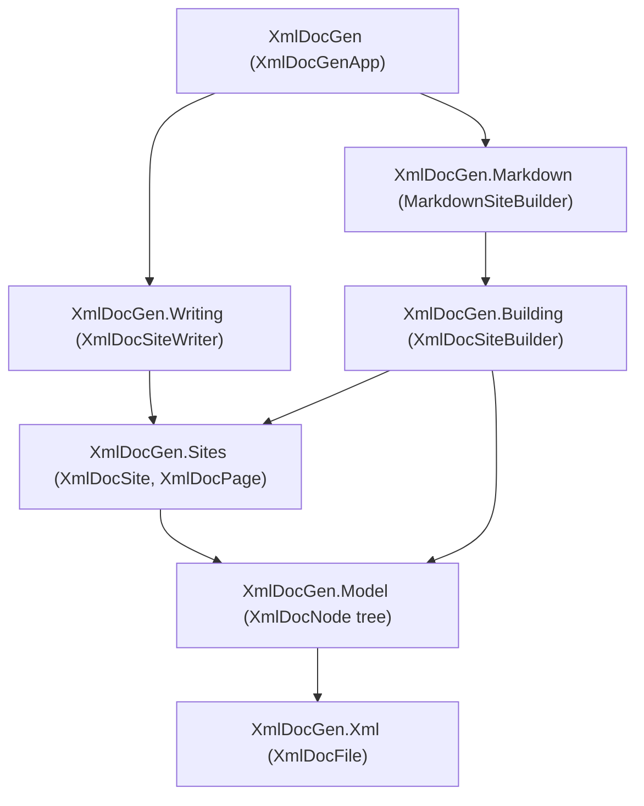

# XmlDocGen Plan

A plan for taking the current `XmlDocMarkdown.Core` work-in-progress and reshaping it into a new,
layered library named **XmlDocGen**, published to a new repository. No backward compatibility is
required. The goal is a clean, layered API where each layer has a single responsibility, lives in its
own namespace, and can be used independently — while still making it trivially easy to generate a
GitHub/Docusaurus-friendly Markdown site by default.

## Goals

- One NuGet package, `XmlDocGen.Core`, consumed by a tiny local host tool (conventionally `XmlDocGen`)
  that references the assemblies to be documented and calls into the library.
- Markdown generation works out of the box with strong defaults.
- HTML (or any other output) is achievable by swapping/extending one layer, without touching the rest.
- The API is **layered**, with each layer depending only on the layer below it:
  - Layers that perform **I/O** are separate from layers that work purely **in memory**.
  - **Markdown-specific** code is isolated from the format-agnostic core.
- A rich, reflection-backed object model (`XmlDocNode` and friends) is the single source of truth that
  all output formats render from.
- Filtering is first-class via a composable `XmlDocNodeVisibility`.
- Path-to-URL mapping is a customizable extension point (GitHub vs Docusaurus vs HTML differ here).

## Layer Overview

From bottom (closest to raw input) to top (closest to the user):

| # | Layer | Namespace | Responsibility | I/O? |
|---|-------|-----------|----------------|------|
| 0 | XML documentation file | `XmlDocGen.Xml` | Parse the compiler-emitted XML into an in-memory model. | In memory (parsing only) |
| 1 | Documentation object model | `XmlDocGen.Model` | Marry reflection metadata with XML doc content into `XmlDocNode` tree; filtering. | In memory |
| 2 | Site model | `XmlDocGen.Sites` | Partition nodes into pages; represent the generated site and its files; map paths to URLs. | In memory |
| 3 | Site builder (format-agnostic) | `XmlDocGen.Building` | Turn an `XmlDocAssemblyNode` into an `XmlDocSite`. Base class defines paging/link orchestration. | In memory |
| 3b | Markdown builder | `XmlDocGen.Markdown` | Concrete builder that renders pages as Markdown. | In memory |
| 4 | Site writer | `XmlDocGen.Writing` | Write an `XmlDocSite` to the file system with diffing, clean, dry-run, verify. | **File system** |
| 5 | Application | `XmlDocGen` (root) | CLI entry point delegating to the writer. | Console + file system |

Dependency rule: each namespace may reference the ones below it but never the ones above. In
particular, `XmlDocGen.Model`, `XmlDocGen.Sites`, and `XmlDocGen.Building` contain **no file-system
calls**; all disk access lives in `XmlDocGen.Writing` and the `XmlDocGen` app.



---

## Layer 0 — XML Documentation File (`XmlDocGen.Xml`)

Pure parsing of the compiler-emitted `.xml` file. No reflection, no file system beyond an optional
convenience loader. This is essentially today's `XmlDocFile`/`XmlDocMember`/`XmlDocBlock` model, made
public and moved into its own namespace.

```csharp
namespace XmlDocGen.Xml;

/// <summary>An in-memory representation of a compiler-generated XML documentation file.</summary>
public sealed class XmlDocFile
{
    public XmlDocFile();
    public XmlDocFile(XDocument document);

    /// <summary>Convenience loaders (the only I/O in this layer, and clearly opt-in).</summary>
    public static XmlDocFile Load(string path);
    public static XmlDocFile Load(Stream stream);
    public static XmlDocFile Parse(string xml);

    /// <summary>The assembly name from the &lt;assembly&gt; element, if present.</summary>
    public string? AssemblyName { get; }

    public IReadOnlyList<XmlDocMember> Members { get; }

    /// <summary>Find documentation for the given XML doc id (e.g. "T:My.Type").</summary>
    public XmlDocMember? FindMember(string? xmlDocRef);
}

/// <summary>The parsed XML documentation for a single member (type, method, property, etc.).</summary>
public sealed class XmlDocMember
{
    public string? XmlDocRef { get; }                       // was XmlDocName
    public IReadOnlyList<XmlDocBlock> Summary { get; }
    public IReadOnlyList<XmlDocParameter> TypeParameters { get; }
    public IReadOnlyList<XmlDocParameter> Parameters { get; }
    public IReadOnlyList<XmlDocBlock> ReturnValue { get; }
    public IReadOnlyList<XmlDocBlock> PropertyValue { get; }
    public IReadOnlyList<XmlDocException> Exceptions { get; }
    public IReadOnlyList<XmlDocBlock> Remarks { get; }
    public IReadOnlyList<XmlDocBlock> Examples { get; }
    public IReadOnlyList<XmlDocSeeAlso> SeeAlso { get; }
}

public sealed class XmlDocBlock { /* inlines + list kind, as today */ }
public sealed class XmlDocInline { /* text, code, see-ref, etc., as today */ }
public sealed class XmlDocParameter { /* name + blocks */ }
public sealed class XmlDocException { /* ref + blocks */ }
public sealed class XmlDocSeeAlso { /* ref + text */ }
public enum XmlDocListKind { /* bullet, number, table, as today */ }
```

Notes / decisions to confirm:
- Today these are `internal` with mutable `Collection<T>`. For a clean public API, expose
  `IReadOnlyList<T>` and keep construction internal/parsing-driven.
- `XmlDocName` → `XmlDocRef` for clarity and to match the `XmlDocRef` concept used elsewhere.

---

## Layer 1 — Documentation Object Model (`XmlDocGen.Model`)

The heart of the redesign. This layer encapsulates everything obtained from **reflection**, joined
with the matching `XmlDocMember` content from Layer 0, into an `XmlDocNode` tree. All downstream
formatting reads from this tree, so feature support (records, `required`, `ref struct`, etc.) is added
here once and benefits every output format.

### Node hierarchy

```csharp
namespace XmlDocGen.Model;

/// <summary>Base class for any documentable node (assembly, namespace, type, or member).</summary>
public abstract class XmlDocNode
{
    /// <summary>The simple display name (e.g. "ExampleClass").</summary>
    public abstract string Name { get; }

    /// <summary>The XML doc id (e.g. "T:ExampleAssembly.ExampleClass"), or null for assemblies/namespaces.</summary>
    public abstract string? XmlDocRef { get; }

    /// <summary>The parent node, or null for the assembly root.</summary>
    public XmlDocNode? Parent { get; }

    /// <summary>The owning assembly node.</summary>
    public XmlDocAssemblyNode Assembly { get; }

    /// <summary>The parsed XML documentation for this node, if any.</summary>
    public XmlDocMember? Documentation { get; }

    /// <summary>True if the node carries [Obsolete].</summary>
    public bool IsObsolete { get; }

    /// <summary>True if the node carries [EditorBrowsable(Never)].</summary>
    public bool IsBrowsable { get; }

    /// <summary>True if the node carries [CompilerGenerated].</summary>
    public bool IsCompilerGenerated { get; }

    /// <summary>The effective visibility (public/protected/internal/private).</summary>
    public XmlDocVisibility Visibility { get; }

    /// <summary>All immediate child nodes, regardless of filtering.</summary>
    public IReadOnlyList<XmlDocNode> Children { get; }

    /// <summary>Returns immediate children that pass the supplied visibility filter.</summary>
    public IEnumerable<XmlDocNode> GetChildren(XmlDocNodeVisibility visibility);
}

public sealed class XmlDocAssemblyNode : XmlDocNode
{
    /// <summary>Build the model by joining reflection with parsed XML documentation.</summary>
    public static XmlDocAssemblyNode Create(Assembly assembly, XmlDocFile xmlDocFile);

    public AssemblyName AssemblyName { get; }
    public IReadOnlyList<XmlDocNamespaceNode> Namespaces { get; }
}

public sealed class XmlDocNamespaceNode : XmlDocNode
{
    public IReadOnlyList<XmlDocTypeNode> Types { get; }      // top-level types in this namespace
}

public sealed class XmlDocTypeNode : XmlDocNode
{
    public Type Type { get; }
    public XmlDocTypeKind Kind { get; }                      // Class, Struct, Interface, Enum, Delegate, Record, ...
    public IReadOnlyList<XmlDocTypeNode> NestedTypes { get; }
    public IReadOnlyList<XmlDocMemberNode> Members { get; }
    // signature data exposed structurally (base type, interfaces, type params, modifiers)
}

public sealed class XmlDocMemberNode : XmlDocNode
{
    public MemberInfo MemberInfo { get; }
    public XmlDocMemberKind MemberKind { get; }              // Constructor, Method, Property, Field, Event, Operator
    // parameters, return type, accessors, modifiers exposed structurally
}

public enum XmlDocVisibility { Private, Internal, ProtectedInternal, Protected, Public }
public enum XmlDocTypeKind { Class, Struct, Interface, Enum, Delegate, Record, RecordStruct }
public enum XmlDocMemberKind { Constructor, Method, Property, Field, Event, Operator }
```

Design notes:
- `XmlDocVisibility` replaces today's `XmlDocVisibilityLevel` enum, with the same members but framed as
  "the node's own visibility" rather than "the minimum to document." Filtering is now done by
  `XmlDocNodeVisibility` (below) rather than a single threshold value.
- The node tree is **format-agnostic**. It exposes structural signature data (modifiers, type
  parameters, parameters, base types) so that Markdown, HTML, or any renderer can format signatures
  itself. Whether the literal C# signature *string* is produced here (shared) or in the format layer is
  an open question — see "Open questions."

### Visibility / filtering

`XmlDocNodeVisibility` is an abstract base with a single conceptual method, `IsVisible(XmlDocNode)`,
plus a fluent factory for composing common filters. It replaces the scattered
`IncludeObsolete` / `SkipUnbrowsable` / `SkipCompilerGenerated` / `VisibilityLevel` settings.

```csharp
namespace XmlDocGen.Model;

public abstract class XmlDocNodeVisibility
{
    /// <summary>Returns true if the node should be included.</summary>
    public abstract bool IsVisible(XmlDocNode node);

    /// <summary>Start a filter that includes nodes at or above the given visibility (default Protected).</summary>
    public static XmlDocNodeVisibility Create(XmlDocVisibility minimum = XmlDocVisibility.Protected);

    /// <summary>A filter that includes everything.</summary>
    public static XmlDocNodeVisibility All { get; }

    // Fluent, composable refinements (each returns a new XmlDocNodeVisibility):
    public XmlDocNodeVisibility ExcludeObsolete();
    public XmlDocNodeVisibility ExcludeUnbrowsable();
    public XmlDocNodeVisibility ExcludeCompilerGenerated();
    public XmlDocNodeVisibility Exclude(Func<XmlDocNode, bool> shouldExclude);
    public XmlDocNodeVisibility Include(Func<XmlDocNode, bool> shouldInclude);

    /// <summary>Combine two filters (logical AND).</summary>
    public XmlDocNodeVisibility And(XmlDocNodeVisibility other);
}
```

Example:

```csharp
var visibility = XmlDocNodeVisibility
    .Create(XmlDocVisibility.Protected)
    .ExcludeObsolete()
    .ExcludeUnbrowsable()
    .ExcludeCompilerGenerated()
    .Exclude(node => node.Name.StartsWith("Internal", StringComparison.Ordinal));
```

Subclassing is fully supported for callers who want completely custom logic by deriving from
`XmlDocNodeVisibility` and overriding `IsVisible`.

---

## Layer 2 — Site Model (`XmlDocGen.Sites`)

Format-agnostic, in-memory representation of "what files exist in the generated site and which nodes
live on which page." This is where today's `NamedText` becomes `XmlDocSiteFile`, plus the new
`XmlDocPage` concept and the path→URL mapping extension point.

```csharp
namespace XmlDocGen.Sites;

/// <summary>A generated documentation site: a set of output files.</summary>
public sealed class XmlDocSite
{
    public XmlDocSite(IEnumerable<XmlDocSiteFile> files);

    public IReadOnlyList<XmlDocSiteFile> Files { get; }
}

/// <summary>A single generated output file (formerly NamedText).</summary>
public sealed class XmlDocSiteFile
{
    public XmlDocSiteFile(string path, string text);

    /// <summary>The site-relative output path, using '/' separators (e.g. "MyNs/MyType.md").</summary>
    public string Path { get; }

    /// <summary>The file's text content.</summary>
    public string Text { get; }
}

/// <summary>A logical page: the set of nodes documented together in one output file.</summary>
public sealed class XmlDocPage
{
    public XmlDocPage(string path, IEnumerable<XmlDocNode> nodes);

    /// <summary>The site-relative output path this page renders to.</summary>
    public string Path { get; }

    /// <summary>The primary node (the page's subject), e.g. the type for a type page.</summary>
    public XmlDocNode PrimaryNode { get; }

    /// <summary>All nodes documented on this page (e.g. a type plus its members, when not split out).</summary>
    public IReadOnlyList<XmlDocNode> Nodes { get; }
}
```

### Path → URL mapping

The customizable logic for mapping an output path to a relative URL between two pages. This is what
differs across GitHub Markdown, Docusaurus, and HTML.

```csharp
namespace XmlDocGen.Sites;

/// <summary>Maps output paths to the relative URLs used to link between pages.</summary>
public abstract class XmlDocUrlMapper
{
    /// <summary>Returns the URL to <paramref name="targetPath"/> as referenced from <paramref name="fromPath"/>.</summary>
    public abstract string GetRelativeUrl(string fromPath, string targetPath);

    /// <summary>Default mapper: relative file paths keeping the extension (GitHub-friendly).</summary>
    public static XmlDocUrlMapper Default { get; }
}

/// <summary>GitHub-flavored: relative ".md" links (the default).</summary>
public sealed class GitHubUrlMapper : XmlDocUrlMapper { /* ... */ }

/// <summary>Docusaurus-flavored: extensionless, slugged links.</summary>
public sealed class DocusaurusUrlMapper : XmlDocUrlMapper { /* ... */ }
```

This subsumes today's `PermalinkStyle` ("none"/"pretty") and the ad-hoc `MakeRelative` / `GetSafeName`
/ `GetPermalink` helpers in `MarkdownGenerator`, turning them into a documented, swappable strategy.

---

## Layer 3 — Site Builder, Format-Agnostic (`XmlDocGen.Building`)

The orchestration that turns an `XmlDocAssemblyNode` into an `XmlDocSite`. The **base class** owns the
format-independent decisions:

- How nodes are partitioned into pages (assembly page, optional namespace pages, type pages, member
  pages) — producing `XmlDocPage` objects with their `Path`.
- Which `XmlDocUrlMapper` is used for inter-page links.
- Applying the `XmlDocNodeVisibility` filter while walking the tree.

It defers the actual **rendering of a page's text** to abstract methods that a format-specific subclass
implements.

```csharp
namespace XmlDocGen.Building;

public abstract class XmlDocSiteBuilder
{
    protected XmlDocSiteBuilder(XmlDocSiteBuilderSettings? settings = null);

    public XmlDocNodeVisibility Visibility { get; }
    public XmlDocUrlMapper UrlMapper { get; }
    public bool NamespacePages { get; }
    public string? NewLine { get; }

    /// <summary>Build the full site from the assembly model.</summary>
    public XmlDocSite Build(XmlDocAssemblyNode assembly);

    /// <summary>Partition the model into pages. Format-agnostic; overridable for custom layouts.</summary>
    protected virtual IReadOnlyList<XmlDocPage> CreatePages(XmlDocAssemblyNode assembly);

    /// <summary>Render a single page to file text. Implemented by the format-specific subclass.</summary>
    protected abstract XmlDocSiteFile RenderPage(XmlDocPage page, XmlDocRenderContext context);

    /// <summary>The output file extension (e.g. ".md", ".html").</summary>
    protected abstract string FileExtension { get; }
}

/// <summary>Format-agnostic builder settings.</summary>
public class XmlDocSiteBuilderSettings
{
    public XmlDocNodeVisibility? Visibility { get; set; }
    public XmlDocUrlMapper? UrlMapper { get; set; }
    public bool NamespacePages { get; set; }
    public string? NewLine { get; set; }
}

/// <summary>Context passed to rendering: the page set, url mapper, and node lookup for cross-links.</summary>
public sealed class XmlDocRenderContext
{
    public XmlDocAssemblyNode Assembly { get; }
    public IReadOnlyList<XmlDocPage> Pages { get; }
    public XmlDocUrlMapper UrlMapper { get; }

    /// <summary>Find the page (and thus path) that documents a node, for cross-page links.</summary>
    public XmlDocPage? FindPage(XmlDocNode node);
    public XmlDocPage? FindPageByXmlDocRef(string xmlDocRef);
}
```

This is the layer adapted from today's `MarkdownGenerator`, but with all Markdown text generation
pushed down into the subclass and all path/link math pushed into `XmlDocUrlMapper`.

---

## Layer 3b — Markdown Builder (`XmlDocGen.Markdown`)

The concrete, Markdown-specific builder. This is the **only** place Markdown syntax lives. Today's
`MarkdownWriter` and the rendering halves of `MarkdownGenerator` move here.

```csharp
namespace XmlDocGen.Markdown;

public sealed class MarkdownSiteBuilder : XmlDocSiteBuilder
{
    public MarkdownSiteBuilder(MarkdownSiteBuilderSettings? settings = null);

    protected override string FileExtension => ".md";
    protected override XmlDocSiteFile RenderPage(XmlDocPage page, XmlDocRenderContext context);
}

public sealed class MarkdownSiteBuilderSettings : XmlDocSiteBuilderSettings
{
    /// <summary>Optional front-matter template (Jekyll/Docusaurus). Null = none.</summary>
    public string? FrontMatter { get; set; }

    /// <summary>External documentation links for types outside the assembly.</summary>
    public IReadOnlyList<ExternalDocumentation>? ExternalDocs { get; set; }
}

/// <summary>Small helper for emitting Markdown (formerly MarkdownWriter), kept internal or public-utility.</summary>
public sealed class MarkdownWriter { /* Write / WriteLine / WriteLines */ }
```

An HTML builder would be a sibling `HtmlSiteBuilder : XmlDocSiteBuilder` in an `XmlDocGen.Html`
namespace, reusing every layer below unchanged — demonstrating that the design meets the
"HTML with enough customization" goal.

---

## Layer 4 — Site Writer (`XmlDocGen.Writing`)

The **only** layer (besides the app) that touches the file system. Adapted from the I/O half of today's
`XmlDocMarkdownGenerator.Generate`. Takes an already-built `XmlDocSite` and writes it, with diffing,
clean, dry-run, and verify semantics.

```csharp
namespace XmlDocGen.Writing;

public sealed class XmlDocSiteWriter
{
    public XmlDocSiteWriter(XmlDocSiteWriterSettings? settings = null);

    /// <summary>Write the site to the output directory, returning what changed.</summary>
    public XmlDocSiteWriteResult Write(XmlDocSite site, string outputPath);
}

public sealed class XmlDocSiteWriterSettings
{
    /// <summary>Delete previously generated files that are no longer produced.</summary>
    public bool ShouldClean { get; set; }

    /// <summary>Compute the result without writing to disk.</summary>
    public bool IsDryRun { get; set; }

    /// <summary>Suppress per-file messages in the result.</summary>
    public bool IsQuiet { get; set; }

    /// <summary>
    /// Identifies files this tool owns, so --clean only deletes generated files.
    /// Defaults to the "DO NOT EDIT" code-gen marker.
    /// </summary>
    public string? GeneratedMarker { get; set; }
}

public sealed class XmlDocSiteWriteResult
{
    public IReadOnlyList<string> Added { get; }
    public IReadOnlyList<string> Changed { get; }
    public IReadOnlyList<string> Removed { get; }
    public IReadOnlyList<string> Messages { get; }
    public bool HasChanges => Added.Count + Changed.Count + Removed.Count != 0;
}
```

Notes:
- The CR-insensitive comparison and the clean/pattern-matching logic from today's generator move here.
- The "generated marker" (today's `GetCodeGenComment`) becomes a writer setting so clean stays safe and
  format-independent.

---

## Layer 5 — Application (`XmlDocGen`, root namespace)

The thin top layer: a CLI that wires the layers together. Adapted from today's `XmlDocMarkdownApp`.
Defaults to Markdown; a `configure` callback lets the host customize any layer.

```csharp
namespace XmlDocGen;

public sealed class XmlDocGenApp
{
    /// <summary>Run the command-line application. Returns the process exit code.</summary>
    public static int Run(IReadOnlyList<string> args, Action<XmlDocGenAppContext>? configure = null);
}

/// <summary>
/// Passed to the configure callback so the host can tweak the model, builder, and writer
/// before generation runs.
/// </summary>
public sealed class XmlDocGenAppContext
{
    public string AssemblyName { get; }
    public string OutputPath { get; }

    /// <summary>Visibility filter (default: Create(Protected).ExcludeObsolete()...). Settable.</summary>
    public XmlDocNodeVisibility Visibility { get; set; }

    /// <summary>The builder to use (default: a MarkdownSiteBuilder). Swap for HTML, etc.</summary>
    public XmlDocSiteBuilder Builder { get; set; }

    /// <summary>Writer settings (clean/dryrun/quiet/verify wired from CLI flags). Settable.</summary>
    public XmlDocSiteWriterSettings WriterSettings { get; }
}
```

CLI surface (unchanged in spirit from current v3):

```
Usage: XmlDocGen <input-assembly> <output-dir> [options]
  --clean     Delete previously generated files that are no longer used.
  --dryrun    Run without writing to the file system.
  --quiet     Suppress normal console output.
  --verify    Exit with code 1 if changes are needed.
  --help, -h, -?
```

Internally `Run`:
1. Parses args (reuse `ArgsReader`).
2. Loads the assembly by name and its sibling `.xml` (today's `.xml`/`.XML` lookup), building an
   `XmlDocFile` and then `XmlDocAssemblyNode.Create(...)`.
3. Builds the default `MarkdownSiteBuilder`, invokes `configure` to let the host adjust anything.
4. `builder.Build(assembly)` → `XmlDocSite`.
5. `new XmlDocSiteWriter(settings).Write(site, outputPath)` → result; prints messages; returns exit code.

---

## Reuse Map (current → new)

| Current type | New type | Layer / namespace |
|---|---|---|
| `XmlDocFile`, `XmlDocMember`, `XmlDocBlock`, `XmlDocInline`, `XmlDocParameter`, `XmlDocSeeAlso`, `XmlDocException`, `XmlDocListKind` | same names, made public | `XmlDocGen.Xml` |
| `XmlDocVisibilityLevel` | `XmlDocVisibility` (+ new `XmlDocNodeVisibility`) | `XmlDocGen.Model` |
| reflection logic inside `MarkdownGenerator` (`IsVisible`, `GetTypeKind`, signature building, `XmlDocUtility`) | `XmlDocNode` tree + builders | `XmlDocGen.Model` |
| `NamedText` | `XmlDocSiteFile` (+ new `XmlDocSite`, `XmlDocPage`) | `XmlDocGen.Sites` |
| permalink/`MakeRelative`/`GetSafeName`/`GetPermalink`, `PermalinkStyle` | `XmlDocUrlMapper` (+ GitHub/Docusaurus) | `XmlDocGen.Sites` |
| `MarkdownGenerator` (paging/orchestration) | `XmlDocSiteBuilder` (base) | `XmlDocGen.Building` |
| `MarkdownGenerator` (rendering), `MarkdownWriter` | `MarkdownSiteBuilder`, `MarkdownWriter` | `XmlDocGen.Markdown` |
| `XmlDocMarkdownSettings` | split into `XmlDocSiteBuilderSettings`/`MarkdownSiteBuilderSettings` + `XmlDocSiteWriterSettings` | builder + writer |
| I/O half of `XmlDocMarkdownGenerator.Generate`, `XmlDocMarkdownResult` | `XmlDocSiteWriter`, `XmlDocSiteWriteResult` | `XmlDocGen.Writing` |
| `XmlDocMarkdownApp` | `XmlDocGenApp` (+ `XmlDocGenAppContext`) | `XmlDocGen` (root) |
| `ArgsReader`, `ArgsReaderException`, `CommonArgs` | reused as-is | internal |
| `ExternalDocumentation` | reused | `XmlDocGen.Markdown` (or shared) |

---

## Repository & Packaging

- New repo, new package id `XmlDocGen.Core` (root namespace `XmlDocGen`).
- Target the current LTS (`net8.0`), C# 12, nullable enabled, central package management — carry over
  the existing build template, `Directory.Build.props`, `Directory.Packages.props`, `build.ps1`.
- Projects:
  - `src/XmlDocGen.Core` — the library (all layers).
  - `tests/XmlDocGen.Tests` — unit + integration tests.
  - `tools/ExampleAssembly` — example types exercising language features (carried over and expanded).
  - `tools/XmlDocGen` — the local host tool used to regenerate this repo's own docs.
- Carry over the docs-verification build target (regenerate `docs/` and fail if anything changed).
- Open question: whether all layers ship in a single `XmlDocGen.Core` assembly (simplest) or whether
  Markdown/HTML get separate packages later. Plan assumes a single assembly with namespace separation
  for now.

---

## Testing Plan

A primary goal is to grow beyond the current single smoke test into comprehensive coverage, with unit
tests targeting each layer independently (enabled by the layering) plus end-to-end integration tests.

### Layer 0 — `XmlDocGen.Xml`
- Parse representative XML doc fragments: summary, remarks, params, typeparams, returns, value,
  exceptions, examples, seealso, nested `<list>`/`<code>`/`<see>`/`<paramref>` inlines.
- Malformed / partial XML: missing `name`, empty members, unknown elements ignored gracefully.
- `FindMember` lookups by id; `AssemblyName` extraction.
- Round-trip stability: parsing the same input twice yields equal models.

### Layer 1 — `XmlDocGen.Model`
- `XmlDocAssemblyNode.Create` against `ExampleAssembly`: correct namespace/type/member tree shape and
  counts; nesting (`ExampleDeepClass.NestedClass.VeryNestedStruct...`).
- Correct `Visibility`, `IsObsolete`, `IsBrowsable`, `IsCompilerGenerated`, `Kind`, `MemberKind`.
- Documentation join: each node's `Documentation` matches the right `XmlDocMember` by `XmlDocRef`.
- `XmlDocNodeVisibility`:
  - `Create(level)` thresholds (Private→Public) include/exclude the expected nodes.
  - Each fluent refinement (`ExcludeObsolete`/`ExcludeUnbrowsable`/`ExcludeCompilerGenerated`) in
    isolation and combined.
  - `Exclude`/`Include` predicates and `And` composition.
  - Custom subclass overriding `IsVisible`.
- Generic arity, type parameters, and constructed-name handling.
- Modern C# feature coverage (table-driven against example types): records / record structs,
  `readonly`/`ref` struct, `required`/`init`, `in`/`ref readonly`/`scoped`, function pointers,
  `static abstract` interface members, checked/`>>>` operators, newer generic constraints, primary
  constructors. Each example type gets an assertion that the model represents it correctly.

### Layer 2 — `XmlDocGen.Sites`
- `XmlDocSiteFile`/`XmlDocSite` construction and immutability.
- `XmlDocPage` node grouping (primary node + members).
- `XmlDocUrlMapper`:
  - `GitHubUrlMapper`: relative `.md` links across sibling/parent/child paths; same-page links.
  - `DocusaurusUrlMapper`: extensionless/slugged output; period handling.
  - Edge cases: global namespace, deeply nested paths, name collisions / safe-name escaping.

### Layer 3 / 3b — Builders
- `XmlDocSiteBuilder.CreatePages`: page set for `ExampleAssembly` with and without `NamespacePages`;
  expected paths and primary nodes; visibility filter applied during paging.
- `MarkdownSiteBuilder.RenderPage`: **approval/snapshot tests** of rendered Markdown for representative
  pages (assembly page, namespace page, type page, member page) — diff-friendly and the main way to
  catch rendering regressions.
- Front matter on/off; external-docs link substitution; `NewLine` honored.
- Cross-page links resolve through `XmlDocRenderContext.FindPage` to correct relative URLs.
- A minimal alternate builder (test-only `XmlDocSiteBuilder` subclass or an `HtmlSiteBuilder` sketch) to
  prove the base class is genuinely format-agnostic.

### Layer 4 — `XmlDocSiteWriter` (I/O)
- Write to a temp directory; assert files created with correct content and `/`→OS path mapping.
- Diffing: added/changed/removed classification; CR-insensitive comparison.
- `--clean`: deletes only files carrying the generated marker; leaves hand-authored files.
- `IsDryRun`: result computed, nothing written.
- `IsQuiet`: messages suppressed but result still populated.
- Idempotency: writing the same site twice → second run reports no changes.

### Layer 5 — `XmlDocGenApp` (end-to-end)
- Arg parsing: missing input/output, unknown flags, `--help` (exit codes 0/2).
- Full run against `ExampleAssembly` to a temp dir; compare against checked-in expected docs.
- `--verify` returns 1 when changes needed, 0 when clean.
- `--dryrun`, `--quiet`, `--clean` end-to-end.
- `configure` callback can swap `Visibility`, replace `Builder`, and adjust `WriterSettings`.
- Missing XML doc file → friendly error and non-zero exit.

### Cross-cutting
- Keep `docs/` regeneration as an integration test (regenerate, fail on diff), but rely on unit +
  snapshot tests for diagnosing rendering.
- Add code-coverage collection to the build; set a minimum coverage bar for `XmlDocGen.Core`.
- Run CI on Ubuntu, Windows, and macOS.
- Choose a snapshot/approval library (e.g. Verify) or a simple checked-in-expected-file convention —
  decision to confirm.

---

## Open Questions / Decisions to Confirm

- **Signature strings**: produce the canonical C# signature text in `XmlDocGen.Model` (shared by all
  formats) or in each format layer? Leaning toward a structured representation in the model plus a
  shared signature formatter, with format layers adding only markup.
- **Single assembly vs. multiple packages**: one `XmlDocGen.Core` with namespaces (current plan) vs.
  splitting Markdown/HTML into add-on packages later.
- **`XmlDocUrlMapper` as abstract class vs. interface**: abstract class (matches `XmlDocNodeVisibility`
  style and allows a `Default`) is the current choice.
- **Public mutability of the XML model**: expose `IReadOnlyList<T>` (planned) vs. keeping the current
  mutable `Collection<T>` shape.
- **Naming**: `XmlDocSiteFile` vs. `XmlDocFile` collision risk with Layer 0's `XmlDocFile` — names are
  distinct but both start with `XmlDocFile`; confirm this is acceptable or rename one.
- **Where `ExternalDocumentation` lives**: shared `XmlDocGen.Sites`/model vs. Markdown-specific.
- **Front matter**: keep as a raw template string (current) vs. a small structured front-matter model.

## Suggested Build Order

1. Layer 0 (`XmlDocGen.Xml`) — port and make public; full parser tests.
2. Layer 1 (`XmlDocGen.Model`) — node tree + `XmlDocNodeVisibility`; model tests against `ExampleAssembly`.
3. Layer 2 (`XmlDocGen.Sites`) — site/page model + `XmlDocUrlMapper`; mapper tests.
4. Layer 3 (`XmlDocGen.Building`) — base builder + paging.
5. Layer 3b (`XmlDocGen.Markdown`) — Markdown rendering; snapshot tests; reach output parity with today.
6. Layer 4 (`XmlDocGen.Writing`) — writer + diff/clean; I/O tests.
7. Layer 5 (`XmlDocGen`) — app + CLI; end-to-end tests; regenerate `docs/`.
8. Coverage, CI matrix, README, release notes.
