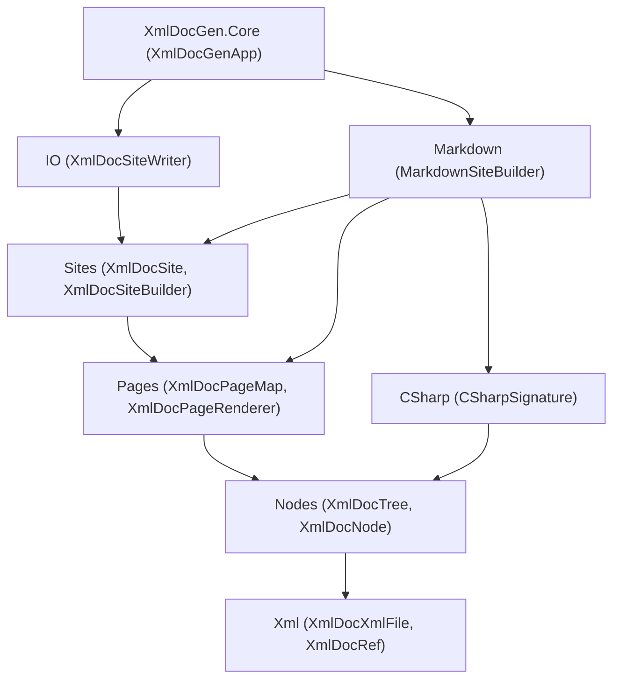

# XmlDocGen Plan

A plan for taking the current `XmlDocMarkdown.Core` work-in-progress and reshaping it into a new,
layered library named **XmlDocGen**, published to a new repository. No backward compatibility is
required.

The goal is a clean, **layered** API where each layer has a single responsibility and lives in its own
namespace. Every layer is **public and self-sufficient**: a client in a different assembly can take any
layer and build their own higher layers on top of it, or replace a layer entirely, without code
duplication. The library still makes it trivially easy to generate a GitHub/Docusaurus-friendly
Markdown site by default.

## Goals

- One NuGet package, `XmlDocGen.Core`, consumed by a tiny local host tool (conventionally `XmlDocGen`)
  that references the assemblies to be documented and calls into the library.
- Markdown generation works out of the box with strong defaults.
- HTML (or any other output) is achievable by plugging in one component, without touching the rest.
- The API is layered, with each layer depending only on the layers below it:
  - Layers that perform **I/O** are separate from layers that work purely **in memory**.
  - **C# signature** generation is its own independently usable/testable layer.
  - **Markdown** generation is its own independently usable/testable layer, exposed as building blocks.
- A rich, reflection-backed object model (`XmlDocNode` and friends) is the single source of truth that
  all output formats render from, and it spans **multiple assemblies**.
- Filtering is first-class via a composable `XmlDocNodeVisibility`.
- Linking to types/members **outside** the documented assemblies, and mapping paths to URLs, are
  customizable extension points.
- **Every layer is customizable** without rewriting the layers around it: page mapping, signature
  formatting, link resolution, and per-section rendering are all extension points.

## Conventions

- **XML documentation is required on every public and protected member.** This is enforced as a build
  warning-as-error and verified by a doc-coverage test (see Testing Plan).
- **Prefer abstract methods over virtual methods.** Contract methods that a subclass must supply are
  `abstract`; ready-made behavior is provided by concrete sealed subclasses rather than virtual
  defaults on a base class. The one deliberate exception is the **renderer/builder section methods**
  (e.g. `MarkdownRenderer.RenderSummary`), which are `virtual` precisely so a client can override one
  section and reuse the rest — that is their entire purpose.
- **"Writer"/"writing" is reserved for I/O.** In-memory producers are "builders" (e.g.
  `CSharpSignatureBuilder`), not writers. The only exception is `MarkdownWriter`, a low-level text
  emitter, which writes to an in-memory `TextWriter`.
- **Settings, not Options.** Configuration objects are uniformly named `...Settings`.

## Namespaces

The root namespace matches the assembly name, `XmlDocGen.Core`, and each layer is a child namespace.

| Layer | Namespace | Responsibility | I/O? |
|-------|-----------|----------------|------|
| XML file | `XmlDocGen.Core.Xml` | Parse compiler-emitted XML; `XmlDocRef` value type. | In memory |
| Object model | `XmlDocGen.Core.Nodes` | Join reflection + XML into the `XmlDocNode` tree across assemblies; filtering. | In memory |
| C# signatures | `XmlDocGen.Core.CSharp` | Produce structured C# signatures/tokens from nodes. | In memory |
| Pages | `XmlDocGen.Core.Pages` | Map nodes to pages; resolve links/URLs; abstract page rendering. | In memory |
| Sites | `XmlDocGen.Core.Sites` | Assemble rendered pages into an in-memory site. | In memory |
| Markdown | `XmlDocGen.Core.Markdown` | Markdown building blocks + Markdown page/site rendering. | In memory |
| IO | `XmlDocGen.Core.IO` | Write a site to the file system (diff, clean, dry-run, verify). | **File system** |
| Application | `XmlDocGen.Core` (root) | CLI entry point wiring it all together. | Console + file system |

Dependency rule: a namespace may reference those above it in the table but never those below it. All
disk access lives in `XmlDocGen.Core.IO` and the root app; everything else is pure in-memory work.



---

## Xml Layer (`XmlDocGen.Core.Xml`)

Pure parsing of the compiler-emitted `.xml` file plus the `XmlDocRef` value type. No reflection; no file
system beyond opt-in convenience loaders. This is today's `XmlDocFile`/`XmlDocMember`/`XmlDocBlock`
model, made public, moved to its own namespace, and renamed with an `XmlDocXml` prefix to avoid
collisions with higher-layer "file"/"site" concepts. The inline model is public so a non-Markdown
renderer in another assembly can format it.

```csharp
namespace XmlDocGen.Core.Xml;

/// <summary>An XML documentation identifier, e.g. "T:My.Type" or "M:My.Type.Method(System.Int32)".</summary>
public readonly struct XmlDocRef : IEquatable<XmlDocRef>
{
    /// <summary>Wraps an identifier string (basic prefix validation only).</summary>
    public XmlDocRef(string value);

    /// <summary>The raw identifier string (e.g. "T:My.Type").</summary>
    public string Value { get; }

    /// <summary>The member-kind prefix: 'T', 'M', 'P', 'F', 'E', or 'N' (namespace); '\0' if unknown.</summary>
    public char Kind { get; }

    /// <summary>Build a reference from reflection metadata.</summary>
    public static XmlDocRef ForType(Type type);
    public static XmlDocRef ForMember(MemberInfo member);
    public static XmlDocRef ForNamespace(string namespaceName);

    public bool Equals(XmlDocRef other);
    public override string ToString();    // returns Value
}

/// <summary>An in-memory representation of a compiler-generated XML documentation file.</summary>
public sealed class XmlDocXmlFile
{
    public XmlDocXmlFile();
    public XmlDocXmlFile(XDocument document);

    /// <summary>Opt-in loaders (the only I/O in this layer).</summary>
    public static XmlDocXmlFile Load(string path);
    public static XmlDocXmlFile Load(Stream stream);
    public static XmlDocXmlFile Parse(string xml);

    /// <summary>The assembly name from the &lt;assembly&gt; element, if present.</summary>
    public string? AssemblyName { get; }

    public IReadOnlyList<XmlDocXmlMember> Members { get; }

    /// <summary>Find documentation for the given reference.</summary>
    public XmlDocXmlMember? FindMember(XmlDocRef reference);
}

/// <summary>The parsed XML documentation for a single member.</summary>
public sealed class XmlDocXmlMember
{
    public XmlDocRef Ref { get; }
    public IReadOnlyList<XmlDocXmlBlock> Summary { get; }
    public IReadOnlyList<XmlDocXmlParameter> TypeParameters { get; }
    public IReadOnlyList<XmlDocXmlParameter> Parameters { get; }
    public IReadOnlyList<XmlDocXmlBlock> ReturnValue { get; }
    public IReadOnlyList<XmlDocXmlBlock> PropertyValue { get; }
    public IReadOnlyList<XmlDocXmlException> Exceptions { get; }
    public IReadOnlyList<XmlDocXmlBlock> Remarks { get; }
    public IReadOnlyList<XmlDocXmlBlock> Examples { get; }
    public IReadOnlyList<XmlDocXmlSeeAlso> SeeAlso { get; }

    /// <summary>The raw &lt;inheritdoc&gt; directive, if present, for the Nodes layer to resolve.</summary>
    public XmlDocXmlInheritDoc? InheritDoc { get; }
}

public sealed class XmlDocXmlBlock { /* inlines + optional list kind */ }
public sealed class XmlDocXmlInline { /* text, code, see (XmlDocRef/href/langword), paramref, typeparamref */ }
public sealed class XmlDocXmlParameter { /* name + blocks */ }
public sealed class XmlDocXmlException { /* XmlDocRef + blocks */ }
public sealed class XmlDocXmlSeeAlso { /* XmlDocRef or href + text */ }
public sealed class XmlDocXmlInheritDoc { /* optional cref + optional path */ }
public enum XmlDocXmlListKind { Bullet, Number, Table, Definition }
```

### Examples

```csharp
// Parse an XML doc file and look up a type's summary, with no higher layers involved.
var xml = XmlDocXmlFile.Load("MyLib.xml");
var member = xml.FindMember(new XmlDocRef("T:MyLib.Widget"));
foreach (var block in member?.Summary ?? [])
    Console.WriteLine(block);

// Build a reference straight from reflection.
XmlDocRef widgetRef = XmlDocRef.ForType(typeof(MyLib.Widget));
XmlDocRef methodRef = XmlDocRef.ForMember(typeof(MyLib.Widget).GetMethod("Spin")!);
```

### Design decisions
- `XmlDocXmlInline` stays a single class with a kind discriminator; the public docs explain the kinds.
- The inline model and `XmlDocRef` are fully public so other assemblies can render XML doc content.
- The constructor does only basic prefix validation; it does not parse the full identifier grammar.

---

## Nodes Layer (`XmlDocGen.Core.Nodes`)

The heart of the redesign: everything from **reflection**, joined with the matching `XmlDocXmlMember`
content, as an `XmlDocNode` tree (`XmlDocTree`) spanning **multiple assemblies**. All downstream layers
read from this tree, so feature support (records, `required`, `ref struct`, etc.) is added here once.

```csharp
namespace XmlDocGen.Core.Nodes;

/// <summary>A documentation tree built from one or more assemblies.</summary>
public sealed class XmlDocTree
{
    public static XmlDocTree Create(IEnumerable<XmlDocAssemblyNode> assemblies);
    public static XmlDocTree Create(IEnumerable<(Assembly Assembly, XmlDocXmlFile Xml)> inputs);

    public IReadOnlyList<XmlDocAssemblyNode> Assemblies { get; }

    /// <summary>Find any node in the tree by reference (across all assemblies).</summary>
    public XmlDocNode? FindNode(XmlDocRef reference);

    /// <summary>Find the node documenting a reflection type or member, if it is in the tree.</summary>
    public XmlDocNode? FindNode(MemberInfo member);
}

/// <summary>Base class for any documentable node (assembly, namespace, type, or member).</summary>
public abstract class XmlDocNode
{
    public abstract string Name { get; }                    // simple display name
    public abstract XmlDocRef Ref { get; }                  // this node's reference

    public XmlDocNode? Parent { get; }                      // null for assembly roots
    public XmlDocAssemblyNode Assembly { get; }             // owning assembly node
    public XmlDocXmlMember? XmlMember { get; }              // joined XML doc, if any (inheritdoc resolved)

    public bool IsObsolete { get; }
    public bool IsBrowsable { get; }
    public bool IsCompilerGenerated { get; }
    public XmlDocVisibility Visibility { get; }

    public IReadOnlyList<XmlDocNode> Children { get; }      // unfiltered, in declaration order
    public IEnumerable<XmlDocNode> GetChildren(XmlDocNodeVisibility visibility);

    /// <summary>This node and all descendants that pass the filter (depth-first, declaration order).</summary>
    public IEnumerable<XmlDocNode> DescendantsAndSelf(XmlDocNodeVisibility visibility);

    /// <summary>Surface an attribute for custom filtering/rendering, if applied to this node.</summary>
    public bool TryGetAttribute<T>(out T attribute) where T : Attribute;
}

public sealed class XmlDocAssemblyNode : XmlDocNode
{
    /// <summary>Build a single-assembly node by joining reflection with parsed XML documentation.</summary>
    public static XmlDocAssemblyNode Create(Assembly assembly, XmlDocXmlFile xml);

    public Assembly Assembly { get; }                       // the reflected assembly
    public XmlDocXmlFile Xml { get; }                       // the parsed XML doc file
    public IReadOnlyList<XmlDocNamespaceNode> Namespaces { get; }
}

public sealed class XmlDocNamespaceNode : XmlDocNode
{
    public IReadOnlyList<XmlDocTypeNode> Types { get; }     // top-level types in this namespace
}

public sealed class XmlDocTypeNode : XmlDocNode
{
    public Type Type { get; }
    public XmlDocTypeKind Kind { get; }
    public IReadOnlyList<XmlDocTypeNode> NestedTypes { get; }
    public IReadOnlyList<XmlDocMemberNode> Members { get; }
    // structural signature data: base type, interfaces, type parameters + constraints, modifiers
}

public sealed class XmlDocMemberNode : XmlDocNode
{
    public MemberInfo MemberInfo { get; }
    public XmlDocMemberKind MemberKind { get; }
    // structural signature data: parameters, return type, accessors, modifiers
}

/// <summary>Visibility ordered from least to most visible, so comparisons (&gt;=) work directly.</summary>
public enum XmlDocVisibility { Private, Internal, ProtectedInternal, Protected, Public }
public enum XmlDocTypeKind { Class, Struct, Interface, Enum, Delegate, Record, RecordStruct }
public enum XmlDocMemberKind { Constructor, Method, Property, Field, Event, Operator }
```

Notes:
- `XmlMember` is the joined XML doc for a node (renamed from `Documentation`), with any
  `<inheritdoc>` already resolved against base types/interfaces during tree construction.
- `XmlDocVisibility` replaces today's `XmlDocVisibilityLevel`, framed as "the node's own visibility."
  The enum is ordered, so a custom generator can compare visibilities directly.
- The tree exposes **structural** signature data so any formatter can build signatures; canonical C#
  text is produced by the `CSharp` layer.

### Visibility / filtering

`XmlDocNodeVisibility` is an abstract base with one abstract method, `IsVisible(XmlDocNode)`, plus a
static property per visibility level and a small set of fluent exclusions.

```csharp
namespace XmlDocGen.Core.Nodes;

public abstract class XmlDocNodeVisibility
{
    public abstract bool IsVisible(XmlDocNode node);

    /// <summary>One ready-made filter per visibility level (each includes that level and above).</summary>
    public static XmlDocNodeVisibility Public { get; }
    public static XmlDocNodeVisibility Protected { get; }            // default
    public static XmlDocNodeVisibility ProtectedInternal { get; }
    public static XmlDocNodeVisibility Internal { get; }
    public static XmlDocNodeVisibility Private { get; }              // includes everything

    public static XmlDocNodeVisibility Create(XmlDocVisibility minimum);

    // Fluent, composable refinements (each returns a new XmlDocNodeVisibility):
    public XmlDocNodeVisibility ExcludeObsolete();
    public XmlDocNodeVisibility ExcludeUnbrowsable();
    public XmlDocNodeVisibility ExcludeCompilerGenerated();
    public XmlDocNodeVisibility Exclude(Func<XmlDocNode, bool> shouldExclude);
}
```

### Examples

```csharp
// Build a multi-assembly tree directly from reflection + XML, no higher layers.
var tree = XmlDocTree.Create(
[
    (typeof(Widget).Assembly, XmlDocXmlFile.Load("Widgets.xml")),
    (typeof(Gadget).Assembly, XmlDocXmlFile.Load("Gadgets.xml")),
]);

// Walk visible public types and print their names.
var visibility = XmlDocNodeVisibility.Public.ExcludeObsolete().ExcludeCompilerGenerated();
foreach (var assembly in tree.Assemblies)
    foreach (var ns in assembly.Namespaces)
        foreach (var type in ns.GetChildren(visibility))
            Console.WriteLine(type.Name);

// A completely custom filter.
sealed class TestApiVisibility : XmlDocNodeVisibility
{
    public override bool IsVisible(XmlDocNode node) => !node.Name.EndsWith("Internal", StringComparison.Ordinal);
}
```

### Design decisions
- **Cross-assembly behavior**: `XmlDocTree` documents each assembly from its own metadata and XML.
  `FindNode` resolves references across all assemblies in the tree, so a type in one example assembly
  can link to a type in the other. Type forwarding and `InternalsVisibleTo` are **out of scope**: a
  forwarded type is documented only if its defining assembly is included. This keeps the tree a faithful
  per-assembly view and avoids surprising merges.
- `GetChildren` filters immediate children only; callers compose traversal via `DescendantsAndSelf`.
  Visibility does not implicitly cascade (a visible type can still expose its visible members even if an
  enclosing namespace were filtered), which matches how documentation is actually consumed.

---

## CSharp Layer (`XmlDocGen.Core.CSharp`)

C# signature generation as an independent, testable layer. It turns nodes into **structured signatures**
(a token list) so any output format can render them — Markdown can hyperlink type tokens, HTML can wrap
them in spans, plain text can ignore the structure. Each linkable token carries the **reflection
target** it refers to, so the linking layer never deals with raw reference strings.

```csharp
namespace XmlDocGen.Core.CSharp;

public enum CSharpTokenKind { Keyword, Identifier, TypeName, Operator, Punctuation, Whitespace, Literal }

/// <summary>One piece of a C# signature.</summary>
public readonly struct CSharpToken
{
    public CSharpTokenKind Kind { get; }
    public string Text { get; }

    /// <summary>For tokens that refer to a type or member, the reflection target to link to (Type is a MemberInfo).</summary>
    public MemberInfo? LinkTarget { get; }
}

/// <summary>A structured C# signature.</summary>
public sealed class CSharpSignature
{
    public IReadOnlyList<CSharpToken> Tokens { get; }
    public override string ToString();                      // concatenated token text
}

public sealed class CSharpSignatureSettings
{
    public bool IncludeAccessModifiers { get; set; } = true;
    public bool IncludeParameterNames { get; set; } = true;
    public bool FullyQualifyTypes { get; set; }
}

/// <summary>Builds C# signatures from nodes.</summary>
public class CSharpSignatureBuilder
{
    public CSharpSignatureBuilder(CSharpSignatureSettings? settings = null);

    public virtual CSharpSignature GetTypeSignature(XmlDocTypeNode type);
    public virtual CSharpSignature GetMemberSignature(XmlDocMemberNode member);

    /// <summary>The short, link-friendly signature used in summary tables.</summary>
    public virtual CSharpSignature GetShortSignature(XmlDocNode node);
}
```

### Examples

```csharp
// Render a type's signature as plain C#, no Markdown involved.
var type = (XmlDocTypeNode) tree.FindNode(typeof(Widget))!;
CSharpSignature sig = new CSharpSignatureBuilder().GetTypeSignature(type);
Console.WriteLine(sig.ToString());   // "public sealed class Widget : IWidget"

// Inspect the tokens to build your own hyperlinked output.
foreach (var token in sig.Tokens)
    if (token.LinkTarget is { } target)
        Console.WriteLine($"links to {target}");
```

### Design decisions
- Token granularity stays fine (one token per syntactic atom); today's model works well and gives
  renderers full control.
- The file-name-safe identifier/path for a node belongs to the Pages layer (`XmlDocPageMap`), not here;
  this layer produces signatures only.

---

## Pages Layer (`XmlDocGen.Core.Pages`)

Page mapping, link resolution, and the abstract page renderer. The simplest way to build pages is a
**node → path mapping**: every node that maps to the same path is documented on the same page. This
layer also owns URL mapping and external link resolution, because linking is part of rendering a page.

```csharp
namespace XmlDocGen.Core.Pages;

/// <summary>Maps each documentable node to the logical page path (no extension) where it is documented.</summary>
public abstract class XmlDocPageMap
{
    /// <summary>The site-relative logical path (no extension). Nodes sharing a path share a page.</summary>
    public abstract string GetPagePath(XmlDocNode node);

    /// <summary>A stable intra-page anchor for the node, used for same-page links.</summary>
    public virtual string GetAnchor(XmlDocNode node);

    /// <summary>The default mapping (assembly page, a page per type, a page per member).</summary>
    public static XmlDocPageMap Create(XmlDocPageMapSettings? settings = null);
}

public sealed class XmlDocPageMapSettings
{
    /// <summary>Give each namespace its own page (otherwise namespaces are listed on the assembly page).</summary>
    public bool NamespacePages { get; set; }

    /// <summary>Give each member its own page (otherwise members are documented on the type page).</summary>
    public bool MemberPages { get; set; } = true;
}

/// <summary>A logical page: the nodes documented together in one output file.</summary>
public sealed class XmlDocPage
{
    public XmlDocPage(string path, IEnumerable<XmlDocNode> nodes);

    public string Path { get; }                             // site-relative, '/'-separated, WITH extension
    public IReadOnlyList<XmlDocNode> Nodes { get; }         // the first node is the page's subject
}

/// <summary>Builds the page set by grouping visible nodes by their mapped path.</summary>
public static class XmlDocPageBuilder
{
    /// <summary>Group visible nodes by <see cref="XmlDocPageMap.GetPagePath"/>, appending the renderer's extension.</summary>
    public static IReadOnlyList<XmlDocPage> CreatePages(
        XmlDocTree tree, XmlDocNodeVisibility visibility, XmlDocPageMap map, string fileExtension);
}

/// <summary>Renders a single page to file text. Format-specific subclasses implement this.</summary>
public abstract class XmlDocPageRenderer
{
    /// <summary>The output file extension (e.g. ".md", ".html"). The page builder appends it to mapped paths.</summary>
    public abstract string FileExtension { get; }

    /// <summary>Render the page using cross-page context (link resolution, sibling pages).</summary>
    public abstract string RenderPage(XmlDocPage page, XmlDocPageContext context);
}

/// <summary>Maps a target page path (+ optional anchor) to a URL relative to the current page.</summary>
public abstract class XmlDocUrlMapper
{
    public abstract string GetUrl(string fromPath, string targetPath, string? anchor = null);
    public static XmlDocUrlMapper GitHub { get; }           // relative ".md" links (default)
    public static XmlDocUrlMapper Docusaurus { get; }       // extensionless, slugged links
}

/// <summary>Resolves links to types/members OUTSIDE the documented assemblies (reflection-based).</summary>
public abstract class XmlDocExternalLinks
{
    /// <summary>An absolute URL for a type or member not in the tree, or null if unknown.</summary>
    public abstract string? TryGetUrl(MemberInfo member);   // Type is a MemberInfo

    public static XmlDocExternalLinks DotNetApi { get; }                 // Microsoft Learn for System.*
    public static XmlDocExternalLinks UrlPattern(string urlFormat);      // custom external source
    public static XmlDocExternalLinks Combine(params XmlDocExternalLinks[] sources);
}

/// <summary>Context available while rendering a page: page lookup and unified link resolution.</summary>
public sealed class XmlDocPageContext
{
    public XmlDocTree Tree { get; }
    public XmlDocPage Page { get; }                         // the page being rendered
    public IReadOnlyList<XmlDocPage> Pages { get; }

    public XmlDocPage? FindPage(XmlDocNode node);
    public XmlDocPage? FindPage(XmlDocRef reference);

    /// <summary>
    /// Resolve a type/member to a URL relative to the current page: an internal page link (with an
    /// anchor when the target shares a page) if it is in the tree; otherwise an external link; otherwise null.
    /// </summary>
    public string? GetLinkUrl(MemberInfo member);
}
```

### Linking and anchors (design)

Internal and external linking are **separate abstractions**, and external links are only consulted when
an internal link is impossible:

1. `XmlDocPageContext.GetLinkUrl(member)` looks up the member's node in the tree.
2. If found (internal), it finds the target page, computes the anchor (`GetAnchor`, used only when the
   target shares a page with another node), and asks the `XmlDocUrlMapper` for a URL **relative to the
   current page** — this is why the mapper takes `fromPath` (the page being rendered) and `targetPath`.
3. If not found (external), it consults `XmlDocExternalLinks.TryGetUrl(member)`.
4. Otherwise it returns null (render as plain text).

Callers never pass `fromPath` themselves; the context supplies the current page. Same-page member links
become `#anchor` (empty relative path + anchor), which the `XmlDocUrlMapper` produces.

### Examples

```csharp
// Compute the page set for a tree without rendering or writing files.
var map = XmlDocPageMap.Create(new XmlDocPageMapSettings { NamespacePages = true });
var pages = XmlDocPageBuilder.CreatePages(tree, XmlDocNodeVisibility.Public, map, ".md");
foreach (var page in pages)
    Console.WriteLine($"{page.Path} <- {page.Nodes[0].Name}");

// A custom mapping: one page per type, no member pages.
sealed class FlatPageMap : XmlDocPageMap
{
    public override string GetPagePath(XmlDocNode node) =>
        node is XmlDocMemberNode m ? GetPagePath(m.Parent!) : $"{node.Assembly.Name}/{node.Name}";
}
```

### Design decisions
- `XmlDocPage.Path` **includes** the extension; the page builder forms it by appending the renderer's
  `FileExtension` to the map's logical path. This is `FileExtension`'s sole purpose.
- The page map is purely structural and does not know the `XmlDocUrlMapper`; URL style is applied later.
- The page's subject is simply `Nodes[0]`; there is no separate "primary node" concept.

### Open questions
- Anchor slugs for overloaded members (same name, different parameters) need a disambiguation scheme —
  proposal: append a short parameter-type hash, matching how member page file names are disambiguated today.

---

## Sites Layer (`XmlDocGen.Core.Sites`)

Site building: combine a tree, page map, renderer, URL mapper, and external links into a complete
in-memory site. Format-agnostic — it takes an `XmlDocPageRenderer` and is unaware of Markdown vs HTML.

```csharp
namespace XmlDocGen.Core.Sites;

/// <summary>A generated documentation site: a set of output files.</summary>
public sealed class XmlDocSite
{
    public XmlDocSite(IEnumerable<XmlDocSiteFile> files);
    public IReadOnlyList<XmlDocSiteFile> Files { get; }     // stable ordering for deterministic output
    public XmlDocSiteFile? FindFile(string path);
}

/// <summary>A single generated output file (formerly NamedText).</summary>
public sealed class XmlDocSiteFile
{
    public XmlDocSiteFile(string path, string text);
    public string Path { get; }                             // site-relative, '/'-separated, with extension
    public string Text { get; }
}

/// <summary>Builds a site by rendering each page with a page renderer.</summary>
public class XmlDocSiteBuilder
{
    public XmlDocSiteBuilder(XmlDocPageRenderer renderer, XmlDocSiteBuilderSettings? settings = null);

    public XmlDocSite Build(XmlDocTree tree);
}

public sealed class XmlDocSiteBuilderSettings
{
    public XmlDocNodeVisibility? Visibility { get; set; }   // default: Protected
    public XmlDocPageMap? PageMap { get; set; }             // default: XmlDocPageMap.Create()
    public XmlDocUrlMapper? UrlMapper { get; set; }         // default: GitHub
    public XmlDocExternalLinks? ExternalLinks { get; set; } // default: DotNetApi
    public string? NewLine { get; set; }
}
```

`Build` creates the page set (`XmlDocPageBuilder`), constructs an `XmlDocPageContext` per page (wired
with the page set, URL mapper, and external links), renders each page, and collects the results into an
`XmlDocSite`.

### Examples

```csharp
// Build a site in memory using a custom page renderer (no Markdown, no file I/O).
sealed class JsonPageRenderer : XmlDocPageRenderer
{
    public override string FileExtension => ".json";
    public override string RenderPage(XmlDocPage page, XmlDocPageContext context) =>
        JsonSerializer.Serialize(new { page.Path, subject = page.Nodes[0].Name });
}

var site = new XmlDocSiteBuilder(new JsonPageRenderer()).Build(tree);
foreach (var file in site.Files)
    Console.WriteLine(file.Path);

// Document framework types via Microsoft Learn; everything else links within the site.
var settings = new XmlDocSiteBuilderSettings { ExternalLinks = XmlDocExternalLinks.DotNetApi };
```

### Design decisions
- Internal links are resolved entirely from the tree/page set; `XmlDocExternalLinks` is consulted only
  when a target is not in the tree. The two concerns stay separate abstractions.

---

## Markdown Layer (`XmlDocGen.Core.Markdown`)

Markdown generation as an independent, testable layer exposed as **building blocks**. This is the only
place Markdown syntax lives. The renderer is composed of small `virtual` section methods (the deliberate
exception to the abstract-over-virtual convention) so a client can override one section without
duplicating the rest. Section methods write into a shared `MarkdownWriter` for easy composition.

```csharp
namespace XmlDocGen.Core.Markdown;

/// <summary>Low-level Markdown emit helpers (formerly MarkdownWriter); writes to an in-memory TextWriter.</summary>
public sealed class MarkdownWriter
{
    public MarkdownWriter(TextWriter writer);
    public void Write(string text);
    public void WriteLine();
    public void WriteLine(string text);
    public void WriteLink(string text, string url);
    public void WriteHeading(int level, string text);
    public void WriteTableRow(params string[] cells);
    // ...code spans, fenced blocks, etc.
}

/// <summary>Renders node/XML content as Markdown building blocks; override a method to customize one section.</summary>
public class MarkdownRenderer
{
    public MarkdownRenderer(CSharpSignatureBuilder? signatures = null);

    public virtual void WriteSignature(MarkdownWriter writer, XmlDocNode node, XmlDocPageContext context);
    public virtual void WriteSummary(MarkdownWriter writer, XmlDocNode node, XmlDocPageContext context);
    public virtual void WriteRemarks(MarkdownWriter writer, XmlDocNode node, XmlDocPageContext context);
    public virtual void WriteParameters(MarkdownWriter writer, XmlDocMemberNode member, XmlDocPageContext context);
    public virtual void WriteSeeAlso(MarkdownWriter writer, XmlDocNode node, XmlDocPageContext context);
    public virtual void WriteInlines(MarkdownWriter writer, IEnumerable<XmlDocXmlInline> inlines, XmlDocPageContext context);
}

/// <summary>A page renderer that emits Markdown. Override the section hooks to customize layout.</summary>
public class MarkdownPageRenderer : XmlDocPageRenderer
{
    public MarkdownPageRenderer(MarkdownPageRendererSettings? settings = null);

    public override string FileExtension => ".md";
    public override string RenderPage(XmlDocPage page, XmlDocPageContext context);

    protected MarkdownRenderer Renderer { get; }
    protected virtual void WriteFrontMatter(MarkdownWriter writer, XmlDocPage page);
    protected virtual void WriteHeader(MarkdownWriter writer, XmlDocPage page, XmlDocPageContext context);
    protected virtual void WriteBody(MarkdownWriter writer, XmlDocPage page, XmlDocPageContext context);
}

public sealed class MarkdownPageRendererSettings
{
    /// <summary>Optional structured front matter (rendered as YAML for Jekyll/Docusaurus).</summary>
    public MarkdownFrontMatter? FrontMatter { get; set; }
}

/// <summary>Structured front matter rendered as a YAML block at the top of each page.</summary>
public sealed class MarkdownFrontMatter
{
    public IDictionary<string, string> Fields { get; }      // e.g. { "title": "Widget", "layout": "doc" }
}

/// <summary>Convenience: an XmlDocSiteBuilder preconfigured with a MarkdownPageRenderer.</summary>
public sealed class MarkdownSiteBuilder
{
    public MarkdownSiteBuilder(XmlDocSiteBuilderSettings? settings = null, MarkdownPageRendererSettings? markdown = null);
    public XmlDocSite Build(XmlDocTree tree);
}
```

An HTML layer would be a sibling `XmlDocGen.Core.Html` with an `HtmlPageRenderer : XmlDocPageRenderer`
and analogous building blocks, reusing every lower layer unchanged.

### Examples

```csharp
// Customize only the parameter table, reusing every other block.
sealed class MyRenderer : MarkdownRenderer
{
    public override void WriteParameters(MarkdownWriter writer, XmlDocMemberNode m, XmlDocPageContext c)
    {
        writer.WriteLine("> custom params");
        base.WriteParameters(writer, m, c);
    }
}

// Use the building blocks directly to assemble a bespoke page.
using var sw = new StringWriter();
var md = new MarkdownWriter(sw);
md.WriteHeading(1, "Widget");
new MarkdownRenderer().WriteSummary(md, widgetNode, context);
```

### Design decisions
- Section methods are writer-based (compose without intermediate strings); this is the intentional
  exception to abstract-over-virtual.
- Front matter is a small **structured model** (`MarkdownFrontMatter`) rendered as YAML, not a raw
  template string.

---

## IO Layer (`XmlDocGen.Core.IO`)

The only layer (besides the app) that touches the file system. Takes an already-built `XmlDocSite` and
writes it with diffing, clean, dry-run, and verify semantics. Adapted from the I/O half of today's
`XmlDocMarkdownGenerator.Generate`.

```csharp
namespace XmlDocGen.Core.IO;

public sealed class XmlDocSiteWriter
{
    public XmlDocSiteWriter(XmlDocSiteWriterSettings? settings = null);

    /// <summary>Write the site to the output directory, returning what changed.</summary>
    public XmlDocSiteWriteResult Write(XmlDocSite site, string outputPath);
}

public sealed class XmlDocSiteWriterSettings
{
    public bool ShouldClean { get; set; }                   // delete stale generated files
    public bool IsDryRun { get; set; }                      // compute result without writing
    public bool IsQuiet { get; set; }                       // suppress per-file messages

    /// <summary>Abstracts the file system so writing/diffing can be unit-tested without a temp dir.</summary>
    public IXmlDocFileSystem? FileSystem { get; set; }      // default: the real file system

    /// <summary>How to normalize newlines before comparing existing vs. generated content.</summary>
    public XmlDocNewLineComparison NewLineComparison { get; set; }   // default: Ignore
}

public enum XmlDocNewLineComparison { Ignore, Exact }       // Ignore = normalize CRLF/LF before compare

public interface IXmlDocFileSystem
{
    bool FileExists(string path);
    string ReadAllText(string path);
    void WriteAllText(string path, string text);
    void DeleteFile(string path);
    IEnumerable<string> EnumerateFiles(string directory);
}

public sealed class XmlDocSiteWriteResult
{
    public IReadOnlyList<string> Added { get; }
    public IReadOnlyList<string> Changed { get; }
    public IReadOnlyList<string> Removed { get; }
    public IReadOnlyList<string> Messages { get; }
    public bool HasChanges => Added.Count + Changed.Count + Removed.Count != 0;
}
```

### Clean detection (design)

Today `--clean` finds stale files by scanning for a "DO NOT EDIT" marker. A **manifest** is safer and is
the proposed approach: on each write, the writer emits a small manifest (e.g. `.xmldocgen-manifest`)
listing the files it generated. On the next run, `--clean` deletes only files listed in the previous
manifest that are no longer generated, never touching hand-authored files. The marker scan is kept as a
fallback when no manifest exists (first run after migration).

### Examples

```csharp
// Write any site to disk; works for Markdown, HTML, JSON — anything that produced XmlDocSiteFiles.
var result = new XmlDocSiteWriter(new XmlDocSiteWriterSettings { ShouldClean = true })
    .Write(site, "docs");
foreach (var message in result.Messages)
    Console.WriteLine(message);

// Verify mode: report whether regeneration would change anything, write nothing.
var check = new XmlDocSiteWriter(new XmlDocSiteWriterSettings { IsDryRun = true }).Write(site, "docs");
return check.HasChanges ? 1 : 0;
```

---

## Application Layer (`XmlDocGen.Core` root)

The thin top layer: a CLI that wires the layers together. Defaults to Markdown; a `configure` callback
lets the host customize any layer. Loads **one or more** assemblies by name with their sibling `.xml`.

```csharp
namespace XmlDocGen.Core;

public sealed class XmlDocGenApp
{
    public static int Run(IReadOnlyList<string> args, Action<XmlDocGenAppContext>? configure = null);
}

/// <summary>Passed to the configure callback to tweak any layer before generation runs.</summary>
public sealed class XmlDocGenAppContext
{
    public IReadOnlyList<string> AssemblyNames { get; }
    public string OutputPath { get; }

    public XmlDocNodeVisibility Visibility { get; set; }            // default: Protected.ExcludeObsolete()...
    public XmlDocPageMap PageMap { get; set; }                     // default: XmlDocPageMap.Create()
    public XmlDocPageRenderer Renderer { get; set; }               // default: MarkdownPageRenderer
    public XmlDocUrlMapper UrlMapper { get; set; }                 // default: GitHub
    public XmlDocExternalLinks ExternalLinks { get; set; }         // default: DotNetApi
    public XmlDocSiteWriterSettings WriterSettings { get; }        // clean/dryrun/quiet/verify from CLI
}
```

CLI surface:

```
Usage: XmlDocGen <input-assembly>... <output-dir> [options]
  --clean     Delete previously generated files that are no longer used.
  --dryrun    Run without writing to the file system.
  --quiet     Suppress normal console output.
  --verify    Exit with code 1 if changes are needed.
  --help, -h, -?
```

Internally `Run`:
1. Parses args (reuse `ArgsReader`); supports multiple input assemblies.
2. For each assembly, loads it **by name** and its sibling `.xml`/`.XML` (project/package references
   ensure loading works), then `XmlDocTree.Create(...)`.
3. Builds defaults (Markdown renderer, default map/URL mapper/external links), invokes `configure`.
4. `new XmlDocSiteBuilder(renderer, settings).Build(tree)` → `XmlDocSite`.
5. `new XmlDocSiteWriter(writerSettings).Write(site, outputPath)` → result; prints; returns exit code.

### Examples

```csharp
// Minimal host tool ("XmlDocGen") that documents two assemblies as Markdown.
return XmlDocGenApp.Run(args);

// Host tool that switches to Docusaurus URLs and excludes internal members.
return XmlDocGenApp.Run(args, ctx =>
{
    ctx.Visibility = XmlDocNodeVisibility.Public.ExcludeObsolete();
    ctx.UrlMapper = XmlDocUrlMapper.Docusaurus;
});
```

### Design decisions
- The app loads assemblies **by name only**; project/package references in the host tool guarantee the
  assemblies (and their dependencies) resolve. Per-assembly settings are not supported.

---

## Missing Functionality (vs. the current implementation)

Gaps to close in the new library, independent of the API shape. Each gets example types and tests.

### XML documentation features
- `<inheritdoc>` resolution (with optional `cref` and `path`) against base types and interfaces.
- `<see langword="..."/>` and `<see href="..."/>` in addition to `<see cref="..."/>`.
- `<paramref>` and `<typeparamref>` rendered as links to the relevant parameter.
- `<list type="bullet|number|table">` including tables and definition lists.
- `<c>` inline code and `<code lang="...">` fenced blocks with language hints.
- `<para>`, `<value>`, `<example>`, `<exception>`, `<returns>`, `<remarks>` (verify all are handled).
- `<include>` to merge external doc fragments.
- `cref` to overloaded members and to constructed generic types.

### C# syntax
- `record`, `record struct`, `readonly record struct`.
- `readonly struct`, `ref struct`, `readonly ref struct`, and `allows ref struct` anti-constraint.
- `required` members and `init` accessors.
- `in`, `ref readonly`, and `scoped` parameters and returns.
- Function pointer types.
- `static abstract` and `static virtual` interface members; `sealed` interface members.
- Checked operators and the unsigned right-shift operator (`>>>`).
- Newer generic constraints: `notnull`, `unmanaged`, `default`, nullable-qualified `class`.
- Primary constructors (including the record case) and compiler-emitted members.
- Nullable reference type annotations.
- Default parameter values, `params`, and `params` collections.
- Tuple element names; `nint`/`nuint` native integers.

---

## Reuse Map (current → new)

| Current type | New type | Namespace |
|---|---|---|
| `XmlDocFile`, `XmlDocMember`, `XmlDocBlock`, `XmlDocInline`, `XmlDocParameter`, `XmlDocSeeAlso`, `XmlDocException`, `XmlDocListKind` | `XmlDocXmlFile`, `XmlDocXmlMember`, … (`XmlDocXml` prefix), public | `XmlDocGen.Core.Xml` |
| `XmlDocUtility.GetXmlDocRef` | `XmlDocRef` (readonly struct + `ForType`/`ForMember`/`ForNamespace`) | `XmlDocGen.Core.Xml` |
| `XmlDocVisibilityLevel` | `XmlDocVisibility` + `XmlDocNodeVisibility` | `XmlDocGen.Core.Nodes` |
| reflection logic in `MarkdownGenerator` (`IsVisible`, `GetTypeKind`, tree walk) | `XmlDocNode` tree + `XmlDocTree` (multi-assembly) | `XmlDocGen.Core.Nodes` |
| signature building in `MarkdownGenerator` | `CSharpSignatureBuilder`, `CSharpSignature`, `CSharpToken` | `XmlDocGen.Core.CSharp` |
| paging/path logic in `MarkdownGenerator`, `NamespacePages` | `XmlDocPageMap` (+ settings), `XmlDocPage`, `XmlDocPageBuilder` | `XmlDocGen.Core.Pages` |
| permalink/`MakeRelative`/`GetSafeName`/`GetPermalink`, `PermalinkStyle` | `XmlDocUrlMapper` (GitHub/Docusaurus) | `XmlDocGen.Core.Pages` |
| `ExternalDocumentation` | **removed**; replaced by in-tree internal links + `XmlDocExternalLinks` (`DotNetApi`) | `XmlDocGen.Core.Pages` |
| `NamedText` | `XmlDocSiteFile` (+ `XmlDocSite`) | `XmlDocGen.Core.Sites` |
| `MarkdownGenerator` orchestration | `XmlDocSiteBuilder` (format-agnostic) | `XmlDocGen.Core.Sites` |
| `MarkdownGenerator` rendering, `MarkdownWriter` | `MarkdownPageRenderer`, `MarkdownRenderer`, `MarkdownWriter` | `XmlDocGen.Core.Markdown` |
| `XmlDocMarkdownSettings` | split across site-builder / page-map / renderer / writer settings | various |
| I/O half of `XmlDocMarkdownGenerator.Generate`, `XmlDocMarkdownResult` | `XmlDocSiteWriter`, `XmlDocSiteWriteResult` | `XmlDocGen.Core.IO` |
| `XmlDocMarkdownApp` | `XmlDocGenApp` (+ `XmlDocGenAppContext`) | `XmlDocGen.Core` (root) |
| `ArgsReader`, `ArgsReaderException`, `CommonArgs` | reused, internal | (internal) |

---

## Repository & Packaging

- New repo, new package id `XmlDocGen.Core` (root namespace `XmlDocGen.Core`).
- Target the current LTS (`net8.0`), C# 12, nullable enabled, central package management — carry over
  the existing build template, `Directory.Build.props`, `Directory.Packages.props`, `build.ps1`.
- **All layers ship in one `XmlDocGen.Core` assembly**, separated by namespace.
- Projects:
  - `src/XmlDocGen.Core` — the library (all layers/namespaces).
  - `tests/XmlDocGen.Core.Tests` — unit + integration tests.
  - `tools/ExampleAssembly` and a second example assembly — example types per feature.
  - `tools/XmlDocGen` — the local host tool used to regenerate this repo's own docs.
- Carry over the docs-verification build target (regenerate `docs/` and fail on diff).
- Enforce "XML docs required on public/protected members" as warning-as-error.

---

## Example Assemblies

Reorganized to make tests clearer:

- **Two assemblies** so multi-assembly trees and cross-assembly linking are exercised end to end.
- Group example types by **theme**, each in its own namespace, so tests can target a focused subset:
  - `Features.Records`, `Features.Structs`, `Features.Generics`, `Features.Operators`,
    `Features.Members`, `Features.Modifiers` — one type (or a few) per modern C# feature above.
  - `Visibility.*` — types/members at every visibility level for filtering tests.
  - `Filtering.*` — obsolete, unbrowsable, and compiler-generated examples.
  - `Linking.*` — types referencing BCL types and types in the *other* example assembly.
  - `Docs.*` — rich XML doc comments (summary/remarks/params/exceptions/seealso/lists/code/inheritdoc)
    for renderer snapshot tests.
- Each example type carries a model-level assertion and, where relevant, a checked-in expected signature
  and rendered page.

---

## Testing Plan

The layering lets us unit-test each layer in isolation, with end-to-end integration tests on top.

### Xml layer
- Parse representative fragments: summary, remarks, params, typeparams, returns, value, exceptions,
  examples, seealso, `inheritdoc`, nested `<list>`/`<code>`/`<see>`/`<paramref>`/`<typeparamref>` inlines.
- Malformed/partial XML handled gracefully; unknown elements ignored.
- `XmlDocRef`: `ForType`/`ForMember`/`ForNamespace` against `ExampleAssembly` produce the exact strings
  the compiler emits; equality and `Kind`; round-trip `new XmlDocRef(x.Value)`.
- `FindMember(XmlDocRef)` lookups; `AssemblyName` extraction.

### Nodes layer
- `XmlDocAssemblyNode.Create`: tree shape/counts, nesting, `Assembly`/`Xml` exposed correctly.
- `XmlDocTree.Create` over **two** assemblies; `FindNode(ref)` and `FindNode(MemberInfo)` resolve
  cross-assembly; `<inheritdoc>` resolution merges base/interface docs.
- `XmlMember` join: each node maps to the right `XmlDocXmlMember` by `Ref`.
- Correct `Visibility`, `IsObsolete`, `IsBrowsable`, `IsCompilerGenerated`, `Kind`, `MemberKind`,
  `DescendantsAndSelf`, `TryGetAttribute<T>`.
- `XmlDocNodeVisibility`: each static level; `ExcludeObsolete`/`ExcludeUnbrowsable`/
  `ExcludeCompilerGenerated` alone and combined; `Exclude` predicate; custom subclass.
- Modern C# feature coverage (table-driven against `Features.*`): every item in **Missing Functionality**.

### CSharp layer
- `CSharpSignatureBuilder` golden tests: type/member/short signatures for each `Features.*` example,
  asserted as exact token sequences and as `ToString()` text.
- Linkable tokens carry the correct `LinkTarget`; settings (`FullyQualifyTypes`, `IncludeParameterNames`).
- Subclass override changes one signature shape without affecting others.

### Pages layer
- `XmlDocPageMap.Create`/custom maps: `GetPagePath` groups nodes correctly with `NamespacePages` and
  `MemberPages` on/off; `GetAnchor` stability and overload disambiguation.
- `XmlDocPageBuilder.CreatePages`: page set, paths (with extension), subject = `Nodes[0]`, visibility
  applied during grouping.
- `XmlDocUrlMapper.GitHub`/`Docusaurus`: relative links across sibling/parent/child/same-page; period
  and extension handling; global namespace; deep nesting; safe-name escaping; `#anchor` for same page.
- `XmlDocExternalLinks`: `DotNetApi` maps `System.*` to Learn URLs; `UrlPattern`; `Combine` first-wins.
- `XmlDocPageContext.GetLinkUrl`: internal target → relative URL (+ anchor when shared page); external
  target → external URL; unknown → null.

### Sites layer
- `XmlDocSiteBuilder` with a tiny JSON renderer proves it is genuinely format-agnostic.
- `XmlDocSite` ordering is deterministic; `FindFile`.

### Markdown layer
- `MarkdownWriter` primitives (headings, links, table rows, code/fenced blocks).
- `MarkdownRenderer` block methods over `Docs.*`: **approval/snapshot tests** for summary, remarks,
  parameters, see-also, inline `<see>`/`<paramref>` resolution to links; overriding one block changes
  only that section.
- `MarkdownPageRenderer` full-page snapshots (assembly/namespace/type/member pages); front matter on/off;
  `NewLine` honored; cross-assembly links between the two example assemblies.

### IO layer
- Write via the real file system and via an `IXmlDocFileSystem` fake: files created with correct content
  and `/`→OS paths.
- Diffing under both `NewLineComparison` modes; added/changed/removed classification.
- `--clean` via manifest deletes only previously-generated files; leaves hand-authored files; marker
  fallback when no manifest exists.
- `IsDryRun` writes nothing but computes the result; `IsQuiet` suppresses messages; idempotency.

### Application layer (end-to-end)
- Arg parsing: missing input/output, multiple inputs, unknown flags, `--help` (exit codes 0/2).
- Full run over both example assemblies to a temp dir; compare against checked-in expected docs.
- `--verify` returns 1 when changes needed, 0 when clean; `--dryrun`/`--quiet`/`--clean`.
- `configure` can swap `Visibility`, `Renderer`, `UrlMapper`, `ExternalLinks`, `PageMap`.
- Missing XML doc file → friendly error and non-zero exit.

### Cross-cutting
- A **doc-coverage test** asserts every public/protected member of `XmlDocGen.Core` has XML docs.
- Keep `docs/` regeneration as an integration test (regenerate, fail on diff); diagnose rendering via
  unit + snapshot tests.
- Code-coverage collection with a minimum bar for `XmlDocGen.Core`.
- CI on Ubuntu, Windows, and macOS.
- Choose a snapshot/approval library (e.g. Verify) or a checked-in-expected-file convention — TBD.

---

## Suggested Build Order

1. `Xml` — port + make public; `XmlDocRef`; parser/ref tests.
2. `Nodes` — node tree, `XmlDocTree` (multi-assembly), `inheritdoc`, `XmlDocNodeVisibility`; tests.
3. `CSharp` — structured signatures; golden signature tests.
4. `Pages` — page map + page builder + URL mapper + external links + abstract renderer; tests.
5. `Sites` — site model + format-agnostic site builder; mapper/resolver tests.
6. `Markdown` — building blocks + page renderer; snapshot tests; reach output parity with today.
7. `IO` — writer + diff/clean (manifest); I/O tests.
8. `XmlDocGen.Core` app — CLI; end-to-end tests; regenerate `docs/`.
9. Coverage, CI matrix, README, release notes.
